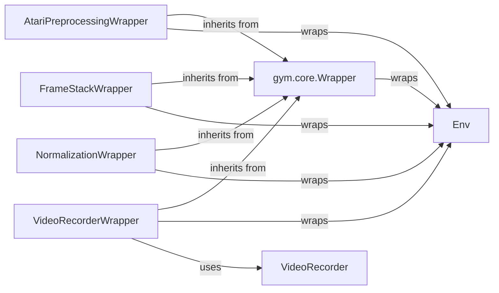

## Details

The `gym.wrappers` subsystem provides a robust and extensible architecture for modifying and enhancing reinforcement learning environments. At its core, the `gym.core.Wrapper` component implements the decorator pattern, allowing various concrete wrappers like `AtariPreprocessingWrapper`, `FrameStackWrapper`, `NormalizationWrapper`, and `VideoRecorderWrapper` to compose and extend the behavior of a base `Env` instance. This design ensures that environment modifications are modular and can be stacked, enabling complex transformations without altering the original environment's implementation. The `VideoRecorderWrapper` further demonstrates this by delegating the specific task of video capture to a dedicated `VideoRecorder` utility, maintaining a clear separation of concerns. This architecture promotes reusability, maintainability, and flexibility in customizing RL environments.

### Env
The core reinforcement learning environment interface that defines the standard interaction methods (`step`, `reset`, `render`, `close`). Wrappers are designed to wrap and modify the behavior of instances of this component.

**Related Classes/Methods**:

- <a href="https://github.com/openai/gym/blob/master/gym/core.py" target="_blank" rel="noopener noreferrer">`gym.core.Env`</a>

### gym.core.Wrapper
The abstract base class for all environment wrappers. It provides the foundational structure for modifying environment behavior by delegating calls to the wrapped environment while allowing for custom logic before or after the delegation.

**Related Classes/Methods**:

- <a href="https://github.com/openai/gym/blob/master/gym/core.py#L213-L346" target="_blank" rel="noopener noreferrer">`gym.core.Wrapper`:213-346</a>

### AtariPreprocessingWrapper
A concrete wrapper that applies common preprocessing steps specifically for Atari environments, such as grayscale conversion, resizing, and frame skipping, to raw observations.

**Related Classes/Methods**:

- <a href="https://github.com/openai/gym/blob/master/gym/wrappers/atari_preprocessing.py" target="_blank" rel="noopener noreferrer">`gym.wrappers.atari_preprocessing.AtariPreprocessingWrapper`</a>

### FrameStackWrapper
A concrete wrapper that stacks multiple consecutive frames (observations) to create a temporal history, providing the agent with more context, which is crucial for tasks where velocity or motion is important.

**Related Classes/Methods**:

- <a href="https://github.com/openai/gym/blob/master/gym/wrappers/frame_stack.py" target="_blank" rel="noopener noreferrer">`gym.wrappers.frame_stack.FrameStackWrapper`</a>

### NormalizationWrapper
A concrete wrapper that normalizes observations and/or rewards, typically using running statistics (mean and standard deviation), to stabilize and improve the training process for reinforcement learning agents.

**Related Classes/Methods**:

- <a href="https://github.com/openai/gym/blob/master/gym/wrappers/normalize.py" target="_blank" rel="noopener noreferrer">`gym.wrappers.normalization.NormalizationWrapper`</a>

### VideoRecorderWrapper
A concrete wrapper responsible for managing the lifecycle of video recording for environment episodes, enabling visual analysis and debugging of agent behavior. It orchestrates the recording process.

**Related Classes/Methods**:

- <a href="https://github.com/openai/gym/blob/master/gym/wrappers/monitoring/video_recorder.py" target="_blank" rel="noopener noreferrer">`gym.wrappers.monitoring.video_recorder.VideoRecorderWrapper`</a>

### VideoRecorder
A utility component that handles the low-level details of capturing and saving video frames from the environment's render output. It is a helper for `VideoRecorderWrapper`.

**Related Classes/Methods**:

- <a href="https://github.com/openai/gym/blob/master/gym/wrappers/monitoring/video_recorder.py#L11-L178" target="_blank" rel="noopener noreferrer">`gym.wrappers.monitoring.video_recorder.VideoRecorder`:11-178</a>

### [FAQ](https://github.com/CodeBoarding/GeneratedOnBoardings/tree/main?tab=readme-ov-file#faq)