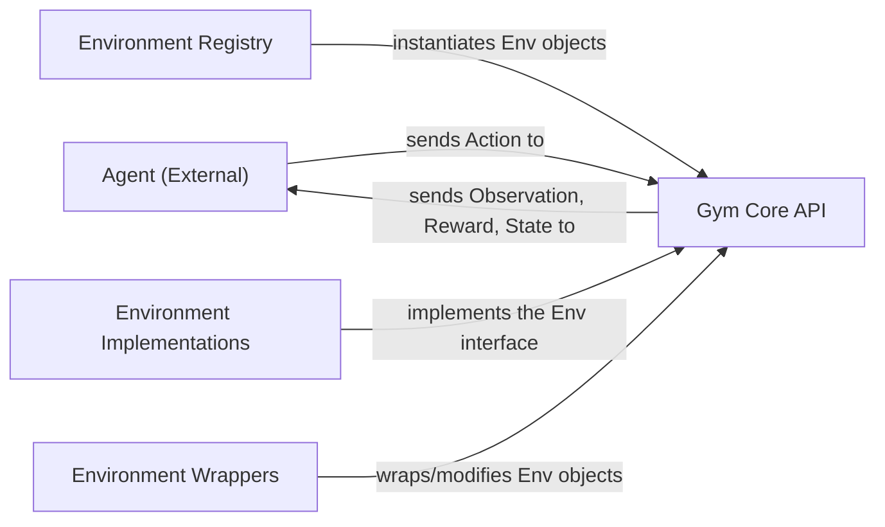

## Details

The Gym library's architecture is centered around the `Gym Core API`, which defines the fundamental `Env` interface for agent-environment interaction. `Environment Implementations` provide concrete instances of various environments, all adhering to this core API. The `Environment Registry` acts as a central catalog, enabling the discovery and instantiation of these environments. `Environment Wrappers` offer a flexible mechanism to modify environment behavior without altering the underlying implementations, allowing for pre-processing, reward shaping, and other transformations. An `Agent (External)` interacts with the system by sending actions to and receiving observations, rewards, and state information from the `Gym Core API`, forming a clear feedback loop. This modular design facilitates easy extension and customization of reinforcement learning environments.

### Agent (External)
Represents the reinforcement learning algorithm or entity that interacts with Gym environments by sending actions and receiving observations. While external to the Gym library, its interaction points are defined by the `Gym Core API`.

**Related Classes/Methods**:

- <a href="https://github.com/openai/gym/blob/master/gym/core.py" target="_blank" rel="noopener noreferrer">`gym.core.Env:step`</a>
- <a href="https://github.com/openai/gym/blob/master/gym/core.py" target="_blank" rel="noopener noreferrer">`gym.core.Env:reset`</a>

### Gym Core API
The foundational interface (`Env` class) that defines the contract for all Gym environments, standardizing agent-environment interaction (e.g., step, reset).

**Related Classes/Methods**:

- <a href="https://github.com/openai/gym/blob/master/gym/core.py" target="_blank" rel="noopener noreferrer">`gym.core.Env`</a>
- <a href="https://github.com/openai/gym/blob/master/gym/core.py" target="_blank" rel="noopener noreferrer">`gym.core.Env:step`</a>
- <a href="https://github.com/openai/gym/blob/master/gym/core.py" target="_blank" rel="noopener noreferrer">`gym.core.Env:reset`</a>

### Environment Registry [[Expand]](./Environment_Registry.md)
Manages the discovery, registration, and instantiation of various Gym environments, acting as a central catalog for available environments.

**Related Classes/Methods**:

- <a href="https://github.com/openai/gym/blob/master/gym/envs/registration.py" target="_blank" rel="noopener noreferrer">`gym.envs.registration`</a>

### Environment Implementations
Concrete implementations of diverse reinforcement learning environments (e.g., classic control, Box2D, MuJoCo) that adhere to the Gym Core API.

**Related Classes/Methods**:

- <a href="https://github.com/openai/gym/blob/master/gym/envs/classic_control/cartpole.py" target="_blank" rel="noopener noreferrer">`gym.envs.classic_control.cartpole`</a>

### Environment Wrappers [[Expand]](./Environment_Wrappers.md)
A flexible layer that allows modification of environment behavior without altering the underlying environment implementation (e.g., observation preprocessing, reward shaping).

**Related Classes/Methods**:

- <a href="https://github.com/openai/gym/blob/master/gym/wrappers/compatibility.py" target="_blank" rel="noopener noreferrer">`gym.wrappers.compatibility`</a>

### [FAQ](https://github.com/CodeBoarding/GeneratedOnBoardings/tree/main?tab=readme-ov-file#faq)