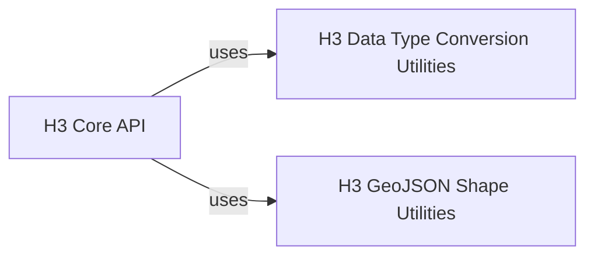

## Component Details

This graph illustrates the core components of the H3 API within the h3-py library. The central component, 'H3 Core API', provides fundamental H3 operations, including conversions, grid traversal, and cell manipulations. It relies on 'H3 Data Type Conversion Utilities' for handling various input/output data formats and 'H3 GeoJSON Shape Utilities' for seamless integration with GeoJSON structures, enabling robust geospatial data processing.

### H3 Core API
This component provides the fundamental H3 API functions for working with individual H3 cells, grid traversal, directed edges, cell collections, and vertices. It serves as the primary interface for most H3 operations, handling conversions between latitude/longitude and H3 cells, managing cell hierarchies, and performing grid-based queries. It integrates various H3 functionalities including basic cell operations, grid traversal, cell compaction, directed edge handling, and GeoJSON conversions.

**Related Classes/Methods**:

- `h3.api.basic_int:is_valid_cell` (full file reference)
- `h3.api.basic_int:latlng_to_cell` (full file reference)
- `h3.api.basic_int:cell_to_latlng` (full file reference)
- `h3.api.basic_int:get_resolution` (full file reference)
- `h3.api.basic_int:cell_to_parent` (full file reference)
- `h3.api.basic_int:cell_to_children_size` (full file reference)
- `h3.api.basic_int:cell_to_children` (full file reference)
- `h3.api.basic_int:cell_to_child_pos` (full file reference)
- `h3.api.basic_int:child_pos_to_cell` (full file reference)
- `h3.api.basic_int:is_pentagon` (full file reference)
- `h3.api.basic_int:get_base_cell_number` (full file reference)
- `h3.api.basic_int:is_res_class_III` (full file reference)
- `h3.api.basic_int:cell_to_center_child` (full file reference)
- `h3.api.basic_int:get_icosahedron_faces` (full file reference)
- `h3.api.basic_int:cell_area` (full file reference)
- `h3.api.basic_int:edge_length` (full file reference)
- `h3.api.basic_int:grid_distance` (full file reference)
- `h3.api.basic_int:grid_disk` (full file reference)
- `h3.api.basic_int:grid_ring` (full file reference)
- `h3.api.basic_int:are_neighbor_cells` (full file reference)
- `h3.api.basic_int:grid_path_cells` (full file reference)
- `h3.api.basic_int:is_valid_directed_edge` (full file reference)
- `h3.api.basic_int:cells_to_directed_edge` (full file reference)
- `h3.api.basic_int:get_directed_edge_origin` (full file reference)
- `h3.api.basic_int:get_directed_edge_destination` (full file reference)
- `h3.api.basic_int:directed_edge_to_cells` (full file reference)
- `h3.api.basic_int:origin_to_directed_edges` (full file reference)
- `h3.api.basic_int:directed_edge_to_boundary` (full file reference)
- `h3.api.basic_int:compact_cells` (full file reference)
- `h3.api.basic_int:uncompact_cells` (full file reference)
- `h3.api.basic_int:polygon_to_cells` (full file reference)
- `h3.api.basic_int:polygon_to_cells_experimental` (full file reference)
- `h3.api.basic_int:cells_to_h3shape` (full file reference)
- `h3.api.basic_int:geo_to_cells` (full file reference)
- `h3.api.basic_int:cells_to_geo` (full file reference)
- `h3.api.basic_int:cell_to_vertex` (full file reference)
- `h3.api.basic_int:cell_to_vertexes` (full file reference)
- `h3.api.basic_int:vertex_to_latlng` (full file reference)
- `h3.api.basic_int:is_valid_vertex` (full file reference)
- <a href="https://github.com/uber/h3-py/blob/master/src/h3/api/basic_int/__init__.py#L1-L100" target="_blank" rel="noopener noreferrer">`h3.api.basic_int.__init__` (1:100)</a>

### H3 Data Type Conversion Utilities
This component provides internal utility functions for converting between different data representations, specifically handling scalar and collection inputs/outputs for interaction with the underlying H3 C library. These utilities ensure proper data formatting for H3 API calls.

**Related Classes/Methods**:

- <a href="https://github.com/uber/h3-py/blob/master/src/h3/api/basic_int/_convert.py#L4-L5" target="_blank" rel="noopener noreferrer">`h3.api.basic_int._convert._in_scalar` (4:5)</a>
- `h3.api.basic_int._convert._out_scalar` (full file reference)
- <a href="https://github.com/uber/h3-py/blob/master/src/h3/api/basic_int/_convert.py#L11-L14" target="_blank" rel="noopener noreferrer">`h3.api.basic_int._convert._in_collection` (11:14)</a>
- `h3.api.basic_int._convert._out_collection` (full file reference)

### H3 GeoJSON Shape Utilities
This component provides utility functions and classes for handling conversions between H3 cells and GeoJSON-like structures. It includes functionalities for converting polygons and multipolygons to H3 cells and vice-versa, and managing the __geo_interface__ for interoperability with geospatial data.

**Related Classes/Methods**:

- <a href="https://github.com/uber/h3-py/blob/master/src/h3/_h3shape.py#L292-L325" target="_blank" rel="noopener noreferrer">`h3._h3shape.geo_to_h3shape` (292:325)</a>
- <a href="https://github.com/uber/h3-py/blob/master/src/h3/_h3shape.py#L328-L338" target="_blank" rel="noopener noreferrer">`h3._h3shape.h3shape_to_geo` (328:338)</a>
- <a href="https://github.com/uber/h3-py/blob/master/src/h3/_h3shape.py#L14-L107" target="_blank" rel="noopener noreferrer">`h3._h3shape.LatLngPoly` (14:107)</a>
- <a href="https://github.com/uber/h3-py/blob/master/src/h3/_h3shape.py#L110-L173" target="_blank" rel="noopener noreferrer">`h3._h3shape.LatLngMultiPoly` (110:173)</a>

### [FAQ](https://github.com/CodeBoarding/GeneratedOnBoardings/tree/main?tab=readme-ov-file#faq)