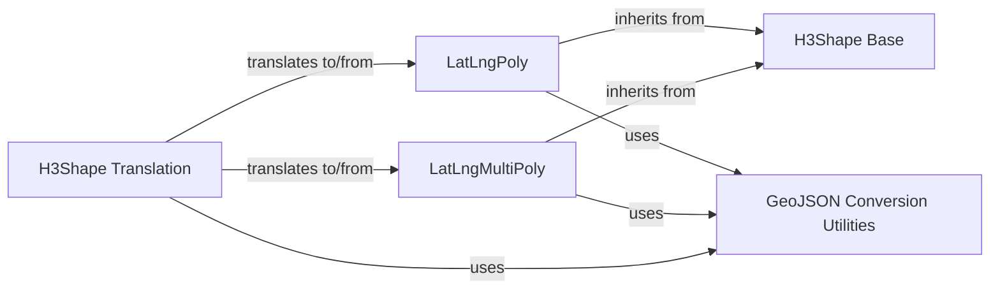

## Component Details

This subsystem defines Python classes for representing H3 geometric shapes like polygons and multi-polygons, along with utility functions for manipulating geographic coordinates and converting these shapes to and from GeoJSON-like structures. Its purpose is to facilitate interoperability with other geospatial libraries by providing a standardized way to handle H3-related geometric data.

### H3Shape Base
The abstract base class for H3 geometric shapes, defining the common interface for converting to and from GeoJSON. It ensures that all concrete shape implementations provide a `__geo_interface__` property.

**Related Classes/Methods**:

- `h3.src.h3._h3shape.H3Shape` (full file reference)

### LatLngPoly
Represents a single polygon with an outer loop and optional inner holes, defined by lists of latitude/longitude points. It handles the initialization, representation, and conversion of polygon data to GeoJSON format.

**Related Classes/Methods**:

- `h3.src.h3._h3shape.LatLngPoly` (14:107)
- `h3.src.h3._h3shape.LatLngPoly:__init__` (full file reference)
- `h3.src.h3._h3shape.LatLngPoly:__geo_interface__` (full file reference)

### LatLngMultiPoly
A container for multiple LatLngPoly objects, representing a collection of polygons. It manages the initialization, representation, and conversion of multi-polygon data to GeoJSON format.

**Related Classes/Methods**:

- `h3.src.h3._h3shape.LatLngMultiPoly` (110:173)
- `h3.src.h3._h3shape.LatLngMultiPoly:__geo_interface__` (full file reference)

### GeoJSON Conversion Utilities
A collection of helper functions responsible for converting between different levels of nested latitude/longitude lists (LL0, LL1, LL2, LL3) and GeoJSON dictionary formats. These utilities handle ring closing/opening, coordinate swapping, and dimension removal.

**Related Classes/Methods**:

- `h3.src.h3._h3shape._mpoly_to_LL3` (197:203)
- `h3.src.h3._h3shape._LL3_to_mpoly` (206:214)
- `h3.src.h3._h3shape._polygon_to_LL2` (217:224)
- `h3.src.h3._h3shape._remove_z` (227:229)
- `h3.src.h3._h3shape._LL2_to_polygon` (232:244)
- `h3.src.h3._h3shape._LL2_to_geojson_dict` (247:253)
- `h3.src.h3._h3shape._LL3_to_geojson_dict` (256:262)
- `h3.src.h3._h3shape._swap_latlng` (265:269)
- `h3.src.h3._h3shape._close_ring` (272:279)
- `h3.src.h3._h3shape._open_ring` (282:289)

### H3Shape Translation
Provides functions for translating between generic GeoJSON-like objects (or dictionaries) and the H3Shape hierarchy (LatLngPoly and LatLngMultiPoly). This component acts as the primary interface for external data integration.

**Related Classes/Methods**:

- `h3.src.h3._h3shape.geo_to_h3shape` (292:325)
- `h3.src.h3._h3shape.h3shape_to_geo` (328:338)

### [FAQ](https://github.com/CodeBoarding/GeneratedOnBoardings/tree/main?tab=readme-ov-file#faq)