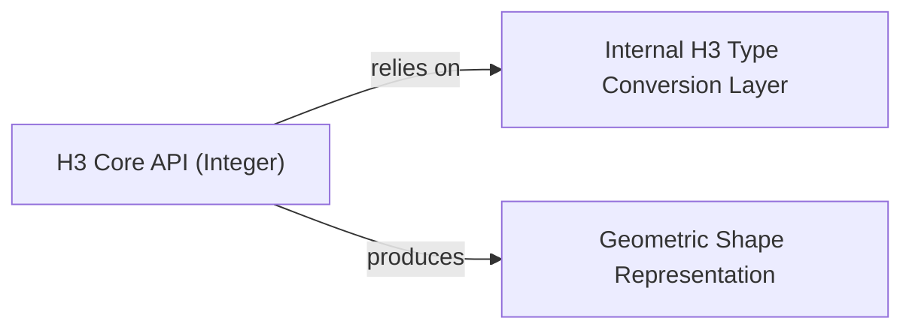

## Component Details

This graph describes the core components of the H3-py library related to integer-based H3 operations and geometric shape representation. The `Internal H3 Type Conversion Layer` acts as a crucial bridge, handling data type conversions between Python native types and the underlying H3 C library. The `H3 Core API (Integer)` exposes the primary H3 functions, relying on the type conversion layer for input handling and producing geometric shapes via the `Geometric Shape Representation` component. The main flow involves H3 API calls, which utilize the conversion layer, and can result in geometric outputs.

### Internal H3 Type Conversion Layer
This crucial internal component is responsible for abstracting the data type conversions required when interacting with the underlying H3 C library (`_cy` module). It ensures that Python native types are correctly marshaled to and from the C library's expected formats for both scalar and collection inputs, acting as a bridge between Python and the native H3 implementation. Specifically, `_in_scalar` handles scalar inputs, and `_in_collection` converts iterable inputs into memory views for efficient C library interaction.

**Related Classes/Methods**:

- <a href="https://github.com/uber/h3-py/blob/master/src/h3/api/basic_int/_convert.py#L4-L5" target="_blank" rel="noopener noreferrer">`h3.api.basic_int._convert._in_scalar` (4:5)</a>
- <a href="https://github.com/uber/h3-py/blob/master/src/h3/api/basic_int/_convert.py#L11-L14" target="_blank" rel="noopener noreferrer">`h3.api.basic_int._convert._in_collection` (11:14)</a>

### H3 Core API (Integer)
This component exposes the primary H3 functions for geospatial indexing and analysis, operating on H3 cell and edge indices represented as integers. It covers a wide range of operations from validation and resolution queries to spatial relationships and hierarchical transformations. It relies on the `Internal H3 Type Conversion Layer` for handling input data types.

**Related Classes/Methods**:

- `h3.api.basic_int:is_valid_cell` (full file reference)
- `h3.api.basic_int:is_valid_directed_edge` (full file reference)
- `h3.api.basic_int:latlng_to_cell` (full file reference)
- `h3.api.basic_int:cell_to_latlng` (full file reference)
- `h3.api.basic_int:get_resolution` (full file reference)
- `h3.api.basic_int:cell_to_parent` (full file reference)
- `h3.api.basic_int:grid_distance` (full file reference)
- `h3.api.basic_int:cell_to_boundary` (full file reference)
- `h3.api.basic_int:grid_disk` (full file reference)
- `h3.api.basic_int:grid_ring` (full file reference)
- `h3.api.basic_int:cell_to_children_size` (full file reference)
- `h3.api.basic_int:cell_to_children` (full file reference)
- `h3.api.basic_int:cell_to_child_pos` (full file reference)
- `h3.api.basic_int:child_pos_to_cell` (full file reference)
- `h3.api.basic_int:compact_cells` (full file reference)
- `h3.api.basic_int:uncompact_cells` (full file reference)
- `h3.api.basic_int:cells_to_h3shape` (full file reference)
- `h3.api.basic_int:is_pentagon` (full file reference)
- `h3.api.basic_int:get_base_cell_number` (full file reference)
- `h3.api.basic_int:are_neighbor_cells` (full file reference)
- `h3.api.basic_int:cells_to_directed_edge` (full file reference)
- `h3.api.basic_int:get_directed_edge_origin` (full file reference)
- `h3.api.basic_int:get_directed_edge_destination` (full file reference)
- `h3.api.basic_int:directed_edge_to_cells` (full file reference)
- `h3.api.basic_int:origin_to_directed_edges` (full file reference)
- `h3.api.basic_int:directed_edge_to_boundary` (full file reference)
- `h3.api.basic_int:grid_path_cells` (full file reference)
- `h3.api.basic_int:is_res_class_III` (full file reference)
- `h3.api.basic_int:cell_to_center_child` (full file reference)
- `h3.api.basic_int:get_icosahedron_faces` (full file reference)
- `h3.api.basic_int:cell_to_local_ij` (full file reference)
- `h3.api.basic_int:local_ij_to_cell` (full file reference)
- `h3.api.basic_int:cell_area` (full file reference)
- `h3.api.basic_int:edge_length` (full file reference)
- `h3.api.basic_int:cell_to_vertex` (full file reference)
- `h3.api.basic_int:cell_to_vertexes` (full file reference)
- `h3.api.basic_int:vertex_to_latlng` (full file reference)
- `h3.api.basic_int:is_valid_vertex` (full file reference)

### Geometric Shape Representation
This component defines classes and helper functions for representing and manipulating geographic polygons and multi-polygons, adhering to the __geo_interface__ protocol. It facilitates the conversion of H3 cell sets into standard geometric formats.

**Related Classes/Methods**:

- <a href="https://github.com/uber/h3-py/blob/master/src/h3/_h3shape.py#L14-L107" target="_blank" rel="noopener noreferrer">`h3._h3shape.LatLngPoly` (14:107)</a>
- <a href="https://github.com/uber/h3-py/blob/master/src/h3/_h3shape.py#L110-L173" target="_blank" rel="noopener noreferrer">`h3._h3shape.LatLngMultiPoly` (110:173)</a>

### [FAQ](https://github.com/CodeBoarding/GeneratedOnBoardings/tree/main?tab=readme-ov-file#faq)