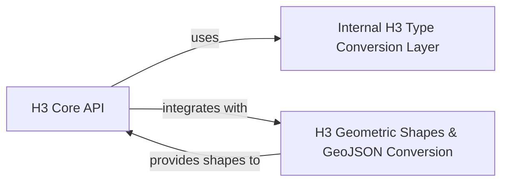

## Component Details

The `h3-py` library provides Python bindings for the H3 geospatial indexing system. Its core functionality revolves around converting geographic coordinates to H3 cell indices, performing grid-based operations like traversal and distance calculations, and managing collections of H3 cells. The architecture is designed to expose the underlying H3 C library's capabilities through a Pythonic interface, with a clear separation between the core H3 operations, geometric shape representations, and an internal layer for handling data type conversions.

### H3 Core API
This component provides the fundamental H3 API functions for working with individual H3 cells, grid traversal, directed edges, cell collections, and vertices. It serves as the primary interface for most H3 operations, handling conversions between latitude/longitude and H3 cells, managing cell hierarchies, and performing grid-based queries.

**Related Classes/Methods**:

- `h3-py.src.h3.api.basic_int:is_valid_cell` (full file reference)
- `h3-py.src.h3.api.basic_int:latlng_to_cell` (full file reference)
- `h3-py.src.h3.api.basic_int:cell_to_latlng` (full file reference)
- `h3-py.src.h3.api.basic_int:get_resolution` (full file reference)
- `h3-py.src.h3.api.basic_int:cell_to_parent` (full file reference)
- `h3-py.src.h3.api.basic_int:cell_to_children_size` (full file reference)
- `h3-py.src.h3.api.basic_int:cell_to_children` (full file reference)
- `h3-py.src.h3.api.basic_int:cell_to_child_pos` (full file reference)
- `h3-py.src.h3.api.basic_int:child_pos_to_cell` (full file reference)
- `h3-py.src.h3.api.basic_int:is_pentagon` (full file reference)
- `h3-py.src.h3.api.basic_int:get_base_cell_number` (full file reference)
- `h3-py.src.h3.api.basic_int:is_res_class_III` (full file reference)
- `h3-py.src.h3.api.basic_int:cell_to_center_child` (full file reference)
- `h3-py.src.h3.api.basic_int:get_icosahedron_faces` (full file reference)
- `h3-py.src.h3.api.basic_int:cell_area` (full file reference)
- `h3-py.src.h3.api.basic_int:edge_length` (full file reference)
- `h3-py.src.h3.api.basic_int:grid_distance` (full file reference)
- `h3-py.src.h3.api.basic_int:grid_disk` (full file reference)
- `h3-py.src.h3.api.basic_int:grid_ring` (full file reference)
- `h3-py.src.h3.api.basic_int:are_neighbor_cells` (full file reference)
- `h3-py.src.h3.api.basic_int:grid_path_cells` (full file reference)
- `h3-py.src.h3.api.basic_int:is_valid_directed_edge` (full file reference)
- `h3-py.src.h3.api.basic_int:cells_to_directed_edge` (full file reference)
- `h3-py.src.h3.api.basic_int:get_directed_edge_origin` (full file reference)
- `h3-py.src.h3.api.basic_int:get_directed_edge_destination` (full file reference)
- `h3-py.src.h3.api.basic_int:directed_edge_to_cells` (full file reference)
- `h3-py.src.h3.api.basic_int:origin_to_directed_edges` (full file reference)
- `h3-py.src.h3.api.basic_int:directed_edge_to_boundary` (full file reference)
- `h3-py.src.h3.api.basic_int:compact_cells` (full file reference)
- `h3-py.src.h3.api.basic_int:uncompact_cells` (full file reference)
- `h3-py.src.h3.api.basic_int:polygon_to_cells` (full file reference)
- `h3-py.src.h3.api.basic_int:polygon_to_cells_experimental` (full file reference)
- `h3-py.src.h3.api.basic_int:cells_to_h3shape` (full file reference)
- `h3-py.src.h3.api.basic_int:geo_to_cells` (full file reference)
- `h3-py.src.h3.api.basic_int:cells_to_geo` (full file reference)
- `h3-py.src.h3.api.basic_int:cell_to_vertex` (full file reference)
- `h3-py.src.h3.api.basic_int:cell_to_vertexes` (full file reference)
- `h3-py.src.h3.api.basic_int:vertex_to_latlng` (full file reference)
- `h3-py.src.h3.api.basic_int:is_valid_vertex` (full file reference)
- <a href="https://github.com/uber/h3-py/blob/master/src/h3/api/basic_int/__init__.py#L1-L100" target="_blank" rel="noopener noreferrer">`h3-py.src.h3.api.basic_int.__init__` (1:100)</a>

### H3 Geometric Shapes & GeoJSON Conversion
This component defines Python classes for representing H3 geometric shapes like polygons and multi-polygons. It also includes utility functions for manipulating geographic coordinates and converting these shapes to and from GeoJSON-like structures, facilitating interoperability with other geospatial libraries.

**Related Classes/Methods**:

- <a href="https://github.com/uber/h3-py/blob/master/src/h3/_h3shape.py#L14-L107" target="_blank" rel="noopener noreferrer">`h3-py.src.h3._h3shape.LatLngPoly` (14:107)</a>
- <a href="https://github.com/uber/h3-py/blob/master/src/h3/_h3shape.py#L110-L173" target="_blank" rel="noopener noreferrer">`h3-py.src.h3._h3shape.LatLngMultiPoly` (110:173)</a>
- <a href="https://github.com/uber/h3-py/blob/master/src/h3/_h3shape.py#L282-L289" target="_blank" rel="noopener noreferrer">`h3-py.src.h3._h3shape._open_ring` (282:289)</a>
- <a href="https://github.com/uber/h3-py/blob/master/src/h3/_h3shape.py#L272-L279" target="_blank" rel="noopener noreferrer">`h3-py.src.h3._h3shape._close_ring` (272:279)</a>
- <a href="https://github.com/uber/h3-py/blob/master/src/h3/_h3shape.py#L265-L269" target="_blank" rel="noopener noreferrer">`h3-py.src.h3._h3shape._swap_latlng` (265:269)</a>
- <a href="https://github.com/uber/h3-py/blob/master/src/h3/_h3shape.py#L227-L229" target="_blank" rel="noopener noreferrer">`h3-py.src.h3._h3shape._remove_z` (227:229)</a>
- <a href="https://github.com/uber/h3-py/blob/master/src/h3/_h3shape.py#L217-L224" target="_blank" rel="noopener noreferrer">`h3-py.src.h3._h3shape._polygon_to_LL2` (217:224)</a>
- <a href="https://github.com/uber/h3-py/blob/master/src/h3/_h3shape.py#L247-L253" target="_blank" rel="noopener noreferrer">`h3-py.src.h3._h3shape._LL2_to_geojson_dict` (247:253)</a>
- <a href="https://github.com/uber/h3-py/blob/master/src/h3/_h3shape.py#L197-L203" target="_blank" rel="noopener noreferrer">`h3-py.src.h3._h3shape._mpoly_to_LL3` (197:203)</a>
- <a href="https://github.com/uber/h3-py/blob/master/src/h3/_h3shape.py#L256-L262" target="_blank" rel="noopener noreferrer">`h3-py.src.h3._h3shape._LL3_to_geojson_dict` (256:262)</a>
- <a href="https://github.com/uber/h3-py/blob/master/src/h3/_h3shape.py#L232-L244" target="_blank" rel="noopener noreferrer">`h3-py.src.h3._h3shape._LL2_to_polygon` (232:244)</a>
- <a href="https://github.com/uber/h3-py/blob/master/src/h3/_h3shape.py#L206-L214" target="_blank" rel="noopener noreferrer">`h3-py.src.h3._h3shape._LL3_to_mpoly` (206:214)</a>
- <a href="https://github.com/uber/h3-py/blob/master/src/h3/_h3shape.py#L292-L325" target="_blank" rel="noopener noreferrer">`h3-py.src.h3._h3shape.geo_to_h3shape` (292:325)</a>
- <a href="https://github.com/uber/h3-py/blob/master/src/h3/_h3shape.py#L328-L338" target="_blank" rel="noopener noreferrer">`h3-py.src.h3._h3shape.h3shape_to_geo` (328:338)</a>

### Internal H3 Type Conversion Layer
This crucial internal component is responsible for abstracting the data type conversions required when interacting with the underlying H3 C library. It ensures that Python native types are correctly marshaled to and from the C library's expected formats for both scalar and collection inputs, acting as a bridge between Python and the native H3 implementation.

**Related Classes/Methods**:

- <a href="https://github.com/uber/h3-py/blob/master/src/h3/api/basic_int/_convert.py#L4-L5" target="_blank" rel="noopener noreferrer">`h3-py.src.h3.api.basic_int._convert._in_scalar` (4:5)</a>
- <a href="https://github.com/uber/h3-py/blob/master/src/h3/api/basic_int/_convert.py#L11-L14" target="_blank" rel="noopener noreferrer">`h3-py.src.h3.api.basic_int._convert._in_collection` (11:14)</a>

### [FAQ](https://github.com/CodeBoarding/GeneratedOnBoardings/tree/main?tab=readme-ov-file#faq)