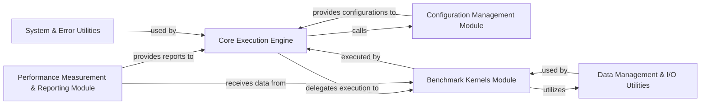

## Details

Abstract Components Overview

### Core Execution Engine [[Expand]](./Core_Execution_Engine.md)
The central orchestrator of the `h5bench` suite. It initializes the application, loads benchmark configurations, and coordinates the execution of various benchmark kernels. It acts as the primary control flow manager, driving the overall benchmarking process.

**Related Classes/Methods**:

- <a href="https://github.com/hpc-io/h5bench/blob/master/src/h5bench.py#L19-L952" target="_blank" rel="noopener noreferrer">`h5bench.H5bench` (19:952)</a>
- <a href="https://github.com/hpc-io/h5bench/blob/master/src/h5bench.py#L175-L252" target="_blank" rel="noopener noreferrer">`h5bench.H5bench:run` (175:252)</a>

### Configuration Management Module
Responsible for parsing, validating, and managing benchmark configurations. It provides the necessary parameters and settings to the Core Execution Engine and other modules.

**Related Classes/Methods**: _None_

### Benchmark Kernels Module
Encapsulates the logic for executing various benchmark tests, including generic I/O patterns, metadata operations, and application-specific benchmarks. It performs the actual I/O and computation tasks.

**Related Classes/Methods**: _None_

### Data Management & I/O Utilities
Provides functionalities for generating, manipulating, and managing data used in benchmarks, with a strong focus on HDF5 I/O operations. It abstracts the low-level data interactions.

**Related Classes/Methods**: _None_

### Performance Measurement & Reporting Module
Collects, processes, and aggregates performance metrics during and after benchmark execution. It is responsible for generating reports and presenting results.

**Related Classes/Methods**: _None_

### System & Error Utilities
Offers common system-level functionalities, including robust error handling, logging, and potentially interaction with the underlying operating system or MPI environment.

**Related Classes/Methods**: _None_

### [FAQ](https://github.com/CodeBoarding/GeneratedOnBoardings/tree/main?tab=readme-ov-file#faq)