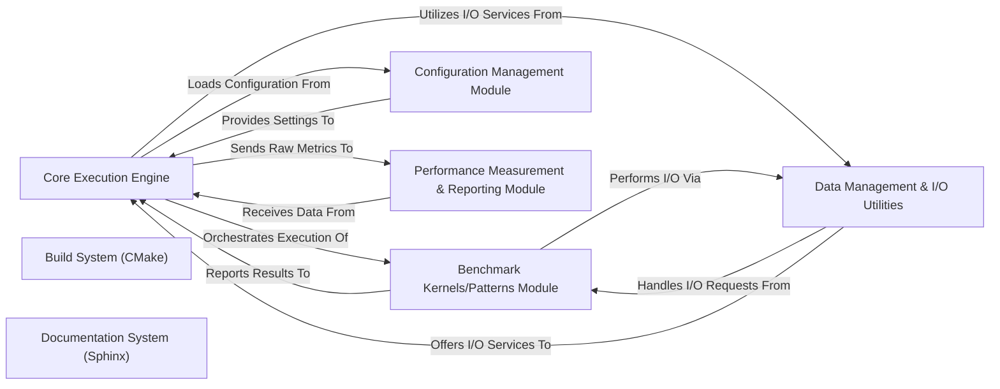

## Details

Component overview for the `Performance Reporting` subsystem, integrated into the broader architecture of the `h5bench` project.

### Core Execution Engine [[Expand]](./Core_Execution_Engine.md)
The central orchestrator of the benchmarking suite. It manages the overall flow, initializes components, schedules benchmark runs, and coordinates data collection.

**Related Classes/Methods**:

- `h5bench.core`

### Benchmark Kernels/Patterns Module
Encapsulates the specific I/O patterns and computational kernels to be benchmarked. These modules define the actual workload executed during a benchmark run.

**Related Classes/Methods**:

- `h5bench.benchmarks`

### Configuration Management Module
Responsible for parsing, validating, and applying configuration settings for benchmark runs. It ensures that the suite operates according to user-defined parameters.

**Related Classes/Methods**:

- `h5bench.config`

### Data Management & I/O Utilities
Provides functionalities for generating, reading, and writing data, particularly focusing on HDF5 operations. It abstracts the underlying I/O complexities.

**Related Classes/Methods**:

- `h5bench.io`

### Performance Measurement & Reporting Module
Collects, processes, and presents the performance metrics gathered during benchmark execution. This component is responsible for generating comprehensive reports, providing insights into throughput, latency, and other relevant performance indicators.

**Related Classes/Methods**:

- `h5bench.configure_log`

### Build System (CMake)
Manages the compilation, linking, and installation process of the entire benchmarking suite. It defines the project structure and dependencies for various platforms.

**Related Classes/Methods**:

- `CMakeLists.txt`

### Documentation System (Sphinx)
Generates comprehensive project documentation, including user guides, API references, and architectural overviews, from source files.

**Related Classes/Methods**:

- `docs`

### [FAQ](https://github.com/CodeBoarding/GeneratedOnBoardings/tree/main?tab=readme-ov-file#faq)