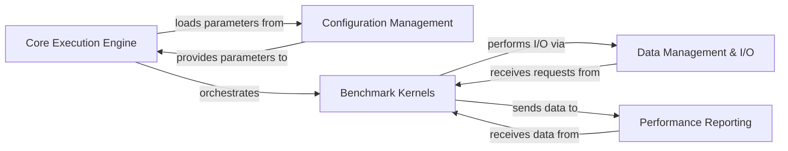

## Details

One paragraph explaining the functionality which is represented by this graph. What the main flow is and what is its purpose.

### Core Execution Engine [[Expand]](./Core_Execution_Engine.md)
The central orchestrator of the `h5bench` suite. It initializes the application, loads benchmark configurations, and coordinates the execution of various benchmark kernels. It acts as the primary control flow manager, driving the overall benchmarking process.

**Related Classes/Methods**:

- <a href="https://github.com/hpc-io/h5bench/blob/master/src/h5bench.py#L19-L952" target="_blank" rel="noopener noreferrer">`H5bench` (19:952)</a>
- <a href="https://github.com/hpc-io/h5bench/blob/master/src/h5bench.py#L175-L252" target="_blank" rel="noopener noreferrer">`H5bench:run` (175:252)</a>

### Configuration Management
Responsible for parsing, validating, and storing all benchmark-specific parameters. This component ensures that the benchmark execution is driven by user-defined settings, including I/O patterns and dataset characteristics.

**Related Classes/Methods**:

- `validate_json` (1:1)
- `prepare` (1:1)
- `h5bench_configuration` (1:1)

### Benchmark Kernels [[Expand]](./Benchmark_Kernels.md)
Contains the core logic for simulating different I/O patterns and data access methods. These kernels are the actual workloads that interact with the underlying data management layer to perform HDF5 operations and generate performance data.

**Related Classes/Methods**:

- `run_pattern` (1:1)
- `run_exerciser` (1:1)
- `run_metadata` (1:1)
- `run_amrex` (1:1)
- `run_openpmd` (1:1)
- `run_e3sm` (1:1)
- `run_macsio` (1:1)

### Data Management & I/O [[Expand]](./Data_Management_I_O.md)
Provides the low-level interface for interacting with HDF5 and MPI. It abstracts the complexities of file creation, data buffer management, and parallel read/write operations, serving as the bridge between the benchmark kernels and the storage system.

**Related Classes/Methods**:

- `prepare_parallel` (1:1)
- `prepare_vol` (1:1)
- `h5bench_util` (1:1)
- `h5bench_util` (1:1)

### Performance Reporting [[Expand]](./Performance_Reporting.md)
Collects, processes, and presents the performance metrics gathered during benchmark execution. This component is responsible for generating comprehensive reports, providing insights into throughput, latency, and other relevant performance indicators.

**Related Classes/Methods**:

- `configure_log` (1:1)

### [FAQ](https://github.com/CodeBoarding/GeneratedOnBoardings/tree/main?tab=readme-ov-file#faq)