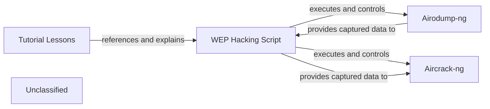

## Details

The Wireless Hacking Tutorials project is structured around a core `WEP Hacking Script` written in Python, which serves as a practical demonstration of WEP cracking. This script orchestrates the use of two essential external command-line tools: `Airodump-ng` for wireless network monitoring and packet capture, and `Aircrack-ng` for WEP key cracking. The `WEP Hacking Script` initiates packet capture via `Airodump-ng`, processes the captured data, and then feeds relevant information to `Aircrack-ng` to deduce the WEP key. Complementing this executable component are the `Tutorial Lessons`, which provide comprehensive educational content, likely in markdown format (e.g., `README.md`), guiding users through the setup, execution, and understanding of the WEP cracking process demonstrated by the script. This architecture highlights a clear separation between the instructional content, the primary automation script, and the specialized external tools it leverages.

### WEP Hacking Script
This is the central Python script (`wep_wifi_hacking.py`) that provides a practical, runnable demonstration of WEP cracking. It manages the lifecycle of external tools, handles packet capture, initiates deauthentication attacks, and attempts WEP key cracking. It serves as the primary executable example within the tutorial series.

**Related Classes/Methods**:

- <a href="https://github.com/amandewatnitrr/hacking-tutorial/blob/mainpython-scripts/wep_wifi_hacking.py" target="_blank" rel="noopener noreferrer">`python-scripts/wep_wifi_hacking.py`</a>

### Airodump-ng
An external command-line tool used by the WEP Hacking Script to monitor wireless networks, capture raw 802.11 frames, and save them to a file for later analysis.

**Related Classes/Methods**:

- `Airodump-ng`

### Aircrack-ng
An external command-line tool used by the WEP Hacking Script to crack WEP keys. It employs statistical methods on captured packets to deduce the WEP key.

**Related Classes/Methods**:

- `Aircrack-ng`

### Tutorial Lessons
This component represents the educational content (e.g., markdown files, documentation) that guides users through understanding, setting up, and running the WEP Hacking Script. It provides context, explanations, and step-by-step instructions for the WEP cracking process.

**Related Classes/Methods**:

- <a href="https://github.com/amandewatnitrr/hacking-tutorial/blob/mainREADME.md" target="_blank" rel="noopener noreferrer">`README.md`</a>

### Unclassified
Component for all unclassified files and utility functions (Utility functions/External Libraries/Dependencies)

**Related Classes/Methods**: _None_

### [FAQ](https://github.com/CodeBoarding/GeneratedOnBoardings/tree/main?tab=readme-ov-file#faq)