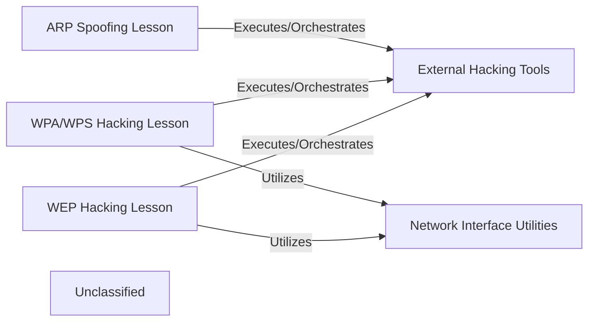

## Details

This project comprises a suite of educational Python scripts designed to demonstrate various network hacking techniques. The core architecture revolves around three distinct "Lesson" components: `ARP Spoofing Lesson`, `WPA/WPS Hacking Lesson`, and `WEP Hacking Lesson`. Each lesson orchestrates specific `External Hacking Tools` (Bettercap, Reaver, Airodump-ng) to perform its designated attack. A shared `Network Interface Utilities` component provides common functionalities, such as retrieving MAC addresses, utilized by the WPA/WPS and WEP hacking lessons. This modular design allows for clear separation of concerns, where each lesson focuses on a specific attack vector, leveraging external tools and internal utilities to achieve its educational objectives. The interactions primarily involve Python scripts executing external command-line tools and utilizing shared helper functions for network interface management.

### ARP Spoofing Lesson
An educational Python script demonstrating ARP spoofing attacks by orchestrating the `Bettercap` tool. It manages the execution flow and user interaction for the ARP spoofing process.

**Related Classes/Methods**:

- <a href="https://github.com/amandewatnitrr/hacking-tutorial/blob/mainpython-scripts/bettercap_arp_spoofing_script.py#L6-L72" target="_blank" rel="noopener noreferrer">`main`:6-72</a>
- <a href="https://github.com/amandewatnitrr/hacking-tutorial/blob/mainpython-scripts/bettercap_arp_spoofing_script.py#L23-L25" target="_blank" rel="noopener noreferrer">`send`:23-25</a>

### WPA/WPS Hacking Lesson
An educational Python script illustrating WPA/WPS cracking techniques, primarily by interacting with the `Reaver` tool. It handles interface configuration and the execution of the Reaver attack.

**Related Classes/Methods**:

- <a href="https://github.com/amandewatnitrr/hacking-tutorial/blob/mainpython-scripts/wpa_wps_hack.py#L33-L49" target="_blank" rel="noopener noreferrer">`wpa_wps_hack`:33-49</a>
- <a href="https://github.com/amandewatnitrr/hacking-tutorial/blob/mainpython-scripts/wpa_wps_hack.py#L15-L31" target="_blank" rel="noopener noreferrer">`run_reaver`:15-31</a>

### WEP Hacking Lesson [[Expand]](./WEP_Hacking_Lesson.md)
An educational Python script designed to illustrate WEP cracking methods, leveraging the `Airodump-ng` and `Aircrack-ng` tools. It manages packet capture, deauthentication attacks, and WEP key cracking.

**Related Classes/Methods**:

- <a href="https://github.com/amandewatnitrr/hacking-tutorial/blob/mainpython-scripts/wep_wifi_hacking.py#L66-L107" target="_blank" rel="noopener noreferrer">`wep_wifi_hacking`:66-107</a>
- <a href="https://github.com/amandewatnitrr/hacking-tutorial/blob/mainpython-scripts/wep_wifi_hacking.py#L86-L87" target="_blank" rel="noopener noreferrer">`airodump_thread_func`:86-87</a>
- <a href="https://github.com/amandewatnitrr/hacking-tutorial/blob/mainpython-scripts/wep_wifi_hacking.py#L21-L64" target="_blank" rel="noopener noreferrer">`run_airodump`:21-64</a>

### Network Interface Utilities
A shared utility module providing common functions for interacting with network interfaces, such as retrieving MAC addresses, used by multiple lesson scripts.

**Related Classes/Methods**:

- <a href="https://github.com/amandewatnitrr/hacking-tutorial/blob/mainpython-scripts/wpa_wps_hack.py#L6-L13" target="_blank" rel="noopener noreferrer">`get_interface_mac`:6-13</a>
- <a href="https://github.com/amandewatnitrr/hacking-tutorial/blob/mainpython-scripts/wpa_wps_hack.py#L6-L13" target="_blank" rel="noopener noreferrer">`get_interface_mac`:6-13</a>

### External Hacking Tools
Represents the collection of external command-line tools (`Bettercap`, `Reaver`, `Airodump-ng`, `Aircrack-ng`, `Aireplay-ng`) that are orchestrated by the lesson scripts to perform specific hacking tasks. These tools are invoked as subprocesses by the Python scripts.

**Related Classes/Methods**:

- <a href="https://github.com/amandewatnitrr/hacking-tutorial/blob/main." target="_blank" rel="noopener noreferrer">`Bettercap`</a>
- <a href="https://github.com/amandewatnitrr/hacking-tutorial/blob/mainpython-scripts/wpa_wps_hack.py#L15-L31" target="_blank" rel="noopener noreferrer">`Reaver`:15-31</a>
- <a href="https://github.com/amandewatnitrr/hacking-tutorial/blob/mainpython-scripts/wep_wifi_hacking.py#L21-L64" target="_blank" rel="noopener noreferrer">`Airodump-ng`:21-64</a>
- <a href="https://github.com/amandewatnitrr/hacking-tutorial/blob/main." target="_blank" rel="noopener noreferrer">`Aircrack-ng`</a>
- <a href="https://github.com/amandewatnitrr/hacking-tutorial/blob/main." target="_blank" rel="noopener noreferrer">`Aireplay-ng`</a>

### Unclassified
Component for all unclassified files and utility functions (Utility functions/External Libraries/Dependencies)

**Related Classes/Methods**: _None_

### [FAQ](https://github.com/CodeBoarding/GeneratedOnBoardings/tree/main?tab=readme-ov-file#faq)