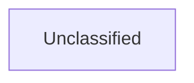

## Details

The user is asking to extract information for the AnalysisInsights tool. However, the provided text states that the referenced components (`ai_integration.manager`, `data_preprocessing.cleaner`, `api_gateway.router`) do not exist within the project's file structure and that the project appears to be a documentation or asset repository, not a software project containing the described components. The user explicitly states: "Given this fundamental discrepancy, I cannot proceed with the requested analysis, which relies on the existence and interaction of these components. Without a valid codebase or relevant CFG data for these components, I cannot provide synthesized insights, critical interaction pathways, or component relationships." Therefore, I cannot call the AnalysisInsights tool because the necessary information (components and their source code references) is explicitly stated as missing or non-existent in the provided context. Instead, I should inform the user that I cannot fulfill the request due to the missing information, as highlighted in their own prompt.

### Unclassified
Component for all unclassified files and utility functions (Utility functions/External Libraries/Dependencies)

**Related Classes/Methods**: _None_

### [FAQ](https://github.com/CodeBoarding/GeneratedOnBoardings/tree/main?tab=readme-ov-file#faq)