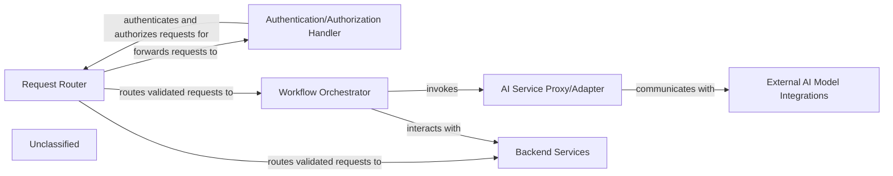

## Details

The API Gateway subsystem acts as the primary entry point for client requests, ensuring secure and orchestrated access to the SDLC suite's functionalities. The `Request Router` initially directs incoming requests, which are then forwarded to the `Authentication/Authorization Handler` for identity verification and permission checks. Once validated, requests are routed either to the `Workflow Orchestrator` for complex, multi-step processes or directly to `Backend Services` for specialized operations. The `Workflow Orchestrator` coordinates internal services and leverages the `AI Service Proxy/Adapter` to interact with `External AI Model Integrations`, standardizing communication and managing external AI providers. This architecture ensures a clear separation of concerns, secure access, and efficient orchestration of both internal and external AI-powered capabilities within the SDLC suite.

### Request Router
Directs incoming client requests to the appropriate internal backend service, authentication handler, or workflow orchestration logic based on predefined rules. It is the initial point of contact within the subsystem.

**Related Classes/Methods**:

- `ConceptualComponent`

### Authentication/Authorization Handler
Verifies the identity of the requesting client and determines their permissions to access specific resources or execute particular workflows. It ensures secure access to the system's functionalities.

**Related Classes/Methods**:

- `ConceptualComponent`

### Workflow Orchestrator
Manages the execution of complex, multi-step processes that often involve interactions with various internal services and external AI models. It coordinates the flow of data and control between different components to achieve a specific outcome.

**Related Classes/Methods**:

- `ConceptualComponent`

### AI Service Proxy/Adapter
Acts as an intermediary for all communications with external AI model providers (e.g., Azure OpenAI, AWS Bedrock, Google Gemini). It standardizes request and response formats, handles API key management, and potentially implements caching or rate limiting.

**Related Classes/Methods**:

- `ConceptualComponent`

### Backend Services
Represents the various specialized services within the SDLC suite (e.g., code analysis, test generation, requirements management) that process requests routed by the API Gateway.

**Related Classes/Methods**:

- `ConceptualComponent`

### External AI Model Integrations
Represents the external AI model providers (e.g., Azure OpenAI, OpenAI Native, AWS Bedrock, Google Gemini) that the `AI Service Proxy/Adapter` communicates with to leverage advanced AI capabilities.

**Related Classes/Methods**:

- `ConceptualComponent`

### Unclassified
Component for all unclassified files and utility functions (Utility functions/External Libraries/Dependencies)

**Related Classes/Methods**: _None_

### [FAQ](https://github.com/CodeBoarding/GeneratedOnBoardings/tree/main?tab=readme-ov-file#faq)