```mermaid
graph LR
    Workflow_Orchestrator["Workflow Orchestrator"]
    Task_Dispatcher["Task Dispatcher"]
    Build_Executor["Build Executor"]
    Test_Executor["Test Executor"]
    Deployment_Executor["Deployment Executor"]
    Environment_Provisioning_Service["Environment Provisioning Service"]
    Event_Notification_Hub["Event & Notification Hub"]
    External_Integration_Adapters["External Integration Adapters"]
    Unclassified["Unclassified"]
    Workflow_Orchestrator -- "orchestrates" --> Task_Dispatcher
    Workflow_Orchestrator -- "receives updates from" --> Event_Notification_Hub
    Task_Dispatcher -- "dispatches tasks to" --> Build_Executor
    Task_Dispatcher -- "dispatches tasks to" --> Test_Executor
    Task_Dispatcher -- "dispatches tasks to" --> Deployment_Executor
    Build_Executor -- "requests environment from" --> Environment_Provisioning_Service
    Build_Executor -- "sends events to" --> Event_Notification_Hub
    Build_Executor -- "utilizes" --> External_Integration_Adapters
    Test_Executor -- "requests environment from" --> Environment_Provisioning_Service
    Test_Executor -- "sends events to" --> Event_Notification_Hub
    Test_Executor -- "utilizes" --> External_Integration_Adapters
    Deployment_Executor -- "requests environment from" --> Environment_Provisioning_Service
    Deployment_Executor -- "sends events to" --> Event_Notification_Hub
    Deployment_Executor -- "utilizes" --> External_Integration_Adapters
    Environment_Provisioning_Service -- "provides environments for" --> Build_Executor
    Environment_Provisioning_Service -- "provides environments for" --> Test_Executor
    Environment_Provisioning_Service -- "provides environments for" --> Deployment_Executor
    Environment_Provisioning_Service -- "integrates with" --> External_Integration_Adapters
    Event_Notification_Hub -- "notifies" --> Workflow_Orchestrator
    Event_Notification_Hub -- "receives events from" --> Build_Executor
    Event_Notification_Hub -- "receives events from" --> Test_Executor
    Event_Notification_Hub -- "receives events from" --> Deployment_Executor
```

## Details

The system operates as an event-driven automation engine, centered around a Workflow Orchestrator that defines and manages the execution of complex pipelines. The Task Dispatcher intelligently assigns individual tasks to specialized Build, Test, and Deployment Executors. These executors rely on the Environment Provisioning Service to dynamically create and manage isolated execution environments. All components communicate asynchronously through the Event & Notification Hub, which also provides status updates to the Workflow Orchestrator. External interactions with various tools and platforms are standardized and managed by the External Integration Adapters, ensuring seamless integration across the ecosystem.

### Workflow Orchestrator
Manages the definition, scheduling, and execution flow of complex automation pipelines. It interprets workflow definitions, manages dependencies between tasks, and ensures proper sequencing.

**Related Classes/Methods**:

- `unknown_source_code`

### Task Dispatcher
Responsible for receiving individual task requests from the Workflow Orchestrator and intelligently assigning them to available and appropriate Task Executors.

**Related Classes/Methods**:

- `unknown_source_code`

### Build Executor
Specializes in executing build-related tasks, including code compilation, dependency resolution, artifact generation, and static code analysis.

**Related Classes/Methods**:

- `unknown_source_code`

### Test Executor
Focuses on running diverse automated tests (unit, integration, end-to-end, performance, security). It manages test environments, collects test results, and integrates with testing frameworks.

**Related Classes/Methods**:

- `unknown_source_code`

### Deployment Executor
Handles the automated deployment of applications and services to various target environments (e.g., development, staging, production).

**Related Classes/Methods**:

- `unknown_source_code`

### Environment Provisioning Service
Dynamically provisions and manages isolated execution environments (e.g., containers, virtual machines) required by the executors for tasks.

**Related Classes/Methods**:

- `unknown_source_code`

### Event & Notification Hub
A central messaging system for asynchronous communication between all components within the engine and with external systems.

**Related Classes/Methods**:

- `unknown_source_code`

### External Integration Adapters
A set of specialized modules that provide a standardized interface for the engine to interact with various external tools and platforms.

**Related Classes/Methods**:

- `unknown_source_code`

### Unclassified
Component for all unclassified files and utility functions (Utility functions/External Libraries/Dependencies)

**Related Classes/Methods**: _None_

### [FAQ](https://github.com/CodeBoarding/GeneratedOnBoardings/tree/main?tab=readme-ov-file#faq)