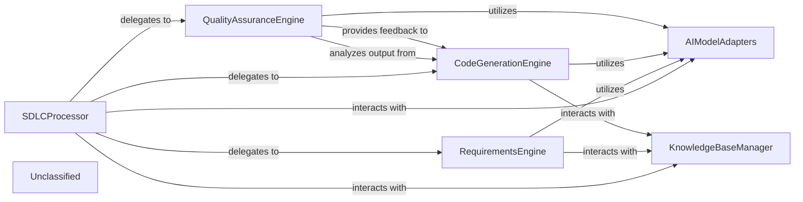

## Details

The AI-driven SDLC system is orchestrated by the `SDLCProcessor`, which acts as the central hub for managing the entire software development lifecycle. It delegates specialized tasks to dedicated engines: `RequirementsEngine` for generating detailed requirements, `CodeGenerationEngine` for automated code creation, and `QualityAssuranceEngine` for comprehensive quality assurance. All these components, including the `SDLCProcessor` itself, interact with `AIModelAdapters` to abstract and standardize communication with various underlying AI models. A `KnowledgeBaseManager` serves as a crucial repository, providing domain-specific knowledge, project context, and coding standards to all engines, ensuring that AI-generated outputs are grounded in relevant information. This architecture promotes modularity, allowing for independent development and scaling of each SDLC phase while maintaining a cohesive and intelligent workflow.

### SDLCProcessor
The primary orchestrator for all AI-driven SDLC tasks. It receives requests for SDLC operations (e.g., generate requirements, create code, perform QA checks), dispatches them to appropriate AI models or specialized sub-components, and consolidates the results. This component is fundamental as the entry point and coordinator for all AI-enhanced SDLC workflows.

**Related Classes/Methods**:

- `SDLCProcessor`

### AIModelAdapters
Provides a standardized interface for interacting with various underlying AI models (Azure OpenAI, OpenAI Native, AWS Bedrock, Google Gemini). Each adapter handles the specifics of API calls, request/response formatting, and error handling for its respective AI model. This component is crucial for abstracting AI model diversity and ensuring extensibility.

**Related Classes/Methods**:

- `AIModelAdapters`

### RequirementsEngine
Specializes in AI-powered requirements engineering. This component takes high-level descriptions or user stories and, using AI models, generates detailed functional and non-functional requirements, user stories, or acceptance criteria. It is a core SDLC service, automating a critical initial phase.

**Related Classes/Methods**:

- `RequirementsEngine`

### CodeGenerationEngine
Focuses on AI-driven code generation. It takes requirements or design specifications and, using AI models, generates code snippets, functions, classes, or even entire modules in specified programming languages. This component directly addresses the acceleration of development.

**Related Classes/Methods**:

- `CodeGenerationEngine`

### QualityAssuranceEngine
Provides AI-powered quality assurance services. This includes generating test cases, performing static code analysis, identifying potential bugs, or suggesting code improvements based on AI model analysis. This component ensures the quality and reliability of generated or existing code.

**Related Classes/Methods**:

- `QualityAssuranceEngine`

### KnowledgeBaseManager
Manages the retrieval and storage of domain-specific knowledge, project context, coding standards, and best practices. This component interfaces with a knowledge base for efficient similarity search and retrieval of relevant information for AI models. It is vital for grounding AI models in project-specific context.

**Related Classes/Methods**:

- `KnowledgeBaseManager`

### Unclassified
Component for all unclassified files and utility functions (Utility functions/External Libraries/Dependencies)

**Related Classes/Methods**: _None_

### [FAQ](https://github.com/CodeBoarding/GeneratedOnBoardings/tree/main?tab=readme-ov-file#faq)