```mermaid
graph LR
    User_Interface_Client_Applications["User Interface/Client Applications"]
    Document_Ingestion["Document Ingestion"]
    Text_Processing_Embedding["Text Processing & Embedding"]
    Data_Storage_Management["Data Storage & Management"]
    Query_Processing_Retrieval["Query Processing & Retrieval"]
    Unclassified["Unclassified"]
    User_Interface_Client_Applications -- "sends user queries to" --> Query_Processing_Retrieval
    User_Interface_Client_Applications -- "receives and displays results from" --> Query_Processing_Retrieval
    Document_Ingestion -- "sends raw documents to" --> Text_Processing_Embedding
    Text_Processing_Embedding -- "receives documents from" --> Document_Ingestion
    Text_Processing_Embedding -- "stores processed text and embeddings into" --> Data_Storage_Management
    Data_Storage_Management -- "receives processed data and embeddings from" --> Text_Processing_Embedding
    Data_Storage_Management -- "provides stored data to" --> Query_Processing_Retrieval
    Query_Processing_Retrieval -- "receives user queries from" --> User_Interface_Client_Applications
    Query_Processing_Retrieval -- "retrieves relevant data from" --> Data_Storage_Management
    Query_Processing_Retrieval -- "sends retrieved results to" --> User_Interface_Client_Applications
    click Data_Storage_Management href "https://github.com/CodeBoarding/GeneratedOnBoardings/blob/main/hai-build/Data_Storage_Management.md" "Details"
```

## Details

The SDLC Acceleration Suite is conceptually structured around five core components: User Interface/Client Applications, Document Ingestion, Text Processing & Embedding, Data Storage & Management, and Query Processing & Retrieval. The User Interface serves as the primary interaction point, allowing users to submit queries and view results. Document Ingestion handles the initial intake of various document types, which are then passed to Text Processing & Embedding for conversion into a searchable format. All processed data, including embeddings, is persistently stored and managed by the Data Storage & Management component. User queries are handled by Query Processing & Retrieval, which leverages the stored data to find and deliver relevant information back to the User Interface. This architecture emphasizes a clear flow of data from ingestion and processing to storage and retrieval, supporting an AI-driven approach to SDLC acceleration.

### User Interface/Client Applications
Provides the primary interface for users to interact with the SDLC Acceleration Suite, enabling query input, document submission, and display of AI-generated insights and retrieved information.

**Related Classes/Methods**: _None_

### Document Ingestion
Responsible for the initial intake of various document types (e.g., requirements, code, test results) into the system, preparing them for further processing.

**Related Classes/Methods**: _None_

### Text Processing & Embedding
Processes raw document text, extracts meaningful information, and converts it into numerical embeddings suitable for efficient storage, similarity search, and AI model consumption.

**Related Classes/Methods**: _None_

### Data Storage & Management [[Expand]](./Data_Storage_Management.md)
Provides persistent storage and management for all project-related data, including raw documents, processed text, embeddings, requirements, generated code, test results, AI model configurations, and user data.

**Related Classes/Methods**: _None_

### Query Processing & Retrieval
Manages user queries, processes them to understand intent, and retrieves the most relevant documents or information snippets from the stored data using embedding-based search.

**Related Classes/Methods**: _None_

### Unclassified
Component for all unclassified files and utility functions (Utility functions/External Libraries/Dependencies)

**Related Classes/Methods**: _None_

### [FAQ](https://github.com/CodeBoarding/GeneratedOnBoardings/tree/main?tab=readme-ov-file#faq)