```mermaid
graph LR
    Client_Applications["Client Applications"]
    API_Gateway_Orchestration["API Gateway & Orchestration"]
    Core_AI_SDLC_Services["Core AI SDLC Services"]
    AI_Model_Integration_Layer["AI Model Integration Layer"]
    Data_Storage_Management["Data Storage & Management"]
    Automation_Execution_Engine["Automation & Execution Engine"]
    OmniParser_Utility["OmniParser Utility"]
    Unclassified["Unclassified"]
    Client_Applications -- "initiates requests to" --> API_Gateway_Orchestration
    API_Gateway_Orchestration -- "routes requests for SDLC tasks to" --> Core_AI_SDLC_Services
    API_Gateway_Orchestration -- "routes automation requests to" --> Automation_Execution_Engine
    Core_AI_SDLC_Services -- "sends prompts and data for AI processing to" --> AI_Model_Integration_Layer
    Core_AI_SDLC_Services -- "stores and retrieves SDLC artifacts from" --> Data_Storage_Management
    Core_AI_SDLC_Services -- "utilizes parsing capabilities from" --> OmniParser_Utility
    Automation_Execution_Engine -- "stores and retrieves execution logs and artifacts from" --> Data_Storage_Management
    Automation_Execution_Engine -- "retrieves generated code and triggers tests within" --> Core_AI_SDLC_Services
    click API_Gateway_Orchestration href "https://github.com/CodeBoarding/GeneratedOnBoardings/blob/main/hai-build/API_Gateway_Orchestration.md" "Details"
    click Core_AI_SDLC_Services href "https://github.com/CodeBoarding/GeneratedOnBoardings/blob/main/hai-build/Core_AI_SDLC_Services.md" "Details"
    click AI_Model_Integration_Layer href "https://github.com/CodeBoarding/GeneratedOnBoardings/blob/main/hai-build/AI_Model_Integration_Layer.md" "Details"
    click Data_Storage_Management href "https://github.com/CodeBoarding/GeneratedOnBoardings/blob/main/hai-build/Data_Storage_Management.md" "Details"
    click Automation_Execution_Engine href "https://github.com/CodeBoarding/GeneratedOnBoardings/blob/main/hai-build/Automation_Execution_Engine.md" "Details"
```

## Details

The `hai-build` project is architected as a cohesive system designed to streamline the AI-driven Software Development Life Cycle. User interactions originate from `Client Applications`, which communicate through a central `API Gateway & Orchestration` layer. This gateway intelligently directs requests to either the `Core AI SDLC Services` for intelligent task execution, such as requirements engineering and code generation, or to the `Automation & Execution Engine` for managing and running automated workflows. The `Core AI SDLC Services` leverages an `AI Model Integration Layer` to interact with various AI providers and an `OmniParser Utility` for efficient data extraction. All persistent data, including SDLC artifacts, configurations, and execution logs, are managed by the `Data Storage & Management` component. This logical separation of concerns ensures a scalable and maintainable architecture, providing a clear flow of data and control across the SDLC process.

### Client Applications
Provides the interactive front-end for users, enabling them to initiate SDLC tasks, view results, and configure the suite. This component encompasses various client types (web, desktop, IDE plugins).

**Related Classes/Methods**:

- `client_applications.main`

### API Gateway & Orchestration [[Expand]](./API_Gateway_Orchestration.md)
Acts as the central entry point for all client requests, routing them to appropriate backend services. It handles authentication, authorization, and orchestrates complex workflows involving multiple services.

**Related Classes/Methods**:

- `api_gateway.router`

### Core AI SDLC Services [[Expand]](./Core_AI_SDLC_Services.md)
The central intelligence hub, encompassing AI-powered services for requirements engineering, code generation, and quality assurance. It processes SDLC-specific tasks using AI models.

**Related Classes/Methods**:

- `core_sdlc_services.processor`

### AI Model Integration Layer [[Expand]](./AI_Model_Integration_Layer.md)
Manages the integration with diverse AI models (Azure OpenAI, OpenAI Native, AWS Bedrock, Google Gemini), handling dynamic model selection, prompt engineering, and secure communication.

**Related Classes/Methods**:

- `ai_integration.manager`

### Data Storage & Management [[Expand]](./Data_Storage_Management.md)
Provides persistent storage and management for all project-related data, including requirements, generated code, test results, AI model configurations, and user data.

**Related Classes/Methods**:

- `data_storage.database`

### Automation & Execution Engine [[Expand]](./Automation_Execution_Engine.md)
Orchestrates and executes various automation tasks across the SDLC, such as build pipelines, deployment scripts, and running automated tests, integrating with CI/CD tools.

**Related Classes/Methods**:

- `automation_engine.executor`

### OmniParser Utility
A specialized utility service designed for parsing and extracting structured information from diverse unstructured or semi-structured formats (e.g., code files, documentation).

**Related Classes/Methods**:

- `omni_parser.parser`

### Unclassified
Component for all unclassified files and utility functions (Utility functions/External Libraries/Dependencies)

**Related Classes/Methods**: _None_

### [FAQ](https://github.com/CodeBoarding/GeneratedOnBoardings/tree/main?tab=readme-ov-file#faq)