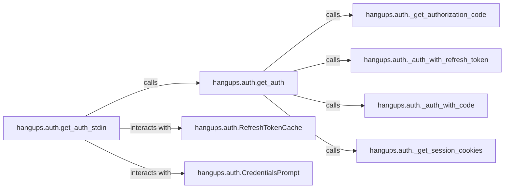

## Details

The `Authentication Manager` subsystem is primarily encapsulated within the `hangups/auth.py` module. It is responsible for managing the entire authentication lifecycle with Google, providing secure session credentials for the `hangups` library and its CLI tool.

### hangups.auth.get_auth
Serves as the primary entry point and facade for the authentication process. It orchestrates the entire authentication flow, attempting various methods (e.g., refresh token, authorization code) to acquire valid session credentials.

**Related Classes/Methods**:

- <a href="https://github.com/tdryer/hangups/blob/master/hangups/auth.py#L170-L213" target="_blank" rel="noopener noreferrer">`hangups.auth.get_auth`:170-213</a>

### hangups.auth._get_authorization_code
Manages the process of obtaining an initial authorization code from Google, potentially involving simulated browser interactions for user consent.

**Related Classes/Methods**:

- <a href="https://github.com/tdryer/hangups/blob/master/hangups/auth.py#L298-L339" target="_blank" rel="noopener noreferrer">`hangups.auth._get_authorization_code`:298-339</a>

### hangups.auth._auth_with_refresh_token
Handles non-interactive authentication by using a previously obtained refresh token to acquire new access tokens and session credentials.

**Related Classes/Methods**:

- <a href="https://github.com/tdryer/hangups/blob/master/hangups/auth.py#L342-L357" target="_blank" rel="noopener noreferrer">`hangups.auth._auth_with_refresh_token`:342-357</a>

### hangups.auth._auth_with_code
Exchanges a newly acquired authorization code for access tokens and session credentials.

**Related Classes/Methods**:

- <a href="https://github.com/tdryer/hangups/blob/master/hangups/auth.py#L360-L376" target="_blank" rel="noopener noreferrer">`hangups.auth._auth_with_code`:360-376</a>

### hangups.auth._get_session_cookies
Extracts and processes session cookies from the authentication response, which are crucial for subsequent interactions with the Hangouts API.

**Related Classes/Methods**:

- <a href="https://github.com/tdryer/hangups/blob/master/hangups/auth.py#L401-L430" target="_blank" rel="noopener noreferrer">`hangups.auth._get_session_cookies`:401-430</a>

### hangups.auth.get_auth_stdin
Provides a command-line interface (CLI) for user-driven authentication, facilitating interactive input for credentials and authorization. This component specifically caters to the "CLI Tool" aspect of the project.

**Related Classes/Methods**:

- <a href="https://github.com/tdryer/hangups/blob/master/hangups/auth.py#L216-L231" target="_blank" rel="noopener noreferrer">`hangups.auth.get_auth_stdin`:216-231</a>

### hangups.auth.RefreshTokenCache
Manages the storage and retrieval of refresh tokens, enabling persistent and non-interactive authentication sessions.

**Related Classes/Methods**:

- <a href="https://github.com/tdryer/hangups/blob/master/hangups/auth.py#L131-L167" target="_blank" rel="noopener noreferrer">`hangups.auth.RefreshTokenCache`:131-167</a>

### hangups.auth.CredentialsPrompt
Handles interactive prompting for user credentials and authorization, typically used in CLI-based authentication flows.

**Related Classes/Methods**:

- <a href="https://github.com/tdryer/hangups/blob/master/hangups/auth.py#L90-L128" target="_blank" rel="noopener noreferrer">`hangups.auth.CredentialsPrompt`:90-128</a>

### [FAQ](https://github.com/CodeBoarding/GeneratedOnBoardings/tree/main?tab=readme-ov-file#faq)