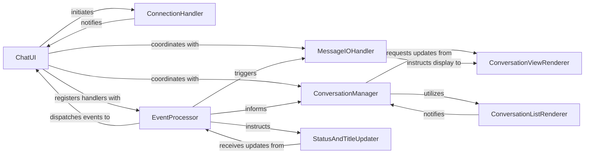

## Details

The `hangups` UI subsystem is designed with a clear separation of concerns, centered around the `ChatUI` component which acts as the primary orchestrator. It delegates connection management to `ConnectionHandler` and event processing to `EventProcessor`. The `EventProcessor` is crucial for routing various events, including user input and backend notifications, to the appropriate components. Conversation display and navigation are managed by `ConversationManager`, which interacts with `ConversationViewRenderer` for detailed conversation views and `ConversationListRenderer` for the overall list. Message input and output are handled by `MessageIOHandler`, which also interfaces with `ConversationViewRenderer`. Finally, `StatusAndTitleUpdater` ensures the UI provides real-time feedback on application status. This modular design facilitates maintainability and allows for independent development of UI features.

### ChatUI
Initializes and manages the overall CLI application lifecycle, including UI setup, connection handling, and the main event loop. It acts as the central facade for the UI.

**Related Classes/Methods**:

- <a href="https://github.com/tdryer/hangups/blob/master/hangups/ui/__main__.py#L72-L254" target="_blank" rel="noopener noreferrer">`ChatUI`:72-254</a>

### ConnectionHandler
Manages the connection state to the hangups backend, including establishing, maintaining, and handling disconnections/reconnections.

**Related Classes/Methods**:

- <a href="https://github.com/tdryer/hangups/blob/master/hangups/ui/__main__.py" target="_blank" rel="noopener noreferrer">`ConnectionHandler`</a>

### EventProcessor
Centralized processing and dispatching of various events, including user input (keyboard) and asynchronous events from the hangups protocol (e.g., new messages, typing notifications, watermark updates).

**Related Classes/Methods**:

- <a href="https://github.com/tdryer/hangups/blob/master/hangups/ui/__main__.py" target="_blank" rel="noopener noreferrer">`EventProcessor`</a>

### ConversationManager
Manages the display, selection, and navigation between different conversations within the UI, including adding new conversation tabs and switching between them.

**Related Classes/Methods**:

- <a href="https://github.com/tdryer/hangups/blob/master/hangups/ui/__main__.py" target="_blank" rel="noopener noreferrer">`ConversationManager`</a>

### MessageIOHandler
Handles the input of new messages from the user and the display of incoming and outgoing messages within the conversation view.

**Related Classes/Methods**:

- <a href="https://github.com/tdryer/hangups/blob/master/hangups/ui/__main__.py" target="_blank" rel="noopener noreferrer">`MessageIOHandler`</a>

### ConversationViewRenderer
Renders the detailed view of a single active conversation, including the list of messages/events and the message input area.

**Related Classes/Methods**:

- <a href="https://github.com/tdryer/hangups/blob/master/hangups/ui/__main__.py" target="_blank" rel="noopener noreferrer">`ConversationViewRenderer`</a>

### ConversationListRenderer
Renders the list of available conversations, allowing the user to browse and select a conversation to view.

**Related Classes/Methods**:

- <a href="https://github.com/tdryer/hangups/blob/master/hangups/ui/__main__.py" target="_blank" rel="noopener noreferrer">`ConversationListRenderer`</a>

### StatusAndTitleUpdater
Manages the dynamic updates to the application's status line (e.g., connection status, current message) and the terminal window title.

**Related Classes/Methods**:

- <a href="https://github.com/tdryer/hangups/blob/master/hangups/ui/__main__.py" target="_blank" rel="noopener noreferrer">`StatusAndTitleUpdater`</a>

### [FAQ](https://github.com/CodeBoarding/GeneratedOnBoardings/tree/main?tab=readme-ov-file#faq)