```mermaid
graph LR
    hangups_conversation_ConversationList["hangups.conversation.ConversationList"]
    hangups_conversation_Conversation["hangups.conversation.Conversation"]
    hangups_event["hangups.event"]
    hangups_conversation_event["hangups.conversation_event"]
    hangups_conversation_event_ChatMessageSegment["hangups.conversation_event.ChatMessageSegment"]
    hangups_conversation_ConversationList -- "manages" --> hangups_conversation_Conversation
    hangups_conversation_Conversation -- "processes events from" --> hangups_event
    hangups_conversation_Conversation -- "uses" --> hangups_conversation_event
    hangups_event -- "defines events for" --> hangups_conversation_Conversation
    hangups_event -- "defines events for" --> hangups_conversation_event
    hangups_conversation_event -- "creates" --> hangups_conversation_event_ChatMessageSegment
```

## Details

The `Conversation & Event Management` subsystem is primarily defined by the modules: `hangups/conversation.py`, `hangups/conversation_event.py`, and `hangups/event.py`. These files encapsulate the logic for managing conversation states, handling various types of events, and structuring message content within the `hangups` library.

### hangups.conversation.ConversationList
This component serves as the primary registry and manager for all active conversations. It provides a high-level interface for accessing, adding, and synchronizing the state of multiple `Conversation` instances, acting as a central hub for conversation management.

**Related Classes/Methods**:

- <a href="https://github.com/tdryer/hangups/blob/master/hangups/conversation.py#L889-L1182" target="_blank" rel="noopener noreferrer">`hangups.conversation.ConversationList`:889-1182</a>

### hangups.conversation.Conversation
This is the core component responsible for managing the state and lifecycle of a single conversation. It processes incoming events (e.g., new messages, membership changes) to update its internal state, maintains message history, and prepares outgoing actions related to that specific conversation.

**Related Classes/Methods**:

- <a href="https://github.com/tdryer/hangups/blob/master/hangups/conversation.py" target="_blank" rel="noopener noreferrer">`hangups.conversation.Conversation`</a>

### hangups.event
This foundational component defines the base classes and structures for all events within the `hangups` system. It establishes a common interface and hierarchy for various event types, crucial for the project's event-driven architecture, allowing for consistent event dispatching and handling.

**Related Classes/Methods**:

- <a href="https://github.com/tdryer/hangups/blob/master/hangups/event.py#L1-L1000" target="_blank" rel="noopener noreferrer">`hangups.event`:1-1000</a>

### hangups.conversation_event
This component specializes in processing and structuring events specifically related to conversations, particularly chat messages. It handles the parsing, serialization, and deserialization of message content, ensuring that raw protocol data is transformed into usable event objects.

**Related Classes/Methods**:

- <a href="https://github.com/tdryer/hangups/blob/master/hangups/conversation_event.py#L1-L1000" target="_blank" rel="noopener noreferrer">`hangups.conversation_event`:1-1000</a>

### hangups.conversation_event.ChatMessageSegment
This component represents a structured segment of a chat message, allowing for rich text formatting, links, and other complex message components. It acts as a data transfer object (DTO) for message content, enabling detailed and structured representation of conversation messages.

**Related Classes/Methods**:

- <a href="https://github.com/tdryer/hangups/blob/master/hangups/conversation_event.py#L50-L141" target="_blank" rel="noopener noreferrer">`hangups.conversation_event.ChatMessageSegment`:50-141</a>

### [FAQ](https://github.com/CodeBoarding/GeneratedOnBoardings/tree/main?tab=readme-ov-file#faq)