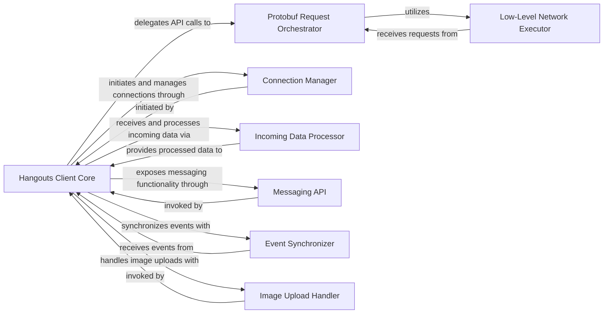

## Details

The Hangouts Client Core subsystem is primarily defined by the hangups.client.Client class and its closely related internal components within the hangups/client.py module. It acts as the central orchestrator and facade for all high-level, asynchronous interactions with the Hangouts protocol, abstracting away the underlying complexities of network communication and protocol specifics.

### Hangouts Client Core [[Expand]](./Hangouts_Client_Core.md)
The primary facade and orchestrator for all high-level, asynchronous interactions with the Hangouts protocol. It provides a simplified, unified interface for external consumers to access various Hangouts functionalities, abstracting away underlying protocol complexities. It manages the overall client lifecycle, delegates specific tasks to internal helper components, and maintains the client's state.

**Related Classes/Methods**:

- <a href="https://github.com/tdryer/hangups/blob/master/hangups/client.py#L30-L684" target="_blank" rel="noopener noreferrer">`hangups.client.Client`:30-684</a>

### Protobuf Request Orchestrator
Responsible for constructing, serializing, and preparing protobuf requests to be sent to the Hangouts server, ensuring they conform to the Hangouts protocol specifications.

**Related Classes/Methods**:

- <a href="https://github.com/tdryer/hangups/blob/master/hangups/client.py#L402-L438" target="_blank" rel="noopener noreferrer">`hangups.client._pb_request`:402-438</a>

### Low-Level Network Executor
Handles the actual low-level network communication, including sending serialized requests and receiving raw responses over the network connection. It is the interface to the underlying transport layer.

**Related Classes/Methods**:

- <a href="https://github.com/tdryer/hangups/blob/master/hangups/client.py#L440-L474" target="_blank" rel="noopener noreferrer">`hangups.client._base_request`:440-474</a>

### Connection Manager
Manages the lifecycle of the persistent connection to the Hangouts server, including establishing, maintaining, and gracefully closing the connection.

**Related Classes/Methods**:

- <a href="https://github.com/tdryer/hangups/blob/master/hangups/client.py#L116-L150" target="_blank" rel="noopener noreferrer">`hangups.client.connect`:116-150</a>

### Incoming Data Processor
Parses and initially handles raw incoming data streams from the Hangouts server, transforming them into a more structured format for further processing by other components.

**Related Classes/Methods**:

- <a href="https://github.com/tdryer/hangups/blob/master/hangups/client.py#L344-L374" target="_blank" rel="noopener noreferrer">`hangups.client._on_receive_array`:344-374</a>

### Messaging API
Provides a high-level interface for sending chat messages and other messaging-related operations, abstracting the specific protobuf structures required for these actions.

**Related Classes/Methods**:

- <a href="https://github.com/tdryer/hangups/blob/master/hangups/client.py#L589-L594" target="_blank" rel="noopener noreferrer">`hangups.client.send_chat_message`:589-594</a>

### Event Synchronizer
Manages the synchronization and processing of various events received from the Hangouts server, ensuring the client's internal state is consistent with the server's.

**Related Classes/Methods**:

- <a href="https://github.com/tdryer/hangups/blob/master/hangups/client.py#L662-L667" target="_blank" rel="noopener noreferrer">`hangups.client.sync_all_new_events`:662-667</a>

### Image Upload Handler
Encapsulates the specific logic and protocol interactions required for uploading images to the Hangouts server, providing a dedicated API for this functionality.

**Related Classes/Methods**:

- <a href="https://github.com/tdryer/hangups/blob/master/hangups/client.py#L243-L309" target="_blank" rel="noopener noreferrer">`hangups.client.upload_image`:243-309</a>

### [FAQ](https://github.com/CodeBoarding/GeneratedOnBoardings/tree/main?tab=readme-ov-file#faq)