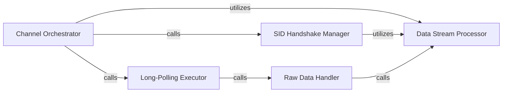

## Details

The Network & Channel Layer subsystem is responsible for establishing and maintaining the low-level, persistent long-polling connection for raw data transfer within the hangups project. It handles the intricacies of the Hangouts protocol's channel communication, from initial session ID acquisition to continuous data reception and preliminary parsing. The subsystem is primarily defined by the hangups/channel.py module, encompassing functions and classes related to managing the long-polling connection, fetching session IDs, sending initial channel maps, and processing raw incoming data streams. The Network & Channel Layer operates in a sequential yet continuous flow. The Channel Orchestrator (hangups.channel.listen) initiates the process by first interacting with the SID Handshake Manager to establish the session. Once the SID is acquired, the Orchestrator then continuously invokes the Long-Polling Executor to maintain the connection and receive data. Upon data reception, the Long-Polling Executor passes the raw data to the Raw Data Handler. This handler, in turn, delegates the low-level parsing and decoding tasks to the Data Stream Processor, which is also used by the SID Handshake Manager for parsing its specific responses. This layered approach ensures a clear separation of concerns between connection management, data reception, and data parsing within the subsystem.

### Channel Orchestrator
The primary entry point for the channel layer, responsible for initiating and managing the entire long-polling connection lifecycle. It orchestrates the initial session ID (SID) acquisition and then continuously manages the long-polling requests to receive data.

**Related Classes/Methods**:

- <a href="https://github.com/tdryer/hangups/blob/master/hangups/channel.py#L168-L215" target="_blank" rel="noopener noreferrer">`hangups.channel.listen`:168-215</a>

### SID Handshake Manager
Manages the initial handshake process to obtain and parse the necessary session ID (SID) from the server. This SID is crucial for establishing and authenticating the long-polling connection. It also handles sending initial parameters or authentication details.

**Related Classes/Methods**:

- <a href="https://github.com/tdryer/hangups/blob/master/hangups/channel.py#L241-L260" target="_blank" rel="noopener noreferrer">`hangups.channel._fetch_channel_sid`:241-260</a>
- <a href="https://github.com/tdryer/hangups/blob/master/hangups/channel.py#L106-L118" target="_blank" rel="noopener noreferrer">`hangups.channel._parse_sid_response`:106-118</a>
- <a href="https://github.com/tdryer/hangups/blob/master/hangups/channel.py#L217-L235" target="_blank" rel="noopener noreferrer">`hangups.channel.send_maps`:217-235</a>

### Long-Polling Executor
Executes the actual HTTP long-polling requests, maintaining the persistent connection to the server and waiting for incoming raw data. This is the core mechanism for continuous data reception.

**Related Classes/Methods**:

- <a href="https://github.com/tdryer/hangups/blob/master/hangups/channel.py#L262-L308" target="_blank" rel="noopener noreferrer">`hangups.channel._longpoll_request`:262-308</a>

### Raw Data Handler
Acts as the primary callback or handler for raw data received directly from the long-polling connection. It prepares this raw data for subsequent processing within the subsystem.

**Related Classes/Methods**:

- <a href="https://github.com/tdryer/hangups/blob/master/hangups/channel.py#L310-L334" target="_blank" rel="noopener noreferrer">`hangups.channel._on_push_data`:310-334</a>

### Data Stream Processor
A utility component responsible for the low-level parsing, decoding, and chunking of raw data streams into meaningful, discrete chunks. It handles protocol-specific framing, segmentation, and robust error handling during decoding.

**Related Classes/Methods**:

- <a href="https://github.com/tdryer/hangups/blob/master/hangups/channel.py#L49-L103" target="_blank" rel="noopener noreferrer">`hangups.channel.ChunkParser`:49-103</a>
- <a href="https://github.com/tdryer/hangups/blob/master/hangups/channel.py#L62-L103" target="_blank" rel="noopener noreferrer">`hangups.channel.get_chunks`:62-103</a>
- <a href="https://github.com/tdryer/hangups/blob/master/hangups/channel.py#L43-L46" target="_blank" rel="noopener noreferrer">`hangups.channel._best_effort_decode`:43-46</a>

### [FAQ](https://github.com/CodeBoarding/GeneratedOnBoardings/tree/main?tab=readme-ov-file#faq)