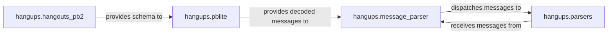

## Details

The `Protocol & Message Processors` subsystem is a critical part of the `hangups` library, responsible for the low-level and high-level handling of Hangouts protocol data. It ensures that raw bytes are correctly transformed into structured messages and then further interpreted into application-specific events and data.

### hangups.pblite
This module is the foundational layer for handling raw Google Protocol Buffer (protobuf) data. It is responsible for the low-level serialization (encoding) and deserialization (decoding) of protobuf messages according to the protobuf wire format. This includes managing field tagging, variable-length integers, and recursive message decoding.

**Related Classes/Methods**:

- <a href="https://github.com/tdryer/hangups/blob/master/hangups/pblite.py#L1-L9999" target="_blank" rel="noopener noreferrer">`hangups.pblite`:1-9999</a>

### hangups.hangouts_pb2
This auto-generated module provides the canonical Python classes and enums that define the entire Hangouts protocol message structure. It acts as the schema or contract, ensuring that both serialization and deserialization processes adhere to the agreed-upon message formats. It is the blueprint for all Hangouts messages.

**Related Classes/Methods**:

- <a href="https://github.com/tdryer/hangups/blob/master/hangups/hangouts_pb2.py#L1-L9999" target="_blank" rel="noopener noreferrer">`hangups.hangouts_pb2`:1-9999</a>

### hangups.message_parser
This module serves as a central entry point or facade for processing incoming Hangouts messages. It receives raw or partially decoded messages, identifies their specific type based on the protocol definitions, and then dispatches them to the appropriate specialized parser for further, higher-level interpretation.

**Related Classes/Methods**:

- <a href="https://github.com/tdryer/hangups/blob/master/hangups/message_parser.py#L1-L9999" target="_blank" rel="noopener noreferrer">`hangups.message_parser`:1-9999</a>

### hangups.parsers
This module contains specialized functions that interpret the generic Python objects produced by `hangups.pblite` (and dispatched by `hangups.message_parser`) into meaningful, application-specific data structures or events. It extracts high-level information relevant to the `hangups` client, such as chat messages, typing statuses, or presence updates.

**Related Classes/Methods**:

- <a href="https://github.com/tdryer/hangups/blob/master/hangups/parsers.py#L1-L9999" target="_blank" rel="noopener noreferrer">`hangups.parsers`:1-9999</a>

### [FAQ](https://github.com/CodeBoarding/GeneratedOnBoardings/tree/main?tab=readme-ov-file#faq)