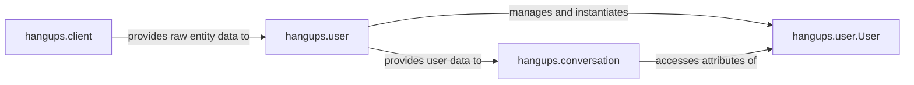

## Details

The User & Entity Management subsystem is crucial for maintaining and providing access to information about users and other entities within the Hangouts network. It primarily focuses on abstracting the complexities of raw entity data into usable User objects and managing their lifecycle.

### hangups.user.User
Represents a single user or entity within the Hangouts network. It is the fundamental data structure holding attributes like user ID, full name, and other entity-specific details.

**Related Classes/Methods**:

- <a href="https://github.com/tdryer/hangups/blob/master/hangups/user.py#L24-L125" target="_blank" rel="noopener noreferrer">`hangups.user.User`:24-125</a>

### hangups.user
This module acts as the central repository and manager for User objects. It handles the lifecycle of user data, including creation, updating, and retrieval, often caching user information to minimize API calls. It serves as the primary interface for other parts of the application to get user information.

**Related Classes/Methods**:

- <a href="https://github.com/tdryer/hangups/blob/master/hangups/user.py" target="_blank" rel="noopener noreferrer">`hangups.user`</a>

### hangups.client
Provides the low-level interface for making requests to the Hangouts API to fetch raw user and entity data. While a broader API client, its entity-related methods are crucial for populating the User Management subsystem.

**Related Classes/Methods**:

- <a href="https://github.com/tdryer/hangups/blob/master/hangups/client.py" target="_blank" rel="noopener noreferrer">`hangups.client`</a>

### hangups.conversation
Manages conversation state and events. It relies on the User Management subsystem to resolve and retrieve user information for conversation participants and event processing, integrating user data into the conversation context.

**Related Classes/Methods**:

- <a href="https://github.com/tdryer/hangups/blob/master/hangups/conversation.py" target="_blank" rel="noopener noreferrer">`hangups.conversation`</a>

### [FAQ](https://github.com/CodeBoarding/GeneratedOnBoardings/tree/main?tab=readme-ov-file#faq)