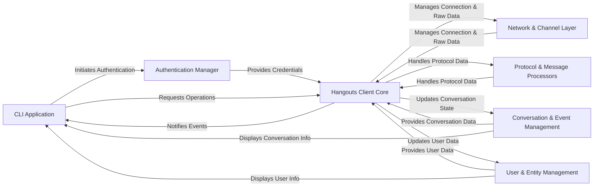

## Details

The `hangups` architecture is structured around a central `Hangouts Client Core` that orchestrates communication with the Google Hangouts service. It leverages an `Authentication Manager` for secure session establishment and a `Network & Channel Layer` for maintaining the persistent long-polling connection. All data exchanged is meticulously handled by the `Protocol & Message Processors` for serialization and deserialization. The parsed information then updates the `Conversation & Event Management` and `User & Entity Management` components, which maintain the application's state regarding conversations and users. Finally, the `CLI Application` acts as the primary consumer, interacting with the `Hangouts Client Core` and displaying real-time updates from the state management components, providing a user-friendly interface over the complex underlying protocol.

### CLI Application [[Expand]](./CLI_Application.md)
The user-facing command-line interface that consumes the `hangups` library for interactive chat.

**Related Classes/Methods**:

- <a href="https://github.com/tdryer/hangups/blob/master/hangups/ui/__main__.py" target="_blank" rel="noopener noreferrer">`hangups/ui/__main__.py`</a>

### Authentication Manager [[Expand]](./Authentication_Manager.md)
Manages the entire authentication lifecycle with Google, providing secure session credentials.

**Related Classes/Methods**:

- <a href="https://github.com/tdryer/hangups/blob/master/hangups/auth.py" target="_blank" rel="noopener noreferrer">`hangups/auth.py`</a>

### Hangouts Client Core [[Expand]](./Hangouts_Client_Core.md)
The primary asynchronous interface, orchestrating all high-level interactions with the Hangouts protocol.

**Related Classes/Methods**:

- <a href="https://github.com/tdryer/hangups/blob/master/hangups/client.py" target="_blank" rel="noopener noreferrer">`hangups/client.py`</a>

### Network & Channel Layer [[Expand]](./Network_Channel_Layer.md)
Responsible for establishing and maintaining the low-level, persistent long-polling connection for raw data transfer.

**Related Classes/Methods**:

- <a href="https://github.com/tdryer/hangups/blob/master/hangups/channel.py" target="_blank" rel="noopener noreferrer">`hangups/channel.py`</a>

### Protocol & Message Processors [[Expand]](./Protocol_Message_Processors.md)
Handles the serialization and deserialization of Hangouts protocol buffers and specific message types.

**Related Classes/Methods**:

- <a href="https://github.com/tdryer/hangups/blob/master/hangups/pblite.py" target="_blank" rel="noopener noreferrer">`hangups/pblite.py`</a>
- <a href="https://github.com/tdryer/hangups/blob/master/hangups/parsers.py" target="_blank" rel="noopener noreferrer">`hangups/parsers.py`</a>
- <a href="https://github.com/tdryer/hangups/blob/master/hangups/message_parser.py" target="_blank" rel="noopener noreferrer">`hangups/message_parser.py`</a>
- <a href="https://github.com/tdryer/hangups/blob/master/hangups/hangouts_pb2.py" target="_blank" rel="noopener noreferrer">`hangups/hangouts_pb2.py`</a>

### Conversation & Event Management [[Expand]](./Conversation_Event_Management.md)
Manages the state and events related to individual conversations, including message history and participant lists.

**Related Classes/Methods**:

- <a href="https://github.com/tdryer/hangups/blob/master/hangups/conversation.py" target="_blank" rel="noopener noreferrer">`hangups/conversation.py`</a>
- <a href="https://github.com/tdryer/hangups/blob/master/hangups/conversation_event.py" target="_blank" rel="noopener noreferrer">`hangups/conversation_event.py`</a>
- <a href="https://github.com/tdryer/hangups/blob/master/hangups/event.py" target="_blank" rel="noopener noreferrer">`hangups/event.py`</a>

### User & Entity Management [[Expand]](./User_Entity_Management.md)
Maintains and provides access to information about users and other entities within the Hangouts network.

**Related Classes/Methods**:

- <a href="https://github.com/tdryer/hangups/blob/master/hangups/user.py" target="_blank" rel="noopener noreferrer">`hangups/user.py`</a>

### [FAQ](https://github.com/CodeBoarding/GeneratedOnBoardings/tree/main?tab=readme-ov-file#faq)