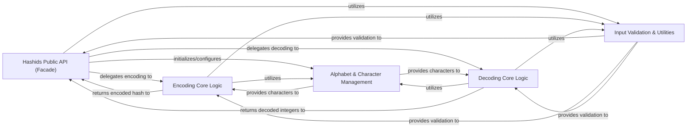

## Details

The hashids-python library is designed as a cohesive utility for generating and decoding short, unique, and non-sequential IDs. Its architecture is centered around the Hashids Public API (Facade), which acts as the primary interface, abstracting the complexity of the underlying hashing algorithms. Data flow initiates when a user calls an encoding or decoding method on the Hashids object. These calls are then delegated to the specialized Encoding Core Logic or Decoding Core Logic components, respectively. Both core logic components interact with the Alphabet & Character Management module to handle the specific character sets and their permutations, and they rely on the Input Validation & Utilities for ensuring data integrity throughout the process. This clear separation of concerns facilitates maintainability and provides a straightforward flow for visual representation, highlighting the transformation of input data through distinct processing stages.

### Hashids Public API (Facade)
The primary entry point for users, providing a simplified interface for encoding and decoding operations. It initializes the hashing parameters and orchestrates calls to internal logic.

**Related Classes/Methods**:

- <a href="https://github.com/davidaurelio/hashids-python/blob/master/hashids.py#L169-L214" target="_blank" rel="noopener noreferrer">`Hashids.__init__`:169-214</a>
- <a href="https://github.com/davidaurelio/hashids-python/blob/master/hashids.py#L216-L229" target="_blank" rel="noopener noreferrer">`Hashids.encode`:216-229</a>
- <a href="https://github.com/davidaurelio/hashids-python/blob/master/hashids.py#L231-L248" target="_blank" rel="noopener noreferrer">`Hashids.decode`:231-248</a>
- <a href="https://github.com/davidaurelio/hashids-python/blob/master/hashids.py#L250-L263" target="_blank" rel="noopener noreferrer">`Hashids.encode_hex`:250-263</a>
- <a href="https://github.com/davidaurelio/hashids-python/blob/master/hashids.py#L265-L273" target="_blank" rel="noopener noreferrer">`Hashids.decode_hex`:265-273</a>

### Encoding Core Logic
Encapsulates the fundamental algorithm for transforming a sequence of integers into a unique hash string, including character manipulation and length enforcement.

**Related Classes/Methods**:

- <a href="https://github.com/davidaurelio/hashids-python/blob/master/hashids.py#L43-L51" target="_blank" rel="noopener noreferrer">`_hash`:43-51</a>
- <a href="https://github.com/davidaurelio/hashids-python/blob/master/hashids.py#L88-L107" target="_blank" rel="noopener noreferrer">`_ensure_length`:88-107</a>
- <a href="https://github.com/davidaurelio/hashids-python/blob/master/hashids.py#L110-L129" target="_blank" rel="noopener noreferrer">`_encode`:110-129</a>

### Decoding Core Logic
Contains the algorithms for reversing the hashing process, converting a hash string back into its original sequence of integers, including string splitting and reverse hashing.

**Related Classes/Methods**:

- <a href="https://github.com/davidaurelio/hashids-python/blob/master/hashids.py#L31-L40" target="_blank" rel="noopener noreferrer">`_split`:31-40</a>
- <a href="https://github.com/davidaurelio/hashids-python/blob/master/hashids.py#L54-L62" target="_blank" rel="noopener noreferrer">`_unhash`:54-62</a>
- <a href="https://github.com/davidaurelio/hashids-python/blob/master/hashids.py#L132-L148" target="_blank" rel="noopener noreferrer">`_decode`:132-148</a>

### Alphabet & Character Management
Manages the internal character set (alphabet), separators, and guards used in the encoding and decoding processes, handling reordering and selection based on salt and internal state.

**Related Classes/Methods**:

- <a href="https://github.com/davidaurelio/hashids-python/blob/master/hashids.py#L65-L80" target="_blank" rel="noopener noreferrer">`_reorder`:65-80</a>
- <a href="https://github.com/davidaurelio/hashids-python/blob/master/hashids.py#L83-L85" target="_blank" rel="noopener noreferrer">`_index_from_ratio`:83-85</a>
- <a href="https://github.com/davidaurelio/hashids-python/blob/master/hashids.py#L169-L214" target="_blank" rel="noopener noreferrer">`Hashids.__init__`:169-214</a>

### Input Validation & Utilities
Provides helper functions for validating input types (e.g., unsigned integers, strings) and other minor utility operations, including handling deprecated methods.

**Related Classes/Methods**:

- <a href="https://github.com/davidaurelio/hashids-python/blob/master/hashids.py#L23-L28" target="_blank" rel="noopener noreferrer">`_is_uint`:23-28</a>
- <a href="https://github.com/davidaurelio/hashids-python/blob/master/hashids.py#L18-L20" target="_blank" rel="noopener noreferrer">`_is_str`:18-20</a>
- <a href="https://github.com/davidaurelio/hashids-python/blob/master/hashids.py#L151-L162" target="_blank" rel="noopener noreferrer">`_deprecated`:151-162</a>

### [FAQ](https://github.com/CodeBoarding/GeneratedOnBoardings/tree/main?tab=readme-ov-file#faq)