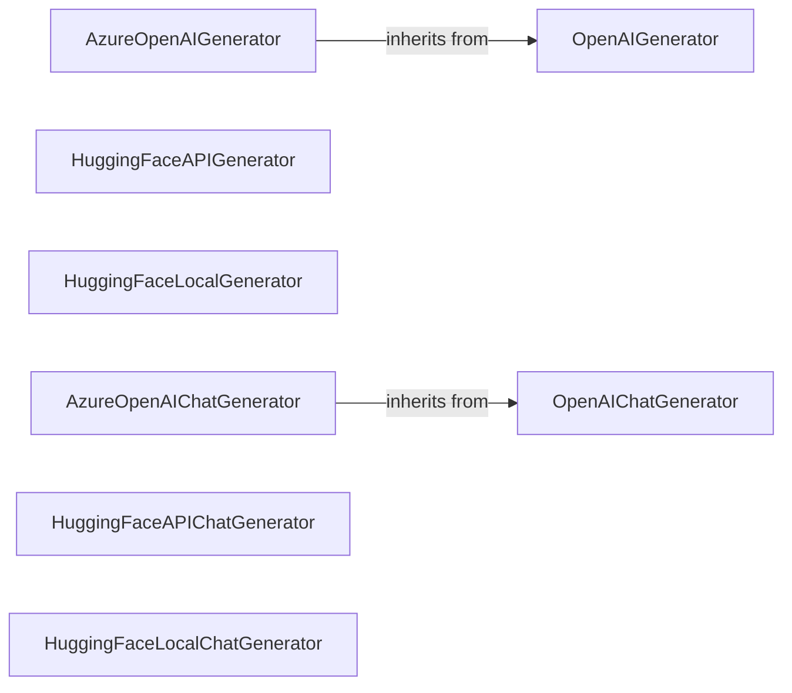

## Component Details

The Answer Generation & Chat component is responsible for generating answers and chat responses based on retrieved documents and user input. It leverages various large language models (LLMs) from providers like OpenAI, Azure OpenAI, and Hugging Face, supporting both API-based and locally loaded models. The component includes specialized generators for chat applications, maintaining conversation context and producing appropriate responses. It handles authentication, prompt formatting, and response parsing for each LLM provider.

### OpenAIGenerator
This component generates text using the OpenAI API. It handles authentication, prompt formatting, and response parsing. It interacts with the OpenAI API to generate text based on the provided prompt and configuration.
- **Related Classes/Methods**: `haystack.components.generators.openai.OpenAIGenerator`

### AzureOpenAIGenerator
This component generates text using the Azure OpenAI API. It is similar to OpenAIGenerator but uses Azure's specific API endpoints and authentication methods.
- **Related Classes/Methods**: `haystack.components.generators.azure.AzureOpenAIGenerator`

### HuggingFaceAPIGenerator
This component generates text using the Hugging Face Inference API. It sends requests to the API with the prompt and model details and receives generated text in response.
- **Related Classes/Methods**: `haystack.components.generators.hugging_face_api.HuggingFaceAPIGenerator`

### HuggingFaceLocalGenerator
This component generates text using a Hugging Face model loaded locally. It loads the model into memory and uses it to generate text directly, without relying on an external API.
- **Related Classes/Methods**: `haystack.components.generators.hugging_face_local.HuggingFaceLocalGenerator`

### OpenAIChatGenerator
This component generates chat responses using the OpenAI Chat API. It manages the conversation history, formats the input for the API, and parses the API's response to extract the generated chat message.
- **Related Classes/Methods**: `haystack.components.generators.chat.openai.OpenAIChatGenerator`

### AzureOpenAIChatGenerator
This component generates chat responses using the Azure OpenAI Chat API. It is similar to OpenAIChatGenerator but uses Azure's specific API endpoints and authentication methods.
- **Related Classes/Methods**: `haystack.components.generators.chat.azure.AzureOpenAIChatGenerator`

### HuggingFaceAPIChatGenerator
This component generates chat responses using the Hugging Face Inference API. It is designed for chat-based interactions, potentially handling streaming responses and tool calls.
- **Related Classes/Methods**: `haystack.components.generators.chat.hugging_face_api.HuggingFaceAPIChatGenerator`

### HuggingFaceLocalChatGenerator
This component generates chat responses using a Hugging Face model loaded locally. It is similar to HuggingFaceLocalGenerator but is specifically designed for chat-based interactions.
- **Related Classes/Methods**: `haystack.components.generators.chat.hugging_face_local.HuggingFaceLocalChatGenerator`
