```mermaid
graph LR
    Document_Fetcher["Document Fetcher"]
    Document_Converter["Document Converter"]
    Document_Cleaner["Document Cleaner"]
    Document_Splitter["Document Splitter"]
    Document_Fetcher -- "fetches content for" --> Document_Converter
    Document_Converter -- "converts document to" --> Document_Cleaner
    Document_Cleaner -- "cleans document" --> Document_Splitter
    Document_Splitter -- "splits document" --> Embedding_Indexing
```

## Component Details

The Data Handling component is responsible for ingesting, converting, cleaning, and splitting documents from various sources into a standardized format suitable for indexing and retrieval. It orchestrates the flow of data from fetching to preprocessing, ensuring that the data is well-structured and optimized for subsequent steps in the pipeline. The component utilizes a variety of converters and preprocessors to handle different file types and cleaning/splitting requirements.

### Document Fetcher
The Document Fetcher component retrieves documents from various sources, such as URLs. It handles the initial step of acquiring the data for processing.
- **Related Classes/Methods**: `haystack.components.fetchers.link_content.LinkContentFetcher`

### Document Converter
The Document Converter component transforms documents from various formats (e.g., PDF, DOCX, HTML) into a unified Document format. It supports a wide range of file types and uses appropriate conversion methods for each.
- **Related Classes/Methods**: `haystack.components.converters.azure.AzureOCRDocumentConverter`, `haystack.components.converters.csv.CSVToDocument`, `haystack.components.converters.docx.DOCXToDocument`, `haystack.components.converters.html.HTMLToDocument`, `haystack.components.converters.json.JSONConverter`, `haystack.components.converters.markdown.MarkdownToDocument`, `haystack.components.converters.msg.MSGToDocument`, `haystack.components.converters.pdfminer.PDFMinerToDocument`, `haystack.components.converters.pptx.PPTXToDocument`, `haystack.components.converters.pypdf.PyPDFToDocument`, `haystack.components.converters.tika.TikaDocumentConverter`, `haystack.components.converters.txt.TextFileToDocument`, `haystack.components.converters.xlsx.XLSXToDocument`

### Document Cleaner
The Document Cleaner component removes noise and irrelevant information from documents, such as unwanted characters, repeated substrings, and header/footer information. It ensures that the text is clean and ready for further processing.
- **Related Classes/Methods**: `haystack.components.preprocessors.document_cleaner.DocumentCleaner`, `haystack.components.preprocessors.csv_document_cleaner.CSVDocumentCleaner`, `haystack.components.preprocessors.text_cleaner.TextCleaner`

### Document Splitter
The Document Splitter component divides documents into smaller chunks based on various criteria, such as sentence length, character count, or separators. It prepares the data for embedding and indexing by creating manageable segments.
- **Related Classes/Methods**: `haystack.components.preprocessors.document_splitter.DocumentSplitter`, `haystack.components.preprocessors.csv_document_splitter.CSVDocumentSplitter`, `haystack.components.preprocessors.recursive_splitter.RecursiveDocumentSplitter`, `haystack.components.preprocessors.sentence_tokenizer.SentenceSplitter`
