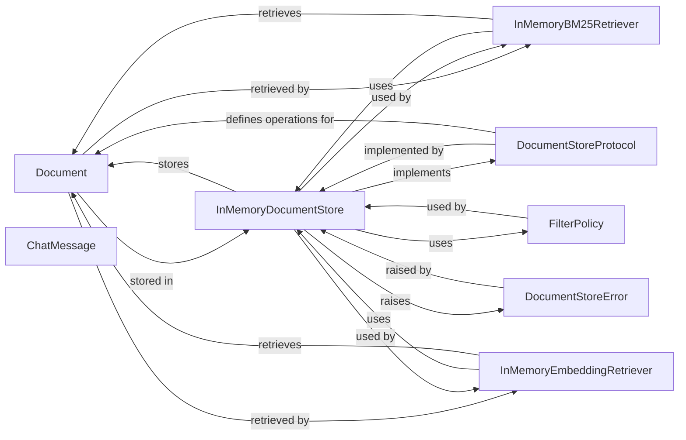

## Component Details

One paragraph explaining the functionality which is represented by this graph. What the main flow is and what is its purpose.

### Document
This class represents the primary unit of data in Haystack. It encapsulates text content, metadata, and optional embeddings. It is fundamental because all information processed and stored in Haystack is ultimately represented as a `Document`.

**Related Classes/Methods**:

- <a href="https://github.com/deepset-ai/haystack/blob/master/haystack/dataclasses/document.py#L45-L182" target="_blank" rel="noopener noreferrer">`haystack.dataclasses.document.Document` (45:182)</a>

### ChatMessage
This class represents a single message within a conversational exchange. It's crucial for handling chat-based interactions and storing the history of a conversation. While not directly stored by `DocumentStore` in the same manner as `Document` objects, it's a key data unit within the broader "Data" aspect of this subsystem.

**Related Classes/Methods**:

- <a href="https://github.com/deepset-ai/haystack/blob/master/haystack/dataclasses/chat_message.py#L128-L543" target="_blank" rel="noopener noreferrer">`haystack.dataclasses.chat_message.ChatMessage` (128:543)</a>

### DocumentStoreProtocol
This is an abstract base class (protocol) that defines the interface for all document store implementations. It's fundamental because it establishes the contract for how documents are added, retrieved, and deleted, ensuring interoperability and allowing for various storage backends to conform to a common API.

**Related Classes/Methods**:

- <a href="https://github.com/deepset-ai/haystack/blob/master/haystack/document_stores/types/protocol.py#L1-L1" target="_blank" rel="noopener noreferrer">`haystack.document_stores.types.protocol.DocumentStoreProtocol` (1:1)</a>

### InMemoryDocumentStore
This class provides a concrete, in-memory implementation of the `DocumentStoreProtocol`. It's fundamental as it's the simplest and often used document store for testing and smaller-scale applications, demonstrating the practical application of the `DocumentStoreProtocol`.

**Related Classes/Methods**:

- <a href="https://github.com/deepset-ai/haystack/blob/master/haystack/document_stores/in_memory/document_store.py#L57-L737" target="_blank" rel="noopener noreferrer">`haystack.document_stores.in_memory.document_store.InMemoryDocumentStore` (57:737)</a>

### FilterPolicy
This class defines how filtering rules are interpreted and applied to documents during retrieval operations. It's fundamental for enabling precise and efficient searching within document stores.

**Related Classes/Methods**:

- <a href="https://github.com/deepset-ai/haystack/blob/master/haystack/document_stores/types/filter_policy.py#L12-L39" target="_blank" rel="noopener noreferrer">`haystack.document_stores.types.filter_policy.FilterPolicy` (12:39)</a>

### DocumentStoreError
This is the base class for all exceptions raised by document store operations. It's fundamental for robust error handling and provides a consistent way to manage issues related to document storage and retrieval across different document store implementations.

**Related Classes/Methods**:

- <a href="https://github.com/deepset-ai/haystack/blob/master/haystack/document_stores/errors/errors.py#L5-L6" target="_blank" rel="noopener noreferrer">`haystack.document_stores.errors.errors.DocumentStoreError` (5:6)</a>

### InMemoryBM25Retriever
A retriever component that uses `InMemoryDocumentStore` as its data source to perform BM25-based document retrieval. It's fundamental as it demonstrates how the stored `Document` objects are accessed and utilized by other Haystack components for information retrieval.

**Related Classes/Methods**:

- <a href="https://github.com/deepset-ai/haystack/blob/master/haystack/components/retrievers/in_memory/bm25_retriever.py#L12-L202" target="_blank" rel="noopener noreferrer">`haystack.components.retrievers.in_memory.bm25_retriever.InMemoryBM25Retriever` (12:202)</a>

### InMemoryEmbeddingRetriever
Similar to `InMemoryBM25Retriever`, this component also uses `InMemoryDocumentStore` but for embedding-based document retrieval. It further highlights the versatility and importance of the `DocumentStore` as a data source for various retrieval strategies.

**Related Classes/Methods**:

- <a href="https://github.com/deepset-ai/haystack/blob/master/haystack/components/retrievers/in_memory/embedding_retriever.py#L12-L244" target="_blank" rel="noopener noreferrer">`haystack.components.retrievers.in_memory.embedding_retriever.InMemoryEmbeddingRetriever` (12:244)</a>

### [FAQ](https://github.com/CodeBoarding/GeneratedOnBoardings/tree/main?tab=readme-ov-file#faq)