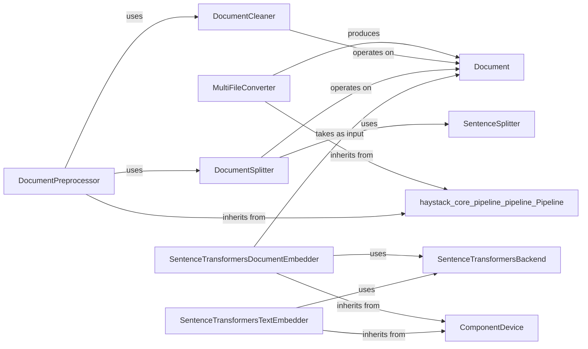

## Component Details

This subsystem is responsible for preparing raw data and `Document` objects for downstream tasks, primarily by cleaning, splitting, and converting them into dense vector representations (embeddings). It acts as the initial stage in many Haystack pipelines, ensuring data quality and semantic understanding.

### MultiFileConverter
This component is designed to handle the ingestion of various file types (e.g., PDF, DOCX, TXT) and convert them into a standardized `Document` format. Its fundamental nature lies in its ability to act as a mini-pipeline, orchestrating different specialized converters, joiners, and routers to process diverse inputs seamlessly. This makes it a versatile entry point for unstructured data.

**Related Classes/Methods**:

- <a href="https://github.com/deepset-ai/haystack/blob/master/haystack/core/pipeline/pipeline.py#L22-L258" target="_blank" rel="noopener noreferrer">`haystack.core.pipeline.pipeline.Pipeline` (22:258)</a>

### DocumentCleaner
A foundational preprocessing component that focuses on improving the quality of textual content within `Document` objects. It handles tasks such as removing redundant whitespace, empty lines, and other common text artifacts. This cleaning step is fundamental for ensuring that subsequent processing steps (like splitting or embedding) operate on clean, relevant data, which directly impacts the accuracy of downstream tasks.

**Related Classes/Methods**: _None_

### DocumentSplitter
This component addresses the critical challenge of processing long texts by breaking down large `Document`s into smaller, more manageable chunks. This is essential for compatibility with models that have input token limits and for improving the granularity of retrieval. Its ability to leverage a `SentenceSplitter` for precise segmentation makes it highly effective.

**Related Classes/Methods**:

- <a href="https://github.com/deepset-ai/haystack/blob/master/haystack/components/preprocessors/sentence_tokenizer.py#L115-L237" target="_blank" rel="noopener noreferrer">`haystack.components.preprocessors.sentence_tokenizer.SentenceSplitter` (115:237)</a>

### SentenceTransformersDocumentEmbedder
This component is central to enabling semantic search and understanding. It transforms the textual content of `Document` objects into dense vector embeddings using pre-trained Sentence Transformers models. These embeddings capture the semantic meaning, allowing for similarity comparisons between documents or between queries and documents. Its ability to manage device placement is crucial for performance.

**Related Classes/Methods**:

- <a href="https://github.com/deepset-ai/haystack/blob/master/haystack/components/embedders/backends/sentence_transformers_backend.py#L0-L0" target="_blank" rel="noopener noreferrer">`haystack.components.embedders.backends.sentence_transformers_backend.SentenceTransformersBackend` (0:0)</a>
- <a href="https://github.com/deepset-ai/haystack/blob/master/haystack/utils/device.py#L247-L487" target="_blank" rel="noopener noreferrer">`haystack.utils.device.ComponentDevice` (247:487)</a>

### SentenceTransformersTextEmbedder
Complementing the Document Embedder, this component provides the capability to convert arbitrary raw text strings (e.g., user queries) into dense vector embeddings using Sentence Transformers models. This is fundamental for tasks like query embedding in semantic search systems. Like its document counterpart, it handles device management for optimal performance.

**Related Classes/Methods**:

- <a href="https://github.com/deepset-ai/haystack/blob/master/haystack/components/embedders/backends/sentence_transformers_backend.py#L0-L0" target="_blank" rel="noopener noreferrer">`haystack.components.embedders.backends.sentence_transformers_backend.SentenceTransformersBackend` (0:0)</a>
- <a href="https://github.com/deepset-ai/haystack/blob/master/haystack/utils/device.py#L247-L487" target="_blank" rel="noopener noreferrer">`haystack.utils.device.ComponentDevice` (247:487)</a>

### SentenceSplitter
A specialized preprocessor that tokenizes text into individual sentences. It is a fundamental building block, particularly for the `DocumentSplitter`, enabling precise and semantically meaningful document segmentation.

**Related Classes/Methods**: _None_

### SentenceTransformersBackend
This is the core implementation detail that encapsulates the logic for loading and running Sentence Transformers models. It provides the actual embedding functionality consumed by both `SentenceTransformersDocumentEmbedder` and `SentenceTransformersTextEmbedder`, making it fundamental to their operation.

**Related Classes/Methods**: _None_

### ComponentDevice
A utility class that provides a standardized way for components to manage and utilize computational devices (CPU, GPU). It's fundamental for performance optimization, especially for computationally intensive tasks like embedding, by ensuring models run on the most suitable hardware.

**Related Classes/Methods**: _None_

### DocumentPreprocessor
This component offers a higher-level abstraction for common document preprocessing workflows. It can encapsulate a sequence of cleaning and splitting operations, simplifying the construction of complex data preparation pipelines. Its inheritance from `Pipeline` highlights its role as an orchestrator of preprocessing steps.

**Related Classes/Methods**:

- <a href="https://github.com/deepset-ai/haystack/blob/master/haystack/core/pipeline/pipeline.py#L22-L258" target="_blank" rel="noopener noreferrer">`haystack.core.pipeline.pipeline.Pipeline` (22:258)</a>
- <a href="https://github.com/deepset-ai/haystack/blob/master/haystack/components/preprocessors/document_cleaner.py#L17-L324" target="_blank" rel="noopener noreferrer">`haystack.components.preprocessors.document_cleaner.DocumentCleaner` (17:324)</a>
- <a href="https://github.com/deepset-ai/haystack/blob/master/haystack/components/preprocessors/document_splitter.py#L21-L489" target="_blank" rel="noopener noreferrer">`haystack.components.preprocessors.document_splitter.DocumentSplitter` (21:489)</a>

### Document
While not a "component" in the executable sense, the `Document` dataclass is the central data structure that flows through the entire `Data Processor & Embedder` subsystem. It represents a piece of text or data along with its associated metadata and, crucially, its embeddings. Its standardized format is fundamental for interoperability between all components in Haystack.

**Related Classes/Methods**: _None_

### [FAQ](https://github.com/CodeBoarding/GeneratedOnBoardings/tree/main?tab=readme-ov-file#faq)