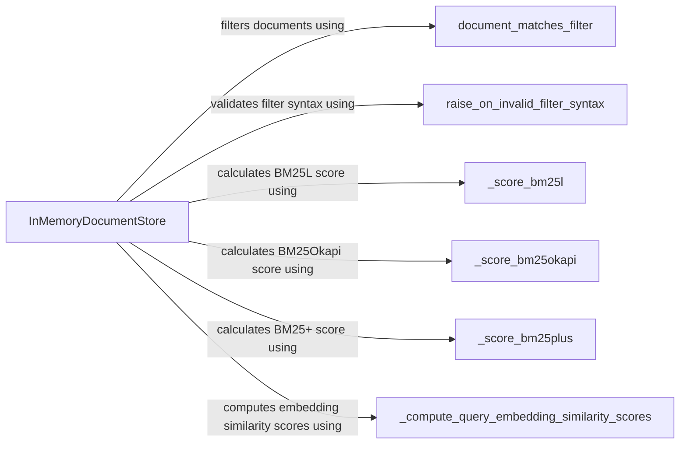

## Component Details

The Document Indexing & Storage component is responsible for managing the storage, indexing, and retrieval of documents and their embeddings. It uses an in-memory document store to provide fast access to documents based on various criteria, including BM25 ranking and embedding similarity. The component supports filtering documents based on metadata and ensures the validity of filter syntax. It acts as a central repository for processed data, enabling efficient search and retrieval of relevant information.

### InMemoryDocumentStore
The InMemoryDocumentStore class provides an in-memory implementation of a document store. It stores documents and their embeddings in memory, allowing for fast retrieval based on various criteria. It supports writing, filtering, and deleting documents, as well as retrieval using BM25 and embeddings. It interacts with filter validation and scoring functions to provide its functionality.
- **Related Classes/Methods**: `haystack.document_stores.in_memory.document_store.InMemoryDocumentStore`

### document_matches_filter
The `document_matches_filter` function is a utility function used to filter documents based on a given filter condition. It checks if a document's metadata matches the specified filter criteria. It is used by the InMemoryDocumentStore to filter documents based on metadata.
- **Related Classes/Methods**: `haystack.utils.filters:document_matches_filter`

### raise_on_invalid_filter_syntax
The `raise_on_invalid_filter_syntax` function is a utility function that validates the syntax of a filter. It raises an exception if the filter syntax is invalid. It is used by the InMemoryDocumentStore to validate filter syntax.
- **Related Classes/Methods**: `haystack.utils.filters:raise_on_invalid_filter_syntax`

### _score_bm25l
The `_score_bm25l` function calculates the BM25L score for a document, which is a variant of the BM25 ranking function. It is used by the InMemoryDocumentStore to score documents based on BM25L.
- **Related Classes/Methods**: `haystack.document_stores.in_memory.document_store.InMemoryDocumentStore:_score_bm25l`

### _score_bm25okapi
The `_score_bm25okapi` function calculates the BM25Okapi score for a document, a widely used ranking function in information retrieval. It is used by the InMemoryDocumentStore to score documents based on BM25Okapi.
- **Related Classes/Methods**: `haystack.document_stores.in_memory.document_store.InMemoryDocumentStore:_score_bm25okapi`

### _score_bm25plus
The `_score_bm25plus` function calculates the BM25+ score for a document, another variant of the BM25 ranking function. It is used by the InMemoryDocumentStore to score documents based on BM25+.
- **Related Classes/Methods**: `haystack.document_stores.in_memory.document_store.InMemoryDocumentStore:_score_bm25plus`

### _compute_query_embedding_similarity_scores
The `_compute_query_embedding_similarity_scores` function computes the similarity scores between a query embedding and document embeddings. It is used by the InMemoryDocumentStore to compute embedding similarity scores.
- **Related Classes/Methods**: `haystack.document_stores.in_memory.document_store.InMemoryDocumentStore:_compute_query_embedding_similarity_scores`
