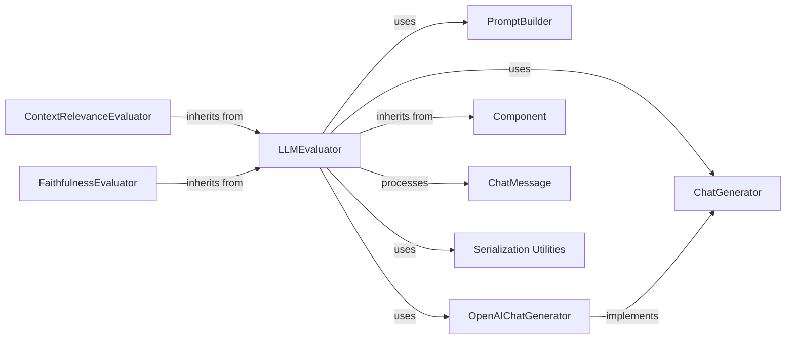

## Component Details

The `Evaluator` subsystem, centered around the `LLMEvaluator`, is designed to measure the performance and quality of various components within a Haystack pipeline, particularly by leveraging Large Language Models (LLMs) for assessment. This includes evaluating aspects like the relevance of retrieved documents or the faithfulness of generated answers.

### LLMEvaluator
This is the core component of the `Evaluator` subsystem. It orchestrates the entire LLM-based evaluation process. Its responsibilities include constructing prompts for the LLM, sending these prompts to a chosen LLM generator, and then parsing and validating the LLM's responses to derive evaluation metrics. It acts as a flexible framework for various LLM-powered evaluations.

**Related Classes/Methods**:

- <a href="https://github.com/deepset-ai/haystack/blob/master/haystack/components/evaluators/llm_evaluator.py#L21-L385" target="_blank" rel="noopener noreferrer">`haystack.components.evaluators.llm_evaluator.LLMEvaluator` (21:385)</a>

### PromptBuilder
This component is responsible for dynamically constructing prompts that are sent to the LLM. It takes a template and input variables, then formats them into a coherent prompt suitable for the LLM. This modularity allows for flexible and reusable prompt definitions for different evaluation criteria.

**Related Classes/Methods**:

- <a href="https://github.com/deepset-ai/haystack/blob/master/haystack/components/builders/prompt_builder.py#L16-L265" target="_blank" rel="noopener noreferrer">`haystack.components.builders.prompt_builder.PromptBuilder` (16:265)</a>

### ChatGenerator
This is an abstract base class or protocol that defines the interface for all chat-based LLM generators in Haystack. `LLMEvaluator` interacts with this protocol, allowing it to work with any compliant chat generator.

**Related Classes/Methods**:

- <a href="https://github.com/deepset-ai/haystack/blob/master/haystack/components/generators/chat/types/protocol.py#L14-L35" target="_blank" rel="noopener noreferrer">`haystack.components.generators.chat.types.protocol.ChatGenerator` (14:35)</a>

### OpenAIChatGenerator
This component serves as a concrete implementation of an LLM generator, specifically designed to interact with the OpenAI Chat API. It handles the communication with the external LLM service, sending the constructed prompts and receiving the generated responses.

**Related Classes/Methods**:

- <a href="https://github.com/deepset-ai/haystack/blob/master/haystack/components/generators/chat/openai.py#L41-L450" target="_blank" rel="noopener noreferrer">`haystack.components.generators.chat.openai.OpenAIChatGenerator` (41:450)</a>

### Component
This is the foundational base class for all components within the Haystack framework, including `LLMEvaluator`. It provides essential functionalities such as defining input and output types, managing component serialization, and ensuring a standardized interface for pipeline integration.

**Related Classes/Methods**:

- <a href="https://github.com/deepset-ai/haystack/blob/master/haystack/core/component/component.py#L146-L193" target="_blank" rel="noopener noreferrer">`haystack.core.component.component.Component` (146:193)</a>

### ChatMessage
This is a dataclass used to represent individual messages within a chat conversation. In the context of `LLMEvaluator`, it's used to format the prompts sent to the LLM and to parse the structured responses received from the LLM.

**Related Classes/Methods**:

- <a href="https://github.com/deepset-ai/haystack/blob/master/haystack/dataclasses/chat_message.py#L128-L543" target="_blank" rel="noopener noreferrer">`haystack.dataclasses.chat_message.ChatMessage` (128:543)</a>

### ContextRelevanceEvaluator
This component is a specialized evaluator that inherits from `LLMEvaluator`. Its specific purpose is to assess the relevance of the retrieved context to a given query or answer. It leverages the generic LLM evaluation capabilities provided by `LLMEvaluator` but with a predefined prompt and logic tailored for context relevance.

**Related Classes/Methods**:

- <a href="https://github.com/deepset-ai/haystack/blob/master/haystack/components/evaluators/context_relevance.py#L41-L214" target="_blank" rel="noopener noreferrer">`haystack.components.evaluators.context_relevance.ContextRelevanceEvaluator` (41:214)</a>

### FaithfulnessEvaluator
Similar to `ContextRelevanceEvaluator`, this component also inherits from `LLMEvaluator`. Its role is to evaluate the faithfulness of a generated answer to the provided source documents. It checks whether the answer contains information that can be directly inferred from the given context.

**Related Classes/Methods**:

- <a href="https://github.com/deepset-ai/haystack/blob/master/haystack/components/evaluators/faithfulness.py#L50-L208" target="_blank" rel="noopener noreferrer">`haystack.components.evaluators.faithfulness.FaithfulnessEvaluator` (50:208)</a>

### Serialization Utilities
These utility functions and modules are responsible for converting Python objects (like `LLMEvaluator` configurations) into a serializable format (e.g., JSON or YAML) and vice-versa. This is crucial for saving, loading, and sharing pipeline configurations, enabling persistence and reusability of evaluator setups.

**Related Classes/Methods**:

- <a href="https://github.com/deepset-ai/haystack/blob/master/haystack/core/serialization.py#L1-L1" target="_blank" rel="noopener noreferrer">`haystack.core.serialization.SerializationUtilities` (1:1)</a>
- <a href="https://github.com/deepset-ai/haystack/blob/master/haystack/utils/type_serialization.py#L1-L1" target="_blank" rel="noopener noreferrer">`haystack.utils.type_serialization.SerializationUtilities` (1:1)</a>
- <a href="https://github.com/deepset-ai/haystack/blob/master/haystack/utils/deserialization.py#L1-L1" target="_blank" rel="noopener noreferrer">`haystack.utils.deserialization.SerializationUtilities` (1:1)</a>

### [FAQ](https://github.com/CodeBoarding/GeneratedOnBoardings/tree/main?tab=readme-ov-file#faq)