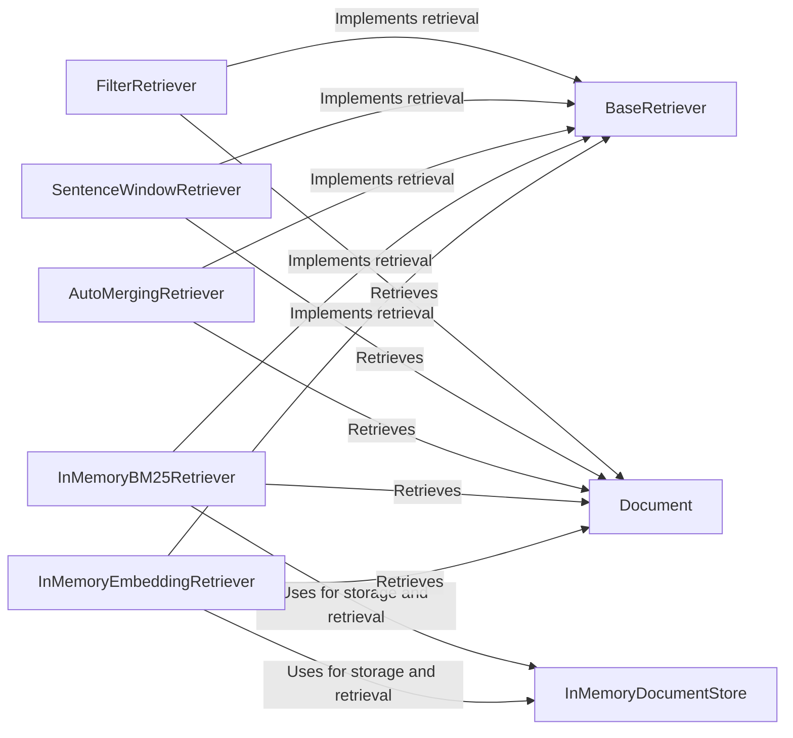

## Component Details

The Information Retrieval component in Haystack is responsible for fetching relevant documents from a DocumentStore based on a user's query. It employs various retrieval strategies, including keyword-based methods like BM25 and semantic methods using embeddings, to identify the most pertinent documents. The component also supports filtering documents based on metadata and merging results from multiple retrievers to enhance retrieval accuracy and coverage. The retrieved documents are then passed on for further processing in the Haystack pipeline.

### BaseRetriever
The abstract base class for all retrievers in Haystack. It defines the interface that all retriever components must implement, primarily the `run` method, which is responsible for executing the retrieval process and returning relevant documents.
- **Related Classes/Methods**: `haystack.components.retrievers.base.BaseRetriever`

### FilterRetriever
This retriever allows for pre-filtering of documents based on a dictionary of filters applied to the document's metadata. By filtering documents before retrieval, it improves efficiency by reducing the search space and focusing on relevant subsets of the DocumentStore.
- **Related Classes/Methods**: `haystack.components.retrievers.filter_retriever.FilterRetriever`

### SentenceWindowRetriever
The SentenceWindowRetriever retrieves documents and extracts specific sentence windows that are most relevant to the query. This component focuses on identifying and returning the most informative passages within a document, enhancing the precision of the retrieval process.
- **Related Classes/Methods**: `haystack.components.retrievers.sentence_window_retriever.SentenceWindowRetriever`

### AutoMergingRetriever
This retriever combines the results from multiple retrievers, automatically merging the retrieved documents into a single, ranked list. It leverages the strengths of different retrieval methods to improve overall retrieval performance and coverage.
- **Related Classes/Methods**: `haystack.components.retrievers.auto_merging_retriever.AutoMergingRetriever`

### InMemoryBM25Retriever
This retriever uses the BM25 ranking function to retrieve documents, with the document index stored in memory. It is suitable for smaller datasets where fast retrieval based on keyword matching is a priority.
- **Related Classes/Methods**: `haystack.components.retrievers.in_memory.bm25_retriever.InMemoryBM25Retriever`

### InMemoryEmbeddingRetriever
This retriever retrieves documents based on the similarity of their embeddings to the query embedding, with the document embeddings stored in memory. This enables semantic search, where documents are retrieved based on their meaning rather than exact keyword matches.
- **Related Classes/Methods**: `haystack.components.retrievers.in_memory.embedding_retriever.InMemoryEmbeddingRetriever`

### InMemoryDocumentStore
A document store that holds documents in memory. It's a fast and lightweight solution for smaller datasets, supporting both BM25 and embedding-based retrieval methods.
- **Related Classes/Methods**: `haystack.document_stores.in_memory.document_store.InMemoryDocumentStore`

### Document
Represents a single document in Haystack, containing its content, metadata, and optionally an embedding. It serves as the fundamental unit of information that is stored, retrieved, and processed within the Haystack pipeline.
- **Related Classes/Methods**: `haystack.dataclasses.document.Document`
