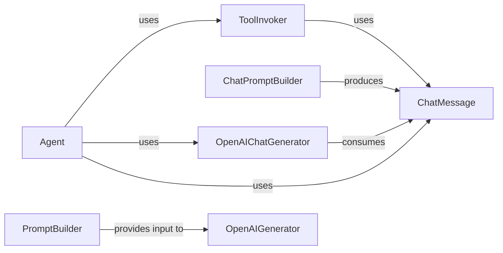

## Component Details

The LLM Interaction subsystem in Haystack is designed to facilitate dynamic prompt construction, seamless interaction with Large Language Models (LLMs), and the orchestration of complex, multi-step reasoning processes through agents and tool invocation. It forms the core of how Haystack applications communicate with and leverage the capabilities of LLMs.

### Agent
The Agent is the orchestrator for sophisticated, goal-driven workflows. It iteratively decides when to interact with LLMs, when to invoke external tools, and how to process intermediate results to achieve a final objective. It manages the flow of control, prepares inputs for generators, and evaluates exit conditions, making it fundamental for complex reasoning and autonomous behavior.

**Related Classes/Methods**:

- <a href="https://github.com/deepset-ai/haystack/blob/master/haystack/components/agents/agent.py#L27-L457" target="_blank" rel="noopener noreferrer">`haystack.components.agents.agent.Agent` (27:457)</a>

### ToolInvoker
This component is responsible for executing external tools within an agent's workflow. It abstracts the complexity of tool lookup, argument injection, error handling during execution, and formatting tool outputs into a standardized ChatMessage format, which is crucial for the LLM to interpret results.

**Related Classes/Methods**:

- <a href="https://github.com/deepset-ai/haystack/blob/master/haystack/components/tools/tool_invoker.py#L61-L727" target="_blank" rel="noopener noreferrer">`haystack.components.tools.tool_invoker.ToolInvoker` (61:727)</a>

### ChatPromptBuilder
A specialized component for constructing chat-based prompts. It dynamically formats various inputs, such as system messages, user queries, and contextual information, into a structured list of ChatMessage objects. This output is directly consumable by chat-oriented LLM generators, ensuring correct conversational formatting.

**Related Classes/Methods**:

- <a href="https://github.com/deepset-ai/haystack/blob/master/haystack/components/builders/chat_prompt_builder.py#L18-L279" target="_blank" rel="noopener noreferrer">`haystack.components.builders.chat_prompt_builder.ChatPromptBuilder` (18:279)</a>

### PromptBuilder
This component is designed for general-purpose prompt construction, not exclusively for chat formats. It allows for the dynamic insertion of variables and context into a prompt template, making it flexible for various text generation tasks where a single string prompt is required.

**Related Classes/Methods**:

- <a href="https://github.com/deepset-ai/haystack/blob/master/haystack/components/builders/prompt_builder.py#L16-L265" target="_blank" rel="noopener noreferrer">`haystack.components.builders.prompt_builder.PromptBuilder` (16:265)</a>

### OpenAIGenerator
This component serves as the interface for interacting with OpenAI's traditional text generation models (e.g., text-davinci-003). It handles the underlying API calls, manages streaming responses, and converts raw API outputs into Haystack's internal data formats, enabling text completion tasks.

**Related Classes/Methods**:

- <a href="https://github.com/deepset-ai/haystack/blob/master/haystack/components/generators/openai.py#L31-L266" target="_blank" rel="noopener noreferrer">`haystack.components.generators.openai.OpenAIGenerator` (31:266)</a>

### OpenAIChatGenerator
Specifically tailored for interacting with OpenAI's chat-based models (e.g., gpt-3.5-turbo, gpt-4). It manages conversation history, prepares API requests that can include tool definitions, and processes both streaming and complete chat responses. This component is crucial for conversational AI and agentic workflows due to its ability to handle structured chat messages and tool calls.

**Related Classes/Methods**:

- <a href="https://github.com/deepset-ai/haystack/blob/master/haystack/components/generators/chat/openai.py#L41-L450" target="_blank" rel="noopener noreferrer">`haystack.components.generators.chat.openai.OpenAIChatGenerator` (41:450)</a>

### ChatMessage
A crucial data class that represents a single message within a chat conversation. It encapsulates essential attributes like the message's role (e.g., system, user, assistant, tool) and its content. It also provides utility methods for easy conversion to and from OpenAI's API message format, making it the standard data structure for conversational interactions.

**Related Classes/Methods**:

- <a href="https://github.com/deepset-ai/haystack/blob/master/haystack/dataclasses/chat_message.py#L128-L543" target="_blank" rel="noopener noreferrer">`haystack.dataclasses.chat_message.ChatMessage` (128:543)</a>

### [FAQ](https://github.com/CodeBoarding/GeneratedOnBoardings/tree/main?tab=readme-ov-file#faq)