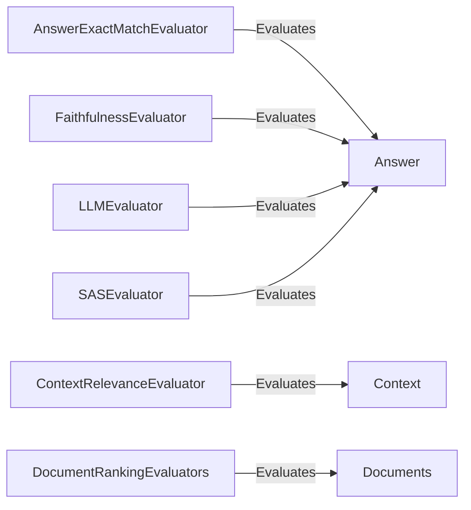

## Component Details

The Pipeline Evaluation component in Haystack provides a suite of tools for assessing the performance of pipelines. It encompasses various evaluators, each designed to measure specific aspects of the pipeline's output, such as answer accuracy, context relevance, and document ranking quality. These evaluators offer a comprehensive view of the pipeline's effectiveness, enabling users to identify areas for improvement and optimize overall performance. The evaluation process involves comparing the pipeline's output against ground truth data, and calculating relevant metrics to quantify the performance.

### AnswerExactMatchEvaluator
Evaluates if the generated answer exactly matches the ground truth answer. This evaluator provides a binary assessment, indicating whether the generated answer is identical to the expected answer.
- **Related Classes/Methods**: `haystack.components.evaluators.answer_exact_match.AnswerExactMatchEvaluator`

### ContextRelevanceEvaluator
Evaluates the relevance of the retrieved context to the given question. This component determines how well the context supports answering the question, providing a measure of the context's utility in the pipeline.
- **Related Classes/Methods**: `haystack.components.evaluators.context_relevance.ContextRelevanceEvaluator`

### DocumentRankingEvaluators
This component encompasses a set of evaluators designed to assess the quality of document ranking within the pipeline. It includes metrics such as Mean Average Precision (MAP), Mean Reciprocal Rank (MRR), Normalized Discounted Cumulative Gain (NDCG), and Recall. These metrics provide a comprehensive evaluation of the ranking performance.
- **Related Classes/Methods**: `haystack.components.evaluators.document_map.DocumentMAPEvaluator`, `haystack.components.evaluators.document_mrr.DocumentMRREvaluator`, `haystack.components.evaluators.document_ndcg.DocumentNDCGEvaluator`, `haystack.components.evaluators.document_recall.DocumentRecallEvaluator`

### FaithfulnessEvaluator
Evaluates the faithfulness of the generated answer to the retrieved context. It checks if the answer is supported by the context and doesn't contain any unsupported information, ensuring the answer is grounded in the provided context.
- **Related Classes/Methods**: `haystack.components.evaluators.faithfulness.FaithfulnessEvaluator`

### LLMEvaluator
Evaluates the quality of a generated answer using a Language Model. It assesses aspects like relevance, accuracy, and coherence by prompting an LLM to score the answer based on the context and question, providing a nuanced evaluation of the answer's quality.
- **Related Classes/Methods**: `haystack.components.evaluators.llm_evaluator.LLMEvaluator`

### SASEvaluator
Evaluates the semantic similarity between the generated answer and the ground truth answer. It uses a Sentence Transformer model to encode both answers and calculates their similarity score, providing a measure of semantic equivalence.
- **Related Classes/Methods**: `haystack.components.evaluators.sas_evaluator.SASEvaluator`
