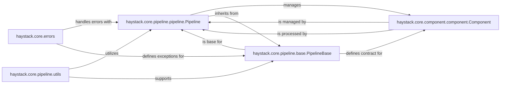

## Component Details

The `Pipeline` component in Haystack is the central orchestrator for defining and executing data flows. It manages the sequence and connections between different processing steps, ensuring data moves correctly between components. Its design emphasizes modularity, allowing complex data processing workflows to be built by composing smaller, reusable components.

### haystack.core.pipeline.pipeline.Pipeline
The concrete implementation of a synchronous pipeline in Haystack. It is responsible for defining, validating, and executing data processing workflows by managing the sequence and connections between various `Component` instances. It handles the flow of data, ensures correct execution order based on the defined graph, and provides mechanisms for input preparation, validation, and output collection.

**Related Classes/Methods**:

- <a href="https://github.com/deepset-ai/haystack/blob/master/haystack/core/pipeline/pipeline.py#L22-L258" target="_blank" rel="noopener noreferrer">`haystack.core.pipeline.pipeline.Pipeline` (22:258)</a>

### haystack.core.pipeline.base.PipelineBase
An abstract base class that provides the foundational structure and common functionalities for all Haystack pipeline implementations (e.g., `Pipeline`, `AsyncPipeline`). It defines the core contract for adding components, connecting them, and managing the pipeline's graph structure, ensuring consistency across different pipeline types.

**Related Classes/Methods**:

- <a href="https://github.com/deepset-ai/haystack/blob/master/haystack/core/pipeline/base.py#L73-L1432" target="_blank" rel="noopener noreferrer">`haystack.core.pipeline.base.PipelineBase` (73:1432)</a>

### haystack.core.component.component.Component
The fundamental building block representing any processing step within a Haystack pipeline. All functional units added to a `Pipeline` must inherit from this base class, providing a standardized interface for input, output, and execution.

**Related Classes/Methods**:

- <a href="https://github.com/deepset-ai/haystack/blob/master/haystack/core/component/component.py#L146-L193" target="_blank" rel="noopener noreferrer">`haystack.core.component.component.Component` (146:193)</a>

### haystack.core.errors
This module defines custom exception types used throughout the Haystack framework, including specific errors related to pipeline definition, validation, and runtime execution. It is crucial for robust error handling and providing clear feedback during pipeline operations.

**Related Classes/Methods**:

- <a href="https://github.com/deepset-ai/haystack/blob/master/haystack/core/errors.py#L0-L0" target="_blank" rel="noopener noreferrer">`haystack.core.errors` (0:0)</a>

### haystack.core.pipeline.utils
This module provides various utility functions that support the complex internal logic of pipeline execution. This includes functionalities related to graph manipulation, input/output management for components, and other helper operations necessary for the `Pipeline` to function correctly.

**Related Classes/Methods**:

- <a href="https://github.com/deepset-ai/haystack/blob/master/haystack/core/pipeline/utils.py#L0-L0" target="_blank" rel="noopener noreferrer">`haystack.core.pipeline.utils` (0:0)</a>

### [FAQ](https://github.com/CodeBoarding/GeneratedOnBoardings/tree/main?tab=readme-ov-file#faq)