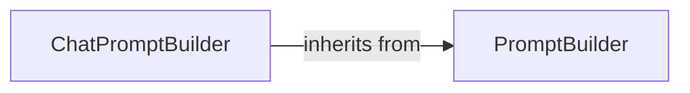

## Component Details

The Prompt Engineering component in Haystack focuses on constructing and managing prompts for language models. It provides tools for building both standard prompts and chat prompts, allowing users to customize the input to the model and control the output format. The core functionality revolves around the `PromptBuilder` and `ChatPromptBuilder` classes, which enable users to define prompt templates and populate them with context variables. This system allows for flexible prompt design, catering to specific tasks and desired language model behaviors.

### PromptBuilder
The `PromptBuilder` component serves as a base class for constructing prompts. It takes a prompt template and a dictionary of context variables as input, rendering a final prompt string. It provides the fundamental structure for creating prompts and is designed to be extended for more specialized prompt building tasks.
- **Related Classes/Methods**: `haystack.components.builders.prompt_builder.PromptBuilder`

### ChatPromptBuilder
The `ChatPromptBuilder` component extends the `PromptBuilder` to handle chat-specific prompts. It is designed for conversational language models, managing chat history and formatting prompts for multi-turn dialogues. It inherits the basic prompt building functionality from `PromptBuilder` and adds features tailored for chat models.
- **Related Classes/Methods**: `haystack.components.builders.chat_prompt_builder.ChatPromptBuilder`
