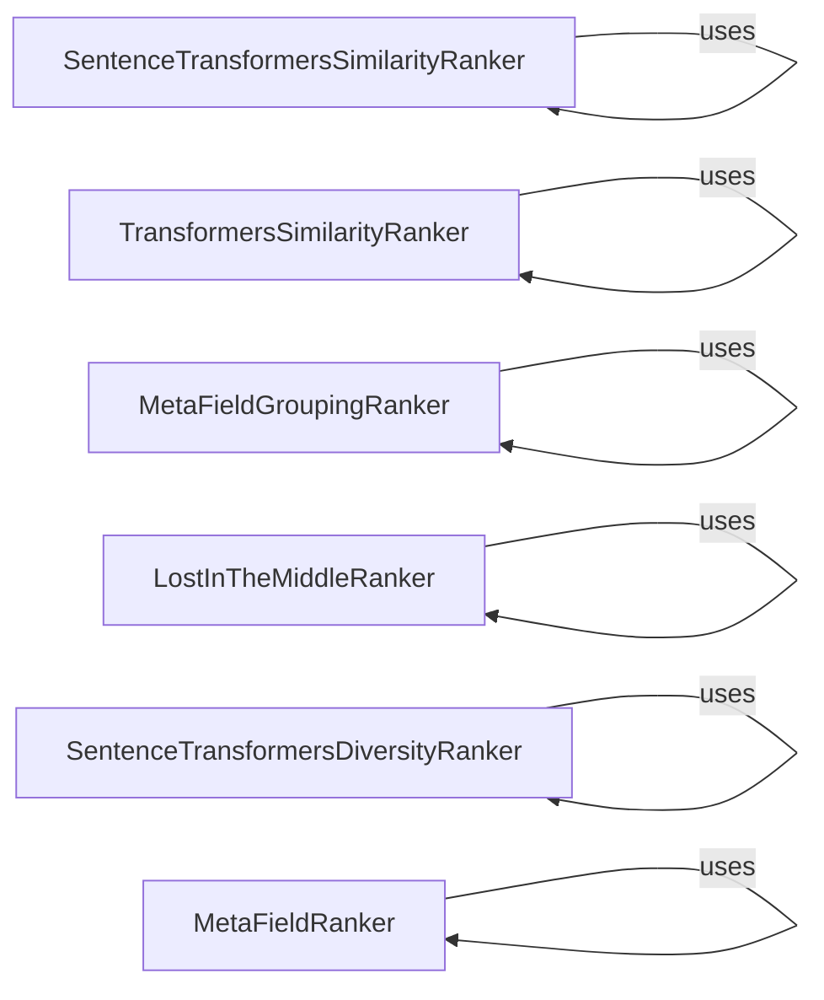

## Component Details

The Result Refinement component focuses on re-ranking retrieved documents to enhance the quality and relevance of search results. It employs various ranking strategies, including semantic similarity, diversity, meta-field ranking, and grouping, to optimize the order of documents presented to the user. The goal is to ensure that the most relevant and diverse documents are prioritized, improving the overall search experience.

### SentenceTransformersSimilarityRanker
This component ranks documents based on their semantic similarity to the query using sentence transformers. It encodes both the query and the documents into embeddings and then calculates similarity scores to determine the ranking order. This approach captures semantic relationships between the query and documents, leading to more relevant results.
- **Related Classes/Methods**: `haystack.components.rankers.sentence_transformers_similarity.SentenceTransformersSimilarityRanker`

### TransformersSimilarityRanker
This component ranks documents based on their similarity to the query using transformer models. It encodes the query and documents using a transformer model and calculates similarity scores to determine the ranking order. This method leverages the contextual understanding of transformer models to improve ranking accuracy.
- **Related Classes/Methods**: `haystack.components.rankers.transformers_similarity.TransformersSimilarityRanker`

### MetaFieldGroupingRanker
This component groups documents based on a specified meta field and then ranks them within each group. This ensures that documents with similar meta-field values are grouped together, allowing for more structured and organized ranking based on document metadata. It is useful when ranking needs to consider contextual information from document metadata.
- **Related Classes/Methods**: `haystack.components.rankers.meta_field_grouping_ranker.MetaFieldGroupingRanker`

### LostInTheMiddleRanker
This component re-ranks documents to address the 'Lost in the Middle' phenomenon, where documents in the middle of a long list tend to be overlooked. It boosts the relevance of these documents, ensuring they are not unfairly penalized due to their position in the initial ranking. This helps to improve the visibility of potentially relevant documents that might otherwise be missed.
- **Related Classes/Methods**: `haystack.components.rankers.lost_in_the_middle.LostInTheMiddleRanker`

### SentenceTransformersDiversityRanker
This component ranks documents based on diversity using sentence transformers. It aims to return a diverse set of documents that cover different aspects of the query, preventing redundancy and providing a more comprehensive set of results. This is particularly useful when the query has multiple facets or when a broad range of information is desired.
- **Related Classes/Methods**: `haystack.components.rankers.sentence_transformers_diversity.SentenceTransformersDiversityRanker`

### MetaFieldRanker
This component ranks documents based on the values of their meta fields. It allows for ranking based on specific criteria defined in the document's metadata, enabling users to prioritize documents based on factors such as date, author, or other relevant metadata fields. This provides a flexible way to customize ranking based on document attributes.
- **Related Classes/Methods**: `haystack.components.rankers.meta_field.MetaFieldRanker`
