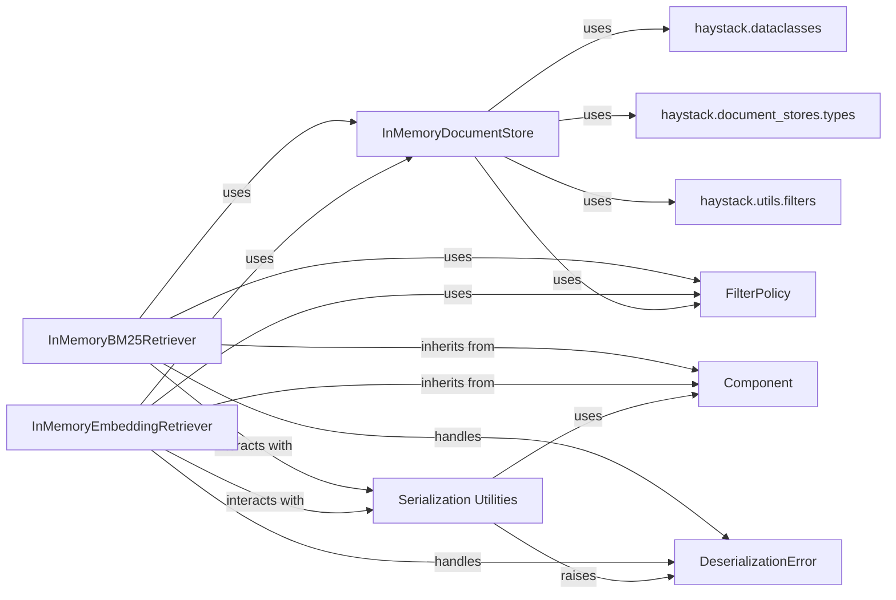

## Component Details

The `Retriever` subsystem in Haystack is crucial for fetching relevant documents from a `Document Store` based on a given query. The analysis focuses on the `InMemoryBM25Retriever` and `InMemoryEmbeddingRetriever` as they represent the core retrieval mechanisms within the in-memory context. These components are fundamental because they directly implement the logic for finding and returning documents, which is the primary purpose of a retriever.

### InMemoryBM25Retriever
This component performs keyword-based document retrieval using the BM25 algorithm. It's optimized for speed and efficiency when searching through an in-memory collection of documents.

**Related Classes/Methods**:

- `InMemoryBM25Retriever` (0:0)

### InMemoryEmbeddingRetriever
This component enables semantic search by retrieving documents based on the vector similarity between query embeddings and document embeddings. It's essential for understanding the contextual meaning of queries and documents.

**Related Classes/Methods**:

- `InMemoryEmbeddingRetriever` (0:0)

### InMemoryDocumentStore
This component acts as the in-memory storage for `Document` objects. It provides the interface for storing, retrieving, and managing documents that the retrievers operate on.

**Related Classes/Methods**:

- `InMemoryDocumentStore` (0:0)

### Component
This is the abstract base class for all Haystack components. It defines the common interface, input/output types, and expected behavior, ensuring modularity and consistent integration within Haystack pipelines.

**Related Classes/Methods**:

- <a href="https://github.com/deepset-ai/haystack/blob/master/haystack/core/component/component.py#L146-L193" target="_blank" rel="noopener noreferrer">`Component` (146:193)</a>

### FilterPolicy
This class defines how filtering rules are interpreted and applied to documents, particularly during the deserialization and operation of retriever components. It ensures that loaded retrievers can correctly apply document filters based on metadata.

**Related Classes/Methods**:

- <a href="https://github.com/deepset-ai/haystack/blob/master/haystack/document_stores/types/filter_policy.py#L12-L39" target="_blank" rel="noopener noreferrer">`FilterPolicy` (12:39)</a>

### Serialization Utilities
This module provides generic utility functions for converting Haystack components into a dictionary representation (for saving) and reconstructing them from a dictionary (for loading). These are crucial for the persistence and reusability of retriever components.

**Related Classes/Methods**:

- <a href="https://github.com/deepset-ai/haystack/blob/master/haystack/core/serialization.py#L0-L0" target="_blank" rel="noopener noreferrer">`haystack.core.serialization` (0:0)</a>

### DeserializationError
This is a specific error class within Haystack's core errors module, used to signal issues encountered during the deserialization process of components.

**Related Classes/Methods**:

- `DeserializationError` (0:0)

### haystack.dataclasses
Likely uses `Document` dataclasses for storing and managing documents.

**Related Classes/Methods**:

- `haystack.dataclasses` (0:0)

### haystack.document_stores.types
Implements interfaces and types defined in this module.

**Related Classes/Methods**:

- `haystack.document_stores.types` (0:0)

### haystack.utils.filters
Utilizes filtering utilities to process document queries.

**Related Classes/Methods**:

- <a href="https://github.com/deepset-ai/haystack/blob/master/haystack/utils/filters.py#L0-L0" target="_blank" rel="noopener noreferrer">`haystack.utils.filters` (0:0)</a>

### [FAQ](https://github.com/CodeBoarding/GeneratedOnBoardings/tree/main?tab=readme-ov-file#faq)