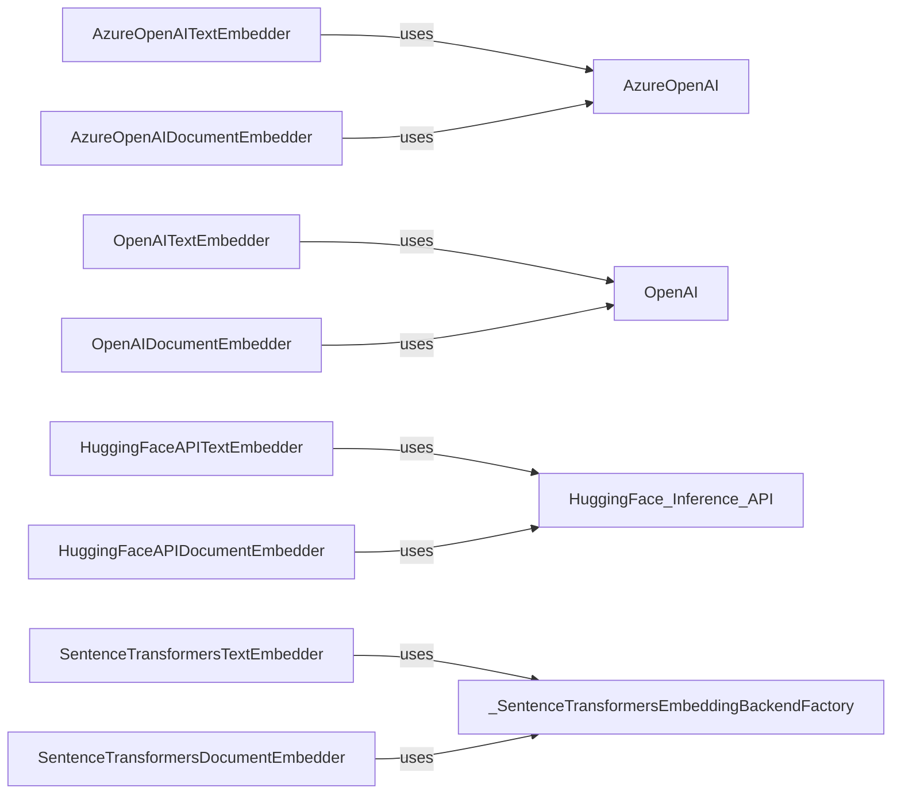

## Component Details

The Semantic Representation component focuses on generating embeddings for both documents and queries to capture their semantic meaning. It supports various embedding models from providers like Azure OpenAI, OpenAI, and SentenceTransformers. The core functionality involves converting text or documents into numerical vectors that represent their semantic content, enabling similarity comparisons for retrieval tasks. The choice of embedding model can be configured based on the specific requirements of the application.

### AzureOpenAITextEmbedder
This component embeds text using Azure OpenAI's text embedding models. It authenticates with the Azure OpenAI service and sends text to generate embeddings, which are numerical representations of the text's semantic meaning. These embeddings can then be used for semantic similarity comparisons.
- **Related Classes/Methods**: `haystack.components.embedders.azure_text_embedder.AzureOpenAITextEmbedder`

### AzureOpenAIDocumentEmbedder
This component embeds documents using Azure OpenAI's text embedding models. It interacts with the Azure OpenAI service to generate embeddings for the content of the documents. The generated embeddings capture the semantic meaning of the documents, facilitating semantic search and retrieval.
- **Related Classes/Methods**: `haystack.components.embedders.azure_document_embedder.AzureOpenAIDocumentEmbedder`

### OpenAITextEmbedder
This component embeds text using OpenAI's text embedding models. It communicates with the OpenAI API to generate embeddings for text inputs. The resulting embeddings represent the semantic content of the text, enabling semantic similarity calculations.
- **Related Classes/Methods**: `haystack.components.embedders.openai_text_embedder.OpenAITextEmbedder`

### OpenAIDocumentEmbedder
This component embeds documents using OpenAI's text embedding models. It sends document content to the OpenAI API to generate embeddings. These embeddings capture the semantic meaning of the documents, which can be used for tasks like document retrieval and similarity analysis.
- **Related Classes/Methods**: `haystack.components.embedders.openai_document_embedder.OpenAIDocumentEmbedder`

### HuggingFaceAPITextEmbedder
This component embeds text using the Hugging Face Inference API. It sends text to the API and retrieves the corresponding embeddings. The embeddings represent the semantic meaning of the text, allowing for semantic comparisons and retrieval.
- **Related Classes/Methods**: `haystack.components.embedders.hugging_face_api_text_embedder.HuggingFaceAPITextEmbedder`

### HuggingFaceAPIDocumentEmbedder
This component embeds documents using the Hugging Face Inference API. It sends documents to the API and retrieves the corresponding embeddings. These embeddings capture the semantic meaning of the documents, enabling semantic search and retrieval.
- **Related Classes/Methods**: `haystack.components.embedders.hugging_face_api_document_embedder.HuggingFaceAPIDocumentEmbedder`

### SentenceTransformersTextEmbedder
This component embeds text using Sentence Transformers models. It loads a Sentence Transformers model and uses it to generate embeddings for text inputs. The embeddings represent the semantic content of the text, facilitating semantic similarity calculations.
- **Related Classes/Methods**: `haystack.components.embedders.sentence_transformers_text_embedder.SentenceTransformersTextEmbedder`

### SentenceTransformersDocumentEmbedder
This component embeds documents using Sentence Transformers models. It loads a Sentence Transformers model and uses it to generate embeddings for document inputs. The generated embeddings capture the semantic meaning of the documents, which can be used for tasks like document retrieval and similarity analysis.
- **Related Classes/Methods**: `haystack.components.embedders.sentence_transformers_document_embedder.SentenceTransformersDocumentEmbedder`

### _SentenceTransformersEmbeddingBackendFactory
This factory class is responsible for creating and managing Sentence Transformers embedding backends. It ensures that the appropriate backend is used for embedding generation, providing a consistent interface for the SentenceTransformersTextEmbedder and SentenceTransformersDocumentEmbedder components.
- **Related Classes/Methods**: `haystack.components.embedders.backends.sentence_transformers_backend._SentenceTransformersEmbeddingBackendFactory`
