```mermaid
graph LR
    Data_Handling["Data Handling"]
    Document_Indexing_Storage["Document Indexing & Storage"]
    Semantic_Representation["Semantic Representation"]
    Information_Retrieval["Information Retrieval"]
    Result_Refinement["Result Refinement"]
    Answer_Generation_Chat["Answer Generation & Chat"]
    Prompt_Engineering["Prompt Engineering"]
    Pipeline_Evaluation["Pipeline Evaluation"]
    Data_Handling -- "processes" --> Document_Indexing_Storage
    Document_Indexing_Storage -- "stores" --> Information_Retrieval
    Semantic_Representation -- "generates embeddings for" --> Document_Indexing_Storage
    Information_Retrieval -- "retrieves from" --> Document_Indexing_Storage
    Information_Retrieval -- "refines" --> Result_Refinement
    Result_Refinement -- "generates answers" --> Answer_Generation_Chat
    Prompt_Engineering -- "builds prompts for" --> Answer_Generation_Chat
    Answer_Generation_Chat -- "evaluates" --> Pipeline_Evaluation
    Pipeline_Evaluation -- "ingests data" --> Data_Handling
    click Data_Handling href "https://github.com/CodeBoarding/GeneratedOnBoardings/blob/main/haystack/Data Handling.md" "Details"
    click Document_Indexing_Storage href "https://github.com/CodeBoarding/GeneratedOnBoardings/blob/main/haystack/Document Indexing & Storage.md" "Details"
    click Semantic_Representation href "https://github.com/CodeBoarding/GeneratedOnBoardings/blob/main/haystack/Semantic Representation.md" "Details"
    click Information_Retrieval href "https://github.com/CodeBoarding/GeneratedOnBoardings/blob/main/haystack/Information Retrieval.md" "Details"
    click Result_Refinement href "https://github.com/CodeBoarding/GeneratedOnBoardings/blob/main/haystack/Result Refinement.md" "Details"
    click Answer_Generation_Chat href "https://github.com/CodeBoarding/GeneratedOnBoardings/blob/main/haystack/Answer Generation & Chat.md" "Details"
    click Prompt_Engineering href "https://github.com/CodeBoarding/GeneratedOnBoardings/blob/main/haystack/Prompt Engineering.md" "Details"
    click Pipeline_Evaluation href "https://github.com/CodeBoarding/GeneratedOnBoardings/blob/main/haystack/Pipeline Evaluation.md" "Details"
```

## Component Details

Haystack is a modular framework for building search and question answering systems. It provides components for data ingestion, preprocessing, storage, retrieval, ranking, and answer generation. The core flow involves ingesting data from various sources, processing it to create searchable documents, storing these documents in a document store, retrieving relevant documents based on a query, ranking the retrieved documents, and generating an answer using a language model. The framework also includes components for prompting, evaluation, routing, and joining, allowing for flexible and customizable pipelines.

### Data Handling
This component encompasses the ingestion, conversion, and preprocessing of data from various sources into a standardized format suitable for indexing and retrieval. It manages fetching data, converting file types, cleaning text, splitting documents, and preparing the data for subsequent steps in the pipeline. It ensures that the data is well-structured and optimized for embedding and storage.
- **Related Classes/Methods**: `haystack.components.converters.azure.AzureOCRDocumentConverter`, `haystack.components.converters.csv.CSVToDocument`, `haystack.components.converters.docx.DOCXToDocument`, `haystack.components.converters.html.HTMLToDocument`, `haystack.components.converters.json.JSONConverter`, `haystack.components.converters.markdown.MarkdownToDocument`, `haystack.components.converters.msg.MSGToDocument`, `haystack.components.converters.multi_file_converter.MultiFileConverter`, `haystack.components.converters.pdfminer.PDFMinerToDocument`, `haystack.components.converters.pptx.PPTXToDocument`, `haystack.components.converters.pypdf.PyPDFToDocument`, `haystack.components.converters.tika.TikaDocumentConverter`, `haystack.components.converters.txt.TextFileToDocument`, `haystack.components.converters.xlsx.XLSXToDocument`, `haystack.components.fetchers.link_content.LinkContentFetcher`, `haystack.components.preprocessors.csv_document_cleaner.CSVDocumentCleaner`, `haystack.components.preprocessors.csv_document_splitter.CSVDocumentSplitter`, `haystack.components.preprocessors.document_cleaner.DocumentCleaner`, `haystack.components.preprocessors.document_preprocessor.DocumentPreprocessor`, `haystack.components.preprocessors.document_splitter.DocumentSplitter`, `haystack.components.preprocessors.hierarchical_document_splitter.HierarchicalDocumentSplitter`, `haystack.components.preprocessors.recursive_splitter.RecursiveDocumentSplitter`, `haystack.components.preprocessors.sentence_tokenizer.SentenceSplitter`, `haystack.components.preprocessors.text_cleaner.TextCleaner`

### Document Indexing & Storage
This component manages the storage and indexing of processed documents and their embeddings. It provides functionalities for indexing, filtering, and retrieving documents, enabling efficient search and retrieval of relevant information. It acts as the central repository for all processed data, allowing for quick access to documents based on various criteria.
- **Related Classes/Methods**: `haystack.document_stores.in_memory.document_store.InMemoryDocumentStore`

### Semantic Representation
This component is responsible for generating embeddings for both documents and queries, capturing their semantic meaning. These embeddings are used to find semantically similar documents during retrieval. It supports various embedding models, including those from Azure, OpenAI, and SentenceTransformers, allowing for flexibility in choosing the most appropriate model for the task.
- **Related Classes/Methods**: `haystack.components.embedders.azure_document_embedder.AzureOpenAIDocumentEmbedder`, `haystack.components.embedders.azure_text_embedder.AzureOpenAITextEmbedder`, `haystack.components.embedders.hugging_face_api_document_embedder.HuggingFaceAPIDocumentEmbedder`, `haystack.components.embedders.hugging_face_api_text_embedder.HuggingFaceAPITextEmbedder`, `haystack.components.embedders.openai_document_embedder.OpenAIDocumentEmbedder`, `haystack.components.embedders.openai_text_embedder.OpenAITextEmbedder`, `haystack.components.embedders.sentence_transformers_document_embedder.SentenceTransformersDocumentEmbedder`, `haystack.components.embedders.sentence_transformers_text_embedder.SentenceTransformersTextEmbedder`

### Information Retrieval
This component focuses on retrieving relevant documents from the DocumentStore based on a query. It uses techniques like BM25 or embedding similarity to find the most relevant documents. It supports filtering and auto-merging of retrieved documents, allowing for fine-tuning of the retrieval process to optimize for accuracy and efficiency.
- **Related Classes/Methods**: `haystack.components.retrievers.auto_merging_retriever.AutoMergingRetriever`, `haystack.components.retrievers.filter_retriever.FilterRetriever`, `haystack.components.retrievers.in_memory.bm25_retriever.InMemoryBM25Retriever`, `haystack.components.retrievers.in_memory.embedding_retriever.InMemoryEmbeddingRetriever`, `haystack.components.retrievers.sentence_window_retriever.SentenceWindowRetriever`

### Result Refinement
This component re-ranks the retrieved documents to improve the quality of the results. It can use techniques like semantic similarity or diversity ranking. It supports meta-field ranking and grouping, allowing for more sophisticated ranking strategies that take into account document metadata and other contextual information.
- **Related Classes/Methods**: `haystack.components.rankers.lost_in_the_middle.LostInTheMiddleRanker`, `haystack.components.rankers.meta_field.MetaFieldRanker`, `haystack.components.rankers.meta_field_grouping_ranker.MetaFieldGroupingRanker`, `haystack.components.rankers.sentence_transformers_diversity.SentenceTransformersDiversityRanker`, `haystack.components.rankers.sentence_transformers_similarity.SentenceTransformersSimilarityRanker`, `haystack.components.rankers.transformers_similarity.TransformersSimilarityRanker`

### Answer Generation & Chat
This component generates answers to the query based on the retrieved documents. It uses large language models to generate coherent and informative answers. It supports various language models, including those from Azure, OpenAI, and Hugging Face. It also includes chat-specific generators for conversational applications, maintaining context and generating appropriate responses.
- **Related Classes/Methods**: `haystack.components.generators.azure.AzureOpenAIGenerator`, `haystack.components.generators.hugging_face_api.HuggingFaceAPIGenerator`, `haystack.components.generators.hugging_face_local.HuggingFaceLocalGenerator`, `haystack.components.generators.openai.OpenAIGenerator`, `haystack.components.generators.openai_dalle.DALLEImageGenerator`, `haystack.components.generators.chat.azure.AzureOpenAIChatGenerator`, `haystack.components.generators.chat.hugging_face_api.HuggingFaceAPIChatGenerator`, `haystack.components.generators.chat.hugging_face_local.HuggingFaceLocalChatGenerator`, `haystack.components.generators.chat.openai.OpenAIChatGenerator`

### Prompt Engineering
This component constructs prompts for language models, allowing users to customize the input to the model and control the output format. It supports building both standard prompts and chat prompts, enabling users to tailor the language model's behavior to specific tasks and requirements. It provides flexibility in designing prompts that elicit the desired responses from the language model.
- **Related Classes/Methods**: `haystack.components.builders.prompt_builder.PromptBuilder`, `haystack.components.builders.chat_prompt_builder.ChatPromptBuilder`

### Pipeline Evaluation
This component evaluates the performance of the pipeline, providing metrics like accuracy, recall, and F1-score. It supports various evaluation metrics, including answer exact match, context relevance, and document-based metrics. It allows for comprehensive assessment of the pipeline's effectiveness, enabling users to identify areas for improvement and optimize performance.
- **Related Classes/Methods**: `haystack.components.evaluators.answer_exact_match.AnswerExactMatchEvaluator`, `haystack.components.evaluators.context_relevance.ContextRelevanceEvaluator`, `haystack.components.evaluators.document_map.DocumentMAPEvaluator`, `haystack.components.evaluators.document_mrr.DocumentMRREvaluator`, `haystack.components.evaluators.document_ndcg.DocumentNDCGEvaluator`, `haystack.components.evaluators.document_recall.DocumentRecallEvaluator`, `haystack.components.evaluators.faithfulness.FaithfulnessEvaluator`, `haystack.components.evaluators.llm_evaluator.LLMEvaluator`, `haystack.components.evaluators.sas_evaluator.SASEvaluator`