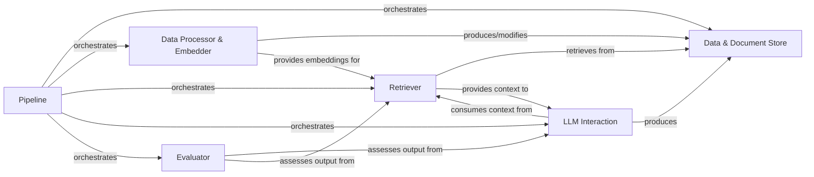

## Component Details

The `haystack` architecture is designed around a modular and extensible pipeline concept, enabling flexible construction of various NLP applications. The core components facilitate data ingestion, processing, retrieval, interaction with Large Language Models (LLMs), and evaluation.

### Pipeline
The central orchestrator for defining and executing data flows. It manages the sequence and connections between different processing steps, ensuring data moves correctly between components.

**Related Classes/Methods**:

- <a href="https://github.com/deepset-ai/haystack/blob/master/haystack/core/pipeline/pipeline.py#L22-L258" target="_blank" rel="noopener noreferrer">`haystack.core.pipeline.pipeline.Pipeline` (22:258)</a>

### Data & Document Store
Manages the fundamental data units (`Document`, `ChatMessage`) that flow through the system and provides persistent or in-memory storage for `Document` objects, enabling efficient storage, retrieval, and filtering.

**Related Classes/Methods**:

- <a href="https://github.com/deepset-ai/haystack/blob/master/haystack/dataclasses/document.py#L45-L182" target="_blank" rel="noopener noreferrer">`haystack.dataclasses.document.Document` (45:182)</a>
- <a href="https://github.com/deepset-ai/haystack/blob/master/haystack/dataclasses/chat_message.py#L128-L543" target="_blank" rel="noopener noreferrer">`haystack.dataclasses.chat_message.ChatMessage` (128:543)</a>
- <a href="https://github.com/deepset-ai/haystack/blob/master/haystack/document_stores/in_memory/document_store.py#L57-L737" target="_blank" rel="noopener noreferrer">`haystack.document_stores.in_memory.document_store.InMemoryDocumentStore` (57:737)</a>

### Data Processor & Embedder
Processes and transforms raw data or existing `Document`s into a more suitable format for downstream tasks (e.g., converting file types, cleaning text, splitting documents). It also converts textual content into dense vector representations (embeddings) for semantic understanding.

**Related Classes/Methods**:

- <a href="https://github.com/deepset-ai/haystack/blob/master/haystack/components/converters/multi_file_converter.py#L37-L130" target="_blank" rel="noopener noreferrer">`haystack.components.converters.multi_file_converter.MultiFileConverter` (37:130)</a>
- <a href="https://github.com/deepset-ai/haystack/blob/master/haystack/components/preprocessors/document_cleaner.py#L17-L324" target="_blank" rel="noopener noreferrer">`haystack.components.preprocessors.document_cleaner.DocumentCleaner` (17:324)</a>
- <a href="https://github.com/deepset-ai/haystack/blob/master/haystack/components/preprocessors/document_splitter.py#L21-L489" target="_blank" rel="noopener noreferrer">`haystack.components.preprocessors.document_splitter.DocumentSplitter` (21:489)</a>
- <a href="https://github.com/deepset-ai/haystack/blob/master/haystack/components/embedders/sentence_transformers_document_embedder.py#L16-L262" target="_blank" rel="noopener noreferrer">`haystack.components.embedders.sentence_transformers_document_embedder.SentenceTransformersDocumentEmbedder` (16:262)</a>
- <a href="https://github.com/deepset-ai/haystack/blob/master/haystack/components/embedders/sentence_transformers_text_embedder.py#L16-L235" target="_blank" rel="noopener noreferrer">`haystack.components.embedders.sentence_transformers_text_embedder.SentenceTransformersTextEmbedder` (16:235)</a>

### Retriever
Finds and fetches the most relevant `Document`s from the `Document Store` based on a given query. It employs various algorithms like BM25 for keyword matching or vector similarity for semantic matching.

**Related Classes/Methods**:

- <a href="https://github.com/deepset-ai/haystack/blob/master/haystack/components/retrievers/in_memory/bm25_retriever.py#L12-L202" target="_blank" rel="noopener noreferrer">`haystack.components.retrievers.in_memory.bm25_retriever.InMemoryBM25Retriever` (12:202)</a>
- <a href="https://github.com/deepset-ai/haystack/blob/master/haystack/components/retrievers/in_memory/embedding_retriever.py#L12-L244" target="_blank" rel="noopener noreferrer">`haystack.components.retrievers.in_memory.embedding_retriever.InMemoryEmbeddingRetriever` (12:244)</a>

### LLM Interaction
Handles the dynamic construction of prompts for Large Language Models, interacts with LLMs to generate human-like text or conversational responses, and orchestrates complex, multi-step reasoning via agents and tool invocation.

**Related Classes/Methods**:

- <a href="https://github.com/deepset-ai/haystack/blob/master/haystack/components/builders/prompt_builder.py#L16-L265" target="_blank" rel="noopener noreferrer">`haystack.components.builders.prompt_builder.PromptBuilder` (16:265)</a>
- <a href="https://github.com/deepset-ai/haystack/blob/master/haystack/components/builders/chat_prompt_builder.py#L18-L279" target="_blank" rel="noopener noreferrer">`haystack.components.builders.chat_prompt_builder.ChatPromptBuilder` (18:279)</a>
- <a href="https://github.com/deepset-ai/haystack/blob/master/haystack/components/generators/openai.py#L31-L266" target="_blank" rel="noopener noreferrer">`haystack.components.generators.openai.OpenAIGenerator` (31:266)</a>
- <a href="https://github.com/deepset-ai/haystack/blob/master/haystack/components/generators/chat/openai.py#L41-L450" target="_blank" rel="noopener noreferrer">`haystack.components.generators.chat.openai.OpenAIChatGenerator` (41:450)</a>
- <a href="https://github.com/deepset-ai/haystack/blob/master/haystack/components/agents/agent.py#L27-L457" target="_blank" rel="noopener noreferrer">`haystack.components.agents.agent.Agent` (27:457)</a>
- <a href="https://github.com/deepset-ai/haystack/blob/master/haystack/components/tools/tool_invoker.py#L61-L727" target="_blank" rel="noopener noreferrer">`haystack.components.tools.tool_invoker.ToolInvoker` (61:727)</a>

### Evaluator
Measures the performance and quality of various components within the pipeline. This includes assessing the relevance of retrieved documents or the faithfulness of generated answers, often by leveraging an LLM for assessment.

**Related Classes/Methods**:

- <a href="https://github.com/deepset-ai/haystack/blob/master/haystack/components/evaluators/llm_evaluator.py#L21-L385" target="_blank" rel="noopener noreferrer">`haystack.components.evaluators.llm_evaluator.LLMEvaluator` (21:385)</a>

### [FAQ](https://github.com/CodeBoarding/GeneratedOnBoardings/tree/main?tab=readme-ov-file#faq)