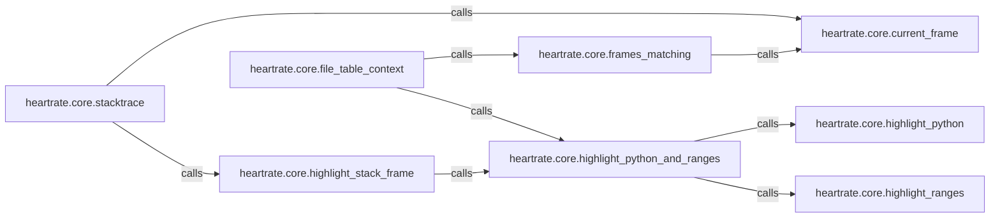

## Details

The `heartrate.core` subsystem is designed to capture, process, and present real-time Python execution data, primarily focusing on stack traces and code highlighting for a web-based visualization. It acts as the backend for a dynamic code introspection tool. The core flow involves an API endpoint (`stacktrace`) that initiates the collection of raw stack frame data. This data is then filtered to focus on relevant user code, and each frame's code is meticulously highlighted, combining general Python syntax with specific execution point emphasis. The processed and structured data is finally exposed through another API endpoint (`file_table_context`) for consumption by a frontend visualization.

### heartrate.core.file_table_context
This is the central component of the subsystem, acting as the primary data aggregator and the backend API endpoint. It orchestrates the transformation of raw execution data (including stack frames and highlighted code) into a structured format specifically designed for the web frontend's file table view. This function is the direct interface for the frontend to retrieve visualization data.

**Related Classes/Methods**:

- <a href="https://github.com/alexmojaki/heartrate/blob/master/heartrate/core.py#L99-L144" target="_blank" rel="noopener noreferrer">`heartrate.core.file_table_context`:99-144</a>
- <a href="https://github.com/alexmojaki/heartrate/blob/master/heartrate/core.py#L153-L158" target="_blank" rel="noopener noreferrer">`heartrate.core.frames_matching`:153-158</a>
- <a href="https://github.com/alexmojaki/heartrate/blob/master/heartrate/core.py#L42-L46" target="_blank" rel="noopener noreferrer">`heartrate.core.highlight_python_and_ranges`:42-46</a>

### heartrate.core.stacktrace
This component serves as an API endpoint (`/stacktrace/`) that dynamically generates and returns a JSON representation of the current Python call stack. It iterates through stack frames, extracts relevant information (filename, line number, function name), applies code highlighting to each frame using `highlight_stack_frame`, and filters out internal `heartrate` frames to provide a clean, user-focused stack trace for visualization.

**Related Classes/Methods**:

- <a href="https://github.com/alexmojaki/heartrate/blob/master/heartrate/core.py#L160-L182" target="_blank" rel="noopener noreferrer">`heartrate.core.stacktrace`:160-182</a>

### heartrate.core.frames_matching
Implements the logic for identifying and filtering stack frames based on specific criteria (e.g., excluding internal frames, focusing on user code). This ensures only relevant frames are processed and sent to the frontend, optimizing data for visualization.

**Related Classes/Methods**:

- <a href="https://github.com/alexmojaki/heartrate/blob/master/heartrate/core.py#L153-L158" target="_blank" rel="noopener noreferrer">`heartrate.core.frames_matching`:153-158</a>
- <a href="https://github.com/alexmojaki/heartrate/blob/master/heartrate/core.py#L150-L151" target="_blank" rel="noopener noreferrer">`heartrate.core.current_frame`:150-151</a>

### heartrate.core.highlight_stack_frame
Focuses on applying detailed code highlighting within individual stack frames. This involves integrating both general Python syntax highlighting and specific line range highlighting to visually emphasize execution points, crucial for the visualization aspect.

**Related Classes/Methods**:

- <a href="https://github.com/alexmojaki/heartrate/blob/master/heartrate/core.py#L49-L61" target="_blank" rel="noopener noreferrer">`heartrate.core.highlight_stack_frame`:49-61</a>
- <a href="https://github.com/alexmojaki/heartrate/blob/master/heartrate/core.py#L42-L46" target="_blank" rel="noopener noreferrer">`heartrate.core.highlight_python_and_ranges`:42-46</a>

### heartrate.core.highlight_python_and_ranges
A utility function that combines general Python syntax highlighting with specific line range highlighting. It acts as an intermediary for applying complex highlighting rules, used by other components to enrich code snippets.

**Related Classes/Methods**:

- <a href="https://github.com/alexmojaki/heartrate/blob/master/heartrate/core.py#L42-L46" target="_blank" rel="noopener noreferrer">`heartrate.core.highlight_python_and_ranges`:42-46</a>
- <a href="https://github.com/alexmojaki/heartrate/blob/master/heartrate/core.py#L34-L39" target="_blank" rel="noopener noreferrer">`heartrate.core.highlight_python`:34-39</a>
- <a href="https://github.com/alexmojaki/heartrate/blob/master/heartrate/core.py#L223-L255" target="_blank" rel="noopener noreferrer">`heartrate.core.highlight_ranges`:223-255</a>

### heartrate.core.highlight_python
This foundational utility applies general Python syntax highlighting to a given code string using the `pygments` library. It is a core part of the visualization process, ensuring code snippets are presented with proper syntax coloring.

**Related Classes/Methods**:

- <a href="https://github.com/alexmojaki/heartrate/blob/master/heartrate/core.py#L34-L39" target="_blank" rel="noopener noreferrer">`heartrate.core.highlight_python`:34-39</a>

### heartrate.core.highlight_ranges
This utility identifies and highlights specific line ranges within a block of source code. It processes a list of stack frames to determine the exact code segments that were executing, marking them for visual emphasis. This is crucial for showing the active lines in the visualized stack trace.

**Related Classes/Methods**:

- <a href="https://github.com/alexmojaki/heartrate/blob/master/heartrate/core.py#L223-L255" target="_blank" rel="noopener noreferrer">`heartrate.core.highlight_ranges`:223-255</a>

### heartrate.core.current_frame
This foundational utility provides direct access to the current execution frame object. It is essential for navigating the call stack and extracting information about the current point of execution.

**Related Classes/Methods**:

- <a href="https://github.com/alexmojaki/heartrate/blob/master/heartrate/core.py#L150-L151" target="_blank" rel="noopener noreferrer">`heartrate.core.current_frame`:150-151</a>

### [FAQ](https://github.com/CodeBoarding/GeneratedOnBoardings/tree/main?tab=readme-ov-file#faq)