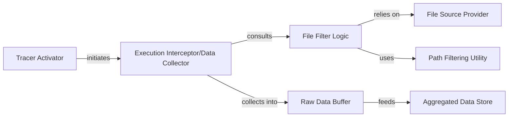

## Details

Analysis of the `Execution Monitor` subsystem, which is responsible for intercepting Python execution, filtering relevant files, and collecting raw line-by-line execution data for the `heartrate` project.

### Tracer Activator
Initializes and activates the Python system-wide tracing mechanism by setting `sys.settrace` to the `trace_func`. It is the entry point for enabling execution monitoring.

**Related Classes/Methods**:

- <a href="https://github.com/alexmojaki/heartrate/blob/master/heartrate/core.py#L64-L216" target="_blank" rel="noopener noreferrer">`heartrate.core.trace`:64-216</a>

### Execution Interceptor/Data Collector
This is the core callback function invoked by the Python interpreter for each executed line. It decides whether to process an event based on file filtering and collects raw line-by-line execution data (e.g., line number, event type, frame information).

**Related Classes/Methods**:

- <a href="https://github.com/alexmojaki/heartrate/blob/master/heartrate/core.py#L195-L205" target="_blank" rel="noopener noreferrer">`heartrate.core.trace_func`:195-205</a>

### File Filter Logic
Determines if a given file's execution should be monitored. It acts as a gatekeeper, ensuring that only relevant source files (e.g., user code, not library code) are traced.

**Related Classes/Methods**:

- <a href="https://github.com/alexmojaki/heartrate/blob/master/heartrate/core.py#L74-L79" target="_blank" rel="noopener noreferrer">`heartrate.core.include_file`:74-79</a>

### File Source Provider
Provides a mechanism to identify and list all potential files that are part of the project and should be considered for monitoring. This could be a list of included/excluded paths.

**Related Classes/Methods**:

- <a href="https://github.com/alexmojaki/heartrate/blob/master/heartrate/files.py#L5-L6" target="_blank" rel="noopener noreferrer">`heartrate.files.all`:5-6</a>

### Path Filtering Utility
A helper function that performs specific path-based filtering checks (e.g., checking if a path contains certain substrings or matches patterns). It refines which files are included or excluded from tracing.

**Related Classes/Methods**:

- <a href="https://github.com/alexmojaki/heartrate/blob/master/heartrate/files.py#L9-L13" target="_blank" rel="noopener noreferrer">`heartrate.files.path_contains`:9-13</a>

### Raw Data Buffer
A temporary, in-memory storage mechanism (likely a queue or list) for raw, unaggregated execution events collected by `trace_func`. It acts as a transient buffer before data is processed further.

**Related Classes/Methods**:

- <a href="https://github.com/alexmojaki/heartrate/blob/master/heartrate/core.py" target="_blank" rel="noopener noreferrer">`heartrate.core.queues`</a>

### Aggregated Data Store
A data structure responsible for aggregating and storing execution statistics (e.g., hit counts per line, total execution time). It processes raw events from the `Raw Data Buffer` into a more structured and summarized form, ready for visualization.

**Related Classes/Methods**:

- <a href="https://github.com/alexmojaki/heartrate/blob/master/heartrate/core.py" target="_blank" rel="noopener noreferrer">`heartrate.core.totals`</a>

### [FAQ](https://github.com/CodeBoarding/GeneratedOnBoardings/tree/main?tab=readme-ov-file#faq)