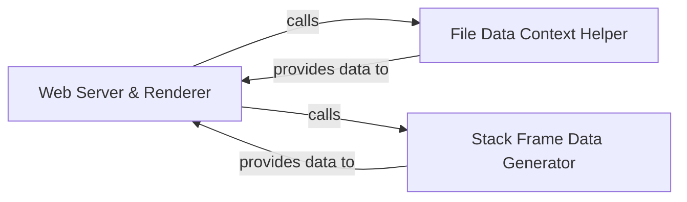

## Details

The heartrate subsystem provides a web-based interface for visualizing Python code execution. At its core, the Web Server & Renderer component, built with Flask, serves as the user-facing application, handling all web requests and rendering dynamic HTML content. It relies on the File Data Context Helper to supply contextual source code information, including highlighted code snippets and file metadata. Concurrently, the Stack Frame Data Generator captures and processes real-time execution stack data, transforming it into a structured format suitable for visualization. These two data-providing components feed into the Web Server & Renderer, enabling it to present an interactive and insightful view of code execution flow and file-specific details to the user.

### Web Server & Renderer [[Expand]](./Web_Server_Renderer.md)
This component is the core Flask application responsible for initializing and hosting the web interface. It manages HTTP request routing, serves static assets (CSS, JavaScript, images), and dynamically renders HTML views by integrating processed data from other backend components. It acts as the primary interface between the backend data processing and the frontend visualization.

**Related Classes/Methods**:

- <a href="https://github.com/alexmojaki/heartrate/blob/master/heartrate/core.py#L64-L216" target="_blank" rel="noopener noreferrer">`heartrate.core.trace`:64-216</a>

### File Data Context Helper
This component is responsible for providing contextual data related to source files. It handles operations such as retrieving file content, line numbers, and highlighting code snippets, which are necessary for the Web Server & Renderer to display code alongside execution traces.

**Related Classes/Methods**:

- <a href="https://github.com/alexmojaki/heartrate/blob/master/heartrate/files.py#L16-L22" target="_blank" rel="noopener noreferrer">`heartrate.files.contains_regex`:16-22</a>
- <a href="https://github.com/alexmojaki/heartrate/blob/master/heartrate/core.py#L223-L255" target="_blank" rel="noopener noreferrer">`heartrate.core.highlight_ranges`:223-255</a>
- <a href="https://github.com/alexmojaki/heartrate/blob/master/heartrate/core.py#L99-L144" target="_blank" rel="noopener noreferrer">`heartrate.core.file_table_context`:99-144</a>

### Stack Frame Data Generator
This component is dedicated to processing and generating structured data related to execution stack frames. It prepares the raw tracing data into a format suitable for consumption by the Web Server & Renderer for visualization, enabling the frontend to display call stacks and execution flow.

**Related Classes/Methods**:

- <a href="https://github.com/alexmojaki/heartrate/blob/master/heartrate/core.py#L195-L205" target="_blank" rel="noopener noreferrer">`heartrate.core.trace_func`:195-205</a>
- <a href="https://github.com/alexmojaki/heartrate/blob/master/heartrate/core.py#L160-L182" target="_blank" rel="noopener noreferrer">`heartrate.core.stacktrace`:160-182</a>
- <a href="https://github.com/alexmojaki/heartrate/blob/master/heartrate/core.py#L49-L61" target="_blank" rel="noopener noreferrer">`heartrate.core.highlight_stack_frame`:49-61</a>

### [FAQ](https://github.com/CodeBoarding/GeneratedOnBoardings/tree/main?tab=readme-ov-file#faq)