```mermaid
graph LR
    Execution_Monitor["Execution Monitor"]
    Data_Transformation_API["Data Transformation & API"]
    Web_Server_Renderer["Web Server & Renderer"]
    Browser_Frontend_External_["Browser Frontend (External)"]
    Execution_Monitor -- "provides raw execution data to" --> Data_Transformation_API
    Data_Transformation_API -- "supplies processed visualization data to" --> Web_Server_Renderer
    Web_Server_Renderer -- "serves the web interface and data to" --> Browser_Frontend_External_
    Browser_Frontend_External_ -- "requests visualization data and views from" --> Web_Server_Renderer
    click Execution_Monitor href "https://github.com/CodeBoarding/GeneratedOnBoardings/blob/main/heartrate/Execution_Monitor.md" "Details"
    click Data_Transformation_API href "https://github.com/CodeBoarding/GeneratedOnBoardings/blob/main/heartrate/Data_Transformation_API.md" "Details"
    click Web_Server_Renderer href "https://github.com/CodeBoarding/GeneratedOnBoardings/blob/main/heartrate/Web_Server_Renderer.md" "Details"
```

## Details

The `heartrate` project is structured around a clear client-server architecture designed for real-time Python code visualization. The Execution Monitor acts as the core data source, intercepting and collecting raw execution traces. This raw data is then fed into the Data Transformation & API, which processes, enriches, and aggregates it into a format suitable for visualization. The Web Server & Renderer, built with Flask, serves as the backend API, hosting the web interface and delivering the processed data. Finally, the Browser Frontend (External), an external client-side component, consumes the served HTML, CSS, and JavaScript to render the interactive code visualization, completing the data flow from execution to user display.

### Execution Monitor [[Expand]](./Execution_Monitor.md)
Intercepts Python execution, filters relevant files, and collects raw line-by-line execution data, acting as the primary data source.

**Related Classes/Methods**:

- <a href="https://github.com/alexmojaki/heartrate/blob/master/heartrate/core.py#L195-L205" target="_blank" rel="noopener noreferrer">`heartrate.core.trace_func`:195-205</a>
- <a href="https://github.com/alexmojaki/heartrate/blob/master/heartrate/core.py#L64-L216" target="_blank" rel="noopener noreferrer">`heartrate.core.trace`:64-216</a>
- <a href="https://github.com/alexmojaki/heartrate/blob/master/heartrate/files.py#L5-L6" target="_blank" rel="noopener noreferrer">`heartrate.files.all`:5-6</a>
- <a href="https://github.com/alexmojaki/heartrate/blob/master/heartrate/files.py#L9-L13" target="_blank" rel="noopener noreferrer">`heartrate.files.path_contains`:9-13</a>
- <a href="https://github.com/alexmojaki/heartrate/blob/master/heartrate/core.py" target="_blank" rel="noopener noreferrer">`heartrate.core.queues`</a>
- <a href="https://github.com/alexmojaki/heartrate/blob/master/heartrate/core.py" target="_blank" rel="noopener noreferrer">`heartrate.core.totals`</a>

### Data Transformation & API [[Expand]](./Data_Transformation_API.md)
Processes raw execution data, navigates stack frames, highlights code, and aggregates all necessary information for the web frontend, serving as the backend API for visualization data.

**Related Classes/Methods**:

- <a href="https://github.com/alexmojaki/heartrate/blob/master/heartrate/core.py#L150-L151" target="_blank" rel="noopener noreferrer">`heartrate.core.current_frame`:150-151</a>
- <a href="https://github.com/alexmojaki/heartrate/blob/master/heartrate/core.py#L153-L158" target="_blank" rel="noopener noreferrer">`heartrate.core.frames_matching`:153-158</a>
- <a href="https://github.com/alexmojaki/heartrate/blob/master/heartrate/core.py#L34-L39" target="_blank" rel="noopener noreferrer">`heartrate.core.highlight_python`:34-39</a>
- <a href="https://github.com/alexmojaki/heartrate/blob/master/heartrate/core.py#L223-L255" target="_blank" rel="noopener noreferrer">`heartrate.core.highlight_ranges`:223-255</a>
- <a href="https://github.com/alexmojaki/heartrate/blob/master/heartrate/core.py#L42-L46" target="_blank" rel="noopener noreferrer">`heartrate.core.highlight_python_and_ranges`:42-46</a>
- <a href="https://github.com/alexmojaki/heartrate/blob/master/heartrate/core.py#L49-L61" target="_blank" rel="noopener noreferrer">`heartrate.core.highlight_stack_frame`:49-61</a>
- <a href="https://github.com/alexmojaki/heartrate/blob/master/heartrate/core.py#L99-L144" target="_blank" rel="noopener noreferrer">`heartrate.core.file_table_context`:99-144</a>
- <a href="https://github.com/alexmojaki/heartrate/blob/master/heartrate/core.py#L160-L182" target="_blank" rel="noopener noreferrer">`heartrate.core.stacktrace`:160-182</a>

### Web Server & Renderer [[Expand]](./Web_Server_Renderer.md)
The Flask application responsible for hosting the web interface, serving static assets, routing HTTP requests, and rendering HTML views using processed data.

**Related Classes/Methods**:

- <a href="https://github.com/alexmojaki/heartrate/blob/master/heartrate/core.py" target="_blank" rel="noopener noreferrer">`heartrate.core.app`</a>
- <a href="https://github.com/alexmojaki/heartrate/blob/master/heartrate/core.py" target="_blank" rel="noopener noreferrer">`flask.render_template`</a>
- <a href="https://github.com/alexmojaki/heartrate/blob/master/heartrate/core.py" target="_blank" rel="noopener noreferrer">`flask.Flask.static_folder`</a>

### Browser Frontend (External)
The client-side web browser that consumes HTML, CSS, and JavaScript served by the Web Server & Renderer to display the interactive code visualization. As an external component, it does not have direct source code references within the heartrate project.

**Related Classes/Methods**: _None_

### [FAQ](https://github.com/CodeBoarding/GeneratedOnBoardings/tree/main?tab=readme-ov-file#faq)