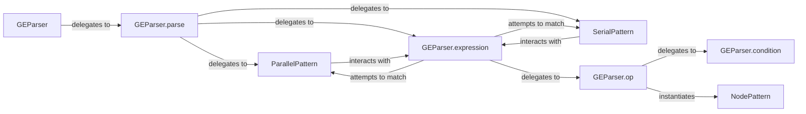

## Details

The hiddenlayer.ge subsystem is designed for defining and matching graph patterns within computational graphs. The central component is GEParser, which acts as the primary orchestrator for parsing and interpreting graph pattern expressions. The GEParser.parse method serves as the entry point, delegating the parsing of complex patterns to specialized methods like GEParser.parallel, GEParser.serial, and GEParser.expression. GEParser.expression further refines the parsing by attempting to match SerialPattern, ParallelPattern, or NodePattern through GEParser.op. GEParser.op is responsible for identifying individual node operations and can incorporate GEParser.condition for conditional matching. NodePattern, SerialPattern, and ParallelPattern are distinct classes that encapsulate the logic for matching specific types of graph patterns. This modular design allows for flexible and extensible graph pattern matching capabilities.

### GEParser
The primary orchestrator and entry point for initiating and managing graph pattern matching and analysis operations. It serves as the high-level interface for the entire subsystem, responsible for parsing the input pattern string.

**Related Classes/Methods**:

- <a href="https://github.com/waleedka/hiddenlayer/blob/master/hiddenlayer/ge.py#L14-L87" target="_blank" rel="noopener noreferrer">`hiddenlayer.ge.GEParser`:14-87</a>

### GEParser.parse
The core method within GEParser responsible for driving the overall parsing and matching process of graph patterns, delegating to specialized pattern handlers like serial, parallel, and expression.

**Related Classes/Methods**:

- <a href="https://github.com/waleedka/hiddenlayer/blob/master/hiddenlayer/ge.py#L19-L20" target="_blank" rel="noopener noreferrer">`hiddenlayer.ge.GEParser:parse`:19-20</a>

### ParallelPattern
A specialized component for identifying and processing parallel patterns within the computational graph, representing concurrent operations. It is instantiated by GEParser.parallel.

**Related Classes/Methods**:

- <a href="https://github.com/waleedka/hiddenlayer/blob/master/hiddenlayer/ge.py#L123-L167" target="_blank" rel="noopener noreferrer">`hiddenlayer.ge.ParallelPattern`:123-167</a>

### SerialPattern
A specialized component for identifying and processing sequential (serial) patterns within the computational graph, representing chained operations. It is instantiated by GEParser.serial.

**Related Classes/Methods**:

- <a href="https://github.com/waleedka/hiddenlayer/blob/master/hiddenlayer/ge.py#L107-L120" target="_blank" rel="noopener noreferrer">`hiddenlayer.ge.SerialPattern`:107-120</a>

### GEParser.expression
Handles the evaluation and processing of complex, nested expressions defined within graph patterns, allowing for flexible and powerful pattern definitions. It attempts to match serial, parallel, or op patterns.

**Related Classes/Methods**:

- <a href="https://github.com/waleedka/hiddenlayer/blob/master/hiddenlayer/ge.py#L48-L57" target="_blank" rel="noopener noreferrer">`hiddenlayer.ge.GEParser:expression`:48-57</a>

### GEParser.op
Manages and applies specific operations or transformations that are part of the defined graph patterns, often involving matching against node operations. It instantiates NodePattern.

**Related Classes/Methods**:

- <a href="https://github.com/waleedka/hiddenlayer/blob/master/hiddenlayer/ge.py#L59-L63" target="_blank" rel="noopener noreferrer">`hiddenlayer.ge.GEParser:op`:59-63</a>

### GEParser.condition
Responsible for evaluating conditions that must be met for a particular graph pattern to be considered a match, adding logical constraints to patterns. It is called by GEParser.op.

**Related Classes/Methods**:

- <a href="https://github.com/waleedka/hiddenlayer/blob/master/hiddenlayer/ge.py#L65-L74" target="_blank" rel="noopener noreferrer">`hiddenlayer.ge.GEParser:condition`:65-74</a>

### NodePattern
Provides the mechanism for defining and matching specific characteristics or attributes of individual nodes within the graph, forming the atomic unit of pattern matching.

**Related Classes/Methods**:

- <a href="https://github.com/waleedka/hiddenlayer/blob/master/hiddenlayer/ge.py#L90-L104" target="_blank" rel="noopener noreferrer">`hiddenlayer.ge.NodePattern`:90-104</a>

### [FAQ](https://github.com/CodeBoarding/GeneratedOnBoardings/tree/main?tab=readme-ov-file#faq)