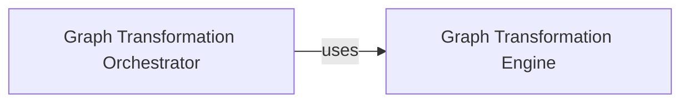

## Details

The `hiddenlayer` project's graph transformation subsystem is designed around two core components: the `Graph Transformation Engine` and the `Graph Transformation Orchestrator`. The `Graph Transformation Engine` provides a suite of atomic graph manipulation algorithms, including various `Fold`, `Prune`, and `Rename` operations, which are implemented as classes within `hiddenlayer.transforms.py`. These operations are responsible for modifying the computational graph, such as simplifying redundant nodes or renaming elements. The `Graph Transformation Orchestrator`, represented by the `SIMPLICITY_TRANSFORMS` list in `hiddenlayer.transforms.py`, defines and manages the sequence in which these individual transformations are applied to a graph. This orchestrator ensures that transformations are executed in a predefined order to achieve desired graph optimizations and simplifications, acting as the control flow for the entire transformation process. The orchestrator leverages the engine's capabilities to perform complex graph modifications.

### Graph Transformation Engine [[Expand]](./Graph_Transformation_Engine.md)
This component encapsulates a collection of atomic graph transformation algorithms. Its primary responsibility is to modify, optimize, and simplify computational graphs by applying specific operations such as folding constants, fusing operations, pruning redundant nodes, or renaming elements. These transformations prepare the graph for subsequent analysis or visualization.

**Related Classes/Methods**:

- <a href="https://github.com/waleedka/hiddenlayer/blob/master/hiddenlayer/transforms.py#L178-L188" target="_blank" rel="noopener noreferrer">`hiddenlayer.transforms.apply`:178-188</a>
- <a href="https://github.com/waleedka/hiddenlayer/blob/master/hiddenlayer/transforms.py#L21-L49" target="_blank" rel="noopener noreferrer">`hiddenlayer.transforms.Fold`:21-49</a>
- <a href="https://github.com/waleedka/hiddenlayer/blob/master/hiddenlayer/transforms.py#L52-L84" target="_blank" rel="noopener noreferrer">`hiddenlayer.transforms.FoldId`:52-84</a>
- <a href="https://github.com/waleedka/hiddenlayer/blob/master/hiddenlayer/transforms.py#L87-L101" target="_blank" rel="noopener noreferrer">`hiddenlayer.transforms.Prune`:87-101</a>
- <a href="https://github.com/waleedka/hiddenlayer/blob/master/hiddenlayer/transforms.py#L104-L143" target="_blank" rel="noopener noreferrer">`hiddenlayer.transforms.PruneBranch`:104-143</a>
- <a href="https://github.com/waleedka/hiddenlayer/blob/master/hiddenlayer/transforms.py#L146-L166" target="_blank" rel="noopener noreferrer">`hiddenlayer.transforms.FoldDuplicates`:146-166</a>
- <a href="https://github.com/waleedka/hiddenlayer/blob/master/hiddenlayer/transforms.py#L169-L188" target="_blank" rel="noopener noreferrer">`hiddenlayer.transforms.Rename`:169-188</a>

### Graph Transformation Orchestrator
This component is responsible for defining and executing a sequence of graph transformations. It orchestrates the application of individual transformation algorithms (provided by the `Graph Transformation Engine`) to a computational graph, ensuring they are applied in a specific, predefined order to achieve desired graph modifications, optimizations, or simplifications. It acts as the control flow for the transformation process.

**Related Classes/Methods**:

- <a href="https://github.com/waleedka/hiddenlayer/blob/master/hiddenlayer/transforms.py" target="_blank" rel="noopener noreferrer">`SIMPLICITY_TRANSFORMS`</a>

### [FAQ](https://github.com/CodeBoarding/GeneratedOnBoardings/tree/main?tab=readme-ov-file#faq)