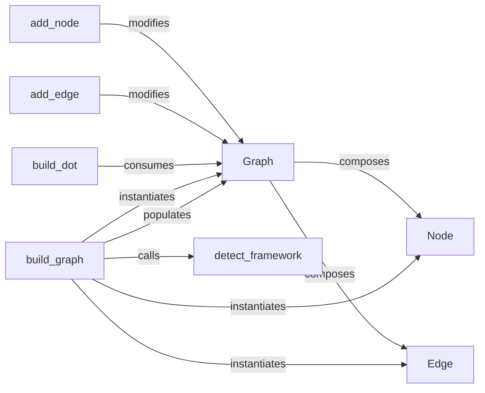

## Details

The `hiddenlayer` subsystem is designed to abstract and visualize neural network computational graphs. Its central component is the `Graph` class, which encapsulates the network's structure using `Node` and `Edge` objects. The `build_graph` function serves as the primary entry point, responsible for parsing external machine learning models (e.g., PyTorch, TensorFlow) and transforming them into this internal `Graph` representation, aided by the `detect_framework` utility. Once the graph is built, `add_node` and `add_edge` methods facilitate its programmatic construction. For visualization, the `build_dot` function converts the `Graph` into a Graphviz DOT format, enabling external rendering. This architecture provides a clear separation between model parsing, graph representation, and visualization concerns.

### Graph
The central data structure (hiddenlayer.graph.Graph) that holds the neural network graph. It acts as the primary container for Node and Edge objects, providing the fundamental API for graph manipulation.

**Related Classes/Methods**:

- <a href="https://github.com/waleedka/hiddenlayer/blob/master/hiddenlayer/graph.py#L165-L368" target="_blank" rel="noopener noreferrer">`hiddenlayer.graph.Graph`:165-368</a>

### Node
Represents a single operation, layer, or tensor within the computational graph. These are the vertices of the graph.

**Related Classes/Methods**:

- <a href="https://github.com/waleedka/hiddenlayer/blob/master/hiddenlayer/graph.py" target="_blank" rel="noopener noreferrer">`hiddenlayer.graph.Node`</a>

### Edge
Represents the data flow or connection between two Node objects in the graph. These are the directed edges of the graph.

**Related Classes/Methods**:

- <a href="https://github.com/waleedka/hiddenlayer/blob/master/hiddenlayer/graph.py" target="_blank" rel="noopener noreferrer">`hiddenlayer.graph.Edge`</a>

### build_graph
A factory-like function responsible for parsing external ML framework models (e.g., PyTorch nn.Module, TensorFlow tf.keras.Model) and constructing the internal Graph representation. This acts as a "Model Adapter/Parser."

**Related Classes/Methods**:

- <a href="https://github.com/waleedka/hiddenlayer/blob/master/hiddenlayer/graph.py#L133-L162" target="_blank" rel="noopener noreferrer">`hiddenlayer.graph.build_graph`:133-162</a>

### add_node
A method of the Graph class that facilitates adding a new Node object to the graph.

**Related Classes/Methods**:

- <a href="https://github.com/waleedka/hiddenlayer/blob/master/hiddenlayer/graph.py" target="_blank" rel="noopener noreferrer">`hiddenlayer.graph.Graph:add_node`</a>

### add_edge
A method of the Graph class that facilitates adding a new Edge object to the graph, establishing a connection between existing nodes.

**Related Classes/Methods**:

- <a href="https://github.com/waleedka/hiddenlayer/blob/master/hiddenlayer/graph.py" target="_blank" rel="noopener noreferrer">`hiddenlayer.graph.Graph:add_edge`</a>

### build_dot
Converts the internal Graph representation into a Graphviz DOT language string, which can then be used by visualization tools. This component is part of the "Visualization Renderers" aspect.

**Related Classes/Methods**:

- <a href="https://github.com/waleedka/hiddenlayer/blob/master/hiddenlayer/graph.py#L311-L355" target="_blank" rel="noopener noreferrer">`hiddenlayer.graph.build_dot`:311-355</a>

### detect_framework
A utility function that identifies the deep learning framework (e.g., PyTorch, TensorFlow, Keras) from which a given model originates. This supports the "Input Abstraction" aspect.

**Related Classes/Methods**:

- <a href="https://github.com/waleedka/hiddenlayer/blob/master/hiddenlayer/graph.py#L46-L53" target="_blank" rel="noopener noreferrer">`hiddenlayer.graph.detect_framework`:46-53</a>

### [FAQ](https://github.com/CodeBoarding/GeneratedOnBoardings/tree/main?tab=readme-ov-file#faq)