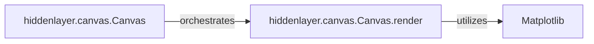

## Details

The `hiddenlayer.canvas` subsystem is responsible for visualizing neural network architectures. The central component, `hiddenlayer.canvas.Canvas`, acts as the primary orchestrator for the rendering process. It manages the rendering environment, including configuration settings and the lifecycle of drawing operations. The `Canvas` class, through its `render` method, executes the core logic for transforming the abstract graph representation into visual output. This `render` method leverages the Matplotlib library to perform the actual plotting and image generation, making the neural network architecture comprehensible through various visual formats.

### hiddenlayer.canvas.Canvas
This class serves as the primary manager for the rendering environment and its lifecycle. It acts as a context manager, ensuring proper initialization and finalization of rendering operations. It is responsible for holding and managing configuration settings pertinent to the visualization, such as output dimensions, format, and other rendering parameters. It sets up the context for rendering and orchestrates the drawing process.

**Related Classes/Methods**:

- <a href="https://github.com/waleedka/hiddenlayer/blob/master/hiddenlayer/canvas.py#L70-L258" target="_blank" rel="noopener noreferrer">`hiddenlayer.canvas.Canvas`:70-258</a>

### hiddenlayer.canvas.Canvas.render
This method, part of the `Canvas` class, embodies the core logic for the actual drawing and conversion of the graph data into a concrete visual format. It takes the abstract graph representation and translates it into visual elements, facilitating the generation of images or data suitable for interactive displays. This is where the actual rendering operations occur, utilizing Matplotlib for plotting.

**Related Classes/Methods**:

- <a href="https://github.com/waleedka/hiddenlayer/blob/master/hiddenlayer/canvas.py#L88-L145" target="_blank" rel="noopener noreferrer">`hiddenlayer.canvas.Canvas.render`:88-145</a>

### [FAQ](https://github.com/CodeBoarding/GeneratedOnBoardings/tree/main?tab=readme-ov-file#faq)